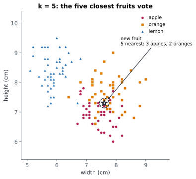
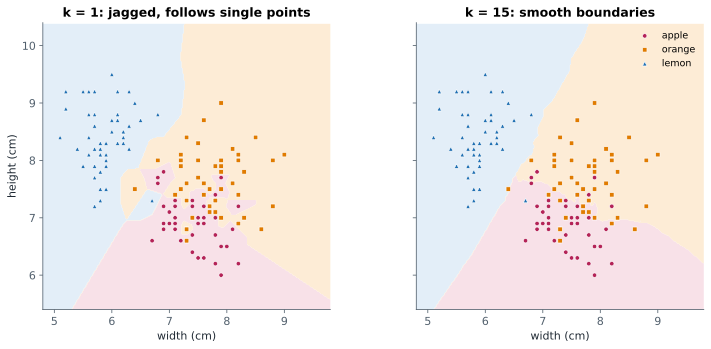

# Lesson 12: k-nearest neighbours and distance

**You'll learn:** nearest neighbours, Euclidean distance, choosing k, decision boundaries, why scaling matters for distances, KNeighborsRegressor.

▶ **Practise this lesson in the [sandbox](https://kishoremadanagopal.github.io/learning/ml/#knn)**: run every example and check your exercise answers.

## Key terms

- **k-nearest neighbours (KNN):** predicts from the k closest training rows: a vote for classes, an average for numbers.
- **Distance:** how far apart two rows are; KNN usually uses straight-line (Euclidean) distance.
- **Euclidean distance:** the square root of the sum of squared differences across features.
- **Decision boundary:** the line or surface where a classifier's prediction changes from one class to another.
- **Feature scale:** the typical size of a feature's values, which depends on its units.
- **KNeighborsRegressor:** KNN for numbers: the average label of the nearest rows.
- **Lazy learner:** a model like KNN that does almost nothing in fit and all its work when predicting.

k-nearest neighbours is the easiest model to explain to anyone: **to predict for a new row, find the k most similar rows in the training data and let them vote** (or, for numbers, average them).



"Similar" means **close**, measured by **distance**. KNN uses the everyday straight-line distance (called Euclidean distance): for two fruits, it's √((width difference)² + (height difference)²), and the same with more features.

```python
import numpy as np

fruit_a = np.array([7.4, 7.0])    # width, height of a fruit
fruit_b = np.array([7.8, 7.7])
distance = np.sqrt(((fruit_a - fruit_b) ** 2).sum())
print(round(distance, 3))
```

KNN doesn't really "learn" anything during `fit`; it just stores the training rows. All the work happens at prediction time, which makes it slow on big data but great for small, well-understood problems.

## What k does



- **Small k** (like 1): the prediction follows single points, including odd ones. Jagged boundaries, **overfitting**.
- **Large k**: smooth boundaries that ignore local detail. Too large and it **underfits** (at k = all rows, it always predicts the most common class).
- An odd k avoids ties between two classes.

```python
import pandas as pd
from sklearn.model_selection import train_test_split
from sklearn.neighbors import KNeighborsClassifier

fruit = pd.read_csv("fruit.csv")
X_train, X_test, y_train, y_test = train_test_split(
    fruit[["width_cm", "height_cm"]], fruit["fruit"], test_size=0.25, random_state=3, stratify=fruit["fruit"])

for k in [1, 5, 15, 51, 111]:
    knn = KNeighborsClassifier(n_neighbors=k).fit(X_train, y_train)
    print(f"k={k:>3}  train {knn.score(X_train, y_train):.3f}  test {knn.score(X_test, y_test):.3f}")
```

At k=111 almost all 112 training fruits get a vote on every prediction, so the answer barely depends on the fruit's own shape any more: training and test accuracy both drop to about two-thirds.

## Distance needs the same scale

Here's a trap. Width and height are in centimetres and vary by about 1 cm; weight is in grams and varies by about 36 g. In the distance formula, a 36 g difference counts as much as a 36 cm difference, so **weight swamps everything else**. Adding a useful feature can make KNN **worse**:

```python
import numpy as np
import pandas as pd
from sklearn.model_selection import train_test_split
from sklearn.neighbors import KNeighborsClassifier
from sklearn.pipeline import make_pipeline
from sklearn.preprocessing import StandardScaler

fruit = pd.read_csv("fruit.csv")
print(fruit[["width_cm", "height_cm", "weight_g"]].std().round(1))

two, three, scaled = [], [], []
for seed in range(20):                      # 20 different splits, then average: fairer than one split
    X_train, X_test, y_train, y_test = train_test_split(
        fruit[["width_cm", "height_cm", "weight_g"]], fruit["fruit"], test_size=0.25, random_state=seed, stratify=fruit["fruit"])
    wh = ["width_cm", "height_cm"]
    two.append(KNeighborsClassifier(5).fit(X_train[wh], y_train).score(X_test[wh], y_test))
    three.append(KNeighborsClassifier(5).fit(X_train, y_train).score(X_test, y_test))
    scaled.append(make_pipeline(StandardScaler(), KNeighborsClassifier(5)).fit(X_train, y_train).score(X_test, y_test))

print("width + height:           ", round(np.mean(two), 3))
print("+ weight, unscaled:       ", round(np.mean(three), 3))
print("+ weight, StandardScaler: ", round(np.mean(scaled), 3))
```

Unscaled, the weight column drowns out the shape information and accuracy **falls**. After `StandardScaler` puts every feature on the same scale, the extra feature finally helps. Lesson 15 covers scaling in detail; for now, remember: **any model that uses distances needs scaled features.**

## KNN for numbers

`KNeighborsRegressor` predicts the **average** label of the k nearest rows:

```python
import pandas as pd
from sklearn.neighbors import KNeighborsRegressor

students = pd.read_csv("students.csv")
knn = KNeighborsRegressor(n_neighbors=5).fit(students[["hours_studied"]], students["math"])
print(knn.predict(pd.DataFrame({"hours_studied": [2, 6, 10]})).round(1))
```

## Common mistakes

- Using KNN without scaling features, so the feature with the biggest units decides everything.
- Picking k=1 because it scores perfectly on the training data.
- Using KNN on very large datasets, where every prediction compares against every stored row and gets slow.

## Exercises

### 1. Choose k

Using the split below, try `n_neighbors` = 1, 3, 5, 7, 9, 11, 15 and 21 (with width and height only). Store the k with the **highest test accuracy** in `best_k`. If two values tie, keep the **smaller** k.

Starter code:

```python
import pandas as pd
from sklearn.model_selection import train_test_split
from sklearn.neighbors import KNeighborsClassifier

fruit = pd.read_csv("fruit.csv")
X_train, X_test, y_train, y_test = train_test_split(
    fruit[["width_cm", "height_cm"]], fruit["fruit"], test_size=0.3, random_state=11, stratify=fruit["fruit"])

```

### 2. Scale before measuring

Using all three fruit measurements and the split below, store the test accuracy of `KNeighborsClassifier(n_neighbors=7)` **without** scaling in `acc_raw`, and of `make_pipeline(StandardScaler(), KNeighborsClassifier(n_neighbors=7))` in `acc_scaled`.

Starter code:

```python
import pandas as pd
from sklearn.model_selection import train_test_split
from sklearn.neighbors import KNeighborsClassifier
from sklearn.pipeline import make_pipeline
from sklearn.preprocessing import StandardScaler

fruit = pd.read_csv("fruit.csv")
X_train, X_test, y_train, y_test = train_test_split(
    fruit[["width_cm", "height_cm", "weight_g"]], fruit["fruit"], test_size=0.3, random_state=11, stratify=fruit["fruit"])

```

**In the sandbox:** exercises 23–24. Press **Check** to test your answer.

<details>
<summary>Hints</summary>

1. Loop over the k values in order and only replace your best when the accuracy is strictly higher.
2. The pipeline is used exactly like a model: `.fit(X_train, y_train)` then `.score(X_test, y_test)`.

</details>

<details>
<summary>Answers</summary>

**1. Choose k**

```python
import pandas as pd
from sklearn.model_selection import train_test_split
from sklearn.neighbors import KNeighborsClassifier

fruit = pd.read_csv("fruit.csv")
X_train, X_test, y_train, y_test = train_test_split(
    fruit[["width_cm", "height_cm"]], fruit["fruit"], test_size=0.3, random_state=11, stratify=fruit["fruit"])

best_k, best_acc = None, -1
for k in [1, 3, 5, 7, 9, 11, 15, 21]:
    acc = KNeighborsClassifier(n_neighbors=k).fit(X_train, y_train).score(X_test, y_test)
    print(k, round(acc, 3))
    if acc > best_acc:            # strictly better, so ties keep the smaller k
        best_k, best_acc = k, acc
print("best k:", best_k)
```

**2. Scale before measuring**

```python
import pandas as pd
from sklearn.model_selection import train_test_split
from sklearn.neighbors import KNeighborsClassifier
from sklearn.pipeline import make_pipeline
from sklearn.preprocessing import StandardScaler

fruit = pd.read_csv("fruit.csv")
X_train, X_test, y_train, y_test = train_test_split(
    fruit[["width_cm", "height_cm", "weight_g"]], fruit["fruit"], test_size=0.3, random_state=11, stratify=fruit["fruit"])

acc_raw = KNeighborsClassifier(n_neighbors=7).fit(X_train, y_train).score(X_test, y_test)
acc_scaled = make_pipeline(StandardScaler(), KNeighborsClassifier(n_neighbors=7)).fit(X_train, y_train).score(X_test, y_test)
print(round(acc_raw, 3), round(acc_scaled, 3))
```

</details>

## Quick quiz

1. How does KNN classify a new row?
   - A) It finds the k closest training rows and takes a vote
   - B) It draws a straight line between classes
   - C) It asks a series of yes/no questions

2. With k=1, KNN tends to:
   - A) Overfit: jagged boundaries that follow single points
   - B) Underfit
   - C) Always predict the most common class

3. Why does adding weight_g in grams hurt an unscaled KNN?
   - A) Its large numbers dominate the distance, drowning out width and height
   - B) Weight is a useless feature
   - C) KNN can't use more than two features

4. What happens at prediction time with KNN on a huge dataset?
   - A) It's instant
   - B) It's slow, because it compares the new row with every stored row
   - C) It fails

<details>
<summary>Quiz answers</summary>

1. **A) It finds the k closest training rows and takes a vote**: KNN predicts from the most similar stored examples.
2. **A) Overfit: jagged boundaries that follow single points**: One neighbour means every odd training point gets its own little region.
3. **A) Its large numbers dominate the distance, drowning out width and height**: Distances add up differences in each feature's own units, so big-unit features dominate. Scale first.
4. **B) It's slow, because it compares the new row with every stored row**: fit just stores the data; the searching happens when you predict.

</details>

---
Previous: [Lesson 11](11-thresholds-roc.md) · Next: [Lesson 13: Decision trees](13-decision-trees.md)
