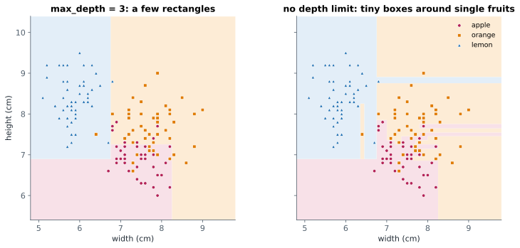

# Lesson 13: Decision trees

**You'll learn:** yes/no splits, root, nodes and leaves, Gini impurity, export_text, axis-aligned boundaries, max_depth and overfitting, feature_importances_.

▶ **Practise this lesson in the [sandbox](https://kishoremadanagopal.github.io/learning/ml/#decision-trees)**: run every example and check your exercise answers.

## Key terms

- **Decision tree:** a model that predicts by asking a series of yes/no questions about the features.
- **Root:** the first question at the top of a tree.
- **Node:** a point in the tree where a question splits the rows.
- **Leaf:** an end point of the tree that gives the prediction.
- **Depth:** the number of questions on the longest path from the root to a leaf.
- **Gini impurity:** a measure of how mixed the classes in a group are; 0 means all one class.
- **max_depth:** a limit on how deep a tree can grow; the main way to stop it overfitting.
- **min_samples_leaf:** the smallest number of training rows allowed in a leaf.
- **export_text:** prints a fitted tree as readable if/else rules.
- **Feature importance:** how much each feature helped the model; for trees, the total impurity reduction from its splits.
- **Interaction:** when one feature's effect depends on another, such as support calls mattering mostly for new customers.

A **decision tree** predicts by asking yes/no questions about the features, one after another, like a game of 20 questions:


- The first question is the **root**. Each question is a **node** (or split); the end points that give the answer are **leaves**.
- To predict, start at the root and follow the answers down to a leaf. The leaf predicts the most common class among the training rows that ended up there.
- The **depth** is the number of questions on the longest path.

## How a tree picks its questions

At each node the tree tries **every feature and every cut-off** ("tenure ≤ 1?", "≤ 2?", … "support calls ≤ 3?"…) and keeps the question that best separates the classes: the one that makes the two groups it creates as **pure** as possible (mostly stayers on one side, mostly leavers on the other). The usual measure of mixed-ness is **Gini impurity**: 0 for a group that's all one class, 0.5 for a 50/50 mix of two classes. Then it repeats inside each group.

```python
import pandas as pd
from sklearn.model_selection import train_test_split
from sklearn.tree import DecisionTreeClassifier, export_text

churn = pd.read_csv("churn.csv")
features = ["tenure_months", "monthly_charge", "support_calls", "data_gb"]
X_train, X_test, y_train, y_test = train_test_split(
    churn[features], churn["churned"], test_size=0.25, random_state=0, stratify=churn["churned"])

tree = DecisionTreeClassifier(max_depth=2, random_state=0).fit(X_train, y_train)
print(export_text(tree, feature_names=features))
print("test accuracy:", round(tree.score(X_test, y_test), 3))
```

`export_text` prints the tree as indented rules. The tree found, by itself, the pattern a retention manager would put in plain words: **new customers who keep calling support are the ones who leave.** (The right-hand branch ends in two "class: 0" leaves; the split still made those groups purer, it just didn't change the vote.)

## Trees in pictures



Trees cut the feature space into **rectangles**, because every question is about one feature at a time. This also means:

- **No scaling needed.** "Is weight ≤ 150 g?" works the same in grams or kilos.
- They capture **interactions** (an effect that depends on another feature, like support calls mattering mostly for new customers) and **non-linear** patterns without extra work.

## Depth controls overfitting

With no limit, a tree keeps splitting until every leaf is pure, which on noisy data means memorising:

```python
import pandas as pd
from sklearn.model_selection import train_test_split
from sklearn.tree import DecisionTreeClassifier

churn = pd.read_csv("churn.csv")
features = ["tenure_months", "monthly_charge", "support_calls", "data_gb"]
X_train, X_test, y_train, y_test = train_test_split(
    churn[features], churn["churned"], test_size=0.25, random_state=0, stratify=churn["churned"])

for depth in [1, 2, 3, 4, 6, 10, None]:
    tree = DecisionTreeClassifier(max_depth=depth, random_state=0).fit(X_train, y_train)
    print(f"max_depth={str(depth):>4}  leaves {tree.get_n_leaves():>3}  train {tree.score(X_train, y_train):.3f}  test {tree.score(X_test, y_test):.3f}")
```

The unlimited tree (`None`) has 182 leaves and a perfect training score, but the worst test score. The shallow trees do best here. Besides `max_depth`, you can limit trees with `min_samples_leaf` (each leaf needs at least this many training rows) or `max_leaf_nodes`.

Single trees are easy to read but **unstable**: a few different training rows can produce a very different tree. The next lesson fixes that by combining many trees.

## Which features did it use?

`feature_importances_` says how much each feature reduced impurity across all the tree's splits (they add up to 1):

```python
import pandas as pd
from sklearn.model_selection import train_test_split
from sklearn.tree import DecisionTreeClassifier

churn = pd.read_csv("churn.csv")
features = ["tenure_months", "monthly_charge", "support_calls", "data_gb"]
X_train, X_test, y_train, y_test = train_test_split(
    churn[features], churn["churned"], test_size=0.25, random_state=0, stratify=churn["churned"])

tree = DecisionTreeClassifier(max_depth=3, random_state=0).fit(X_train, y_train)
print(pd.Series(tree.feature_importances_, index=features).round(3).sort_values(ascending=False))
```

## Common mistakes

- Growing trees without limits on noisy data and trusting the perfect training score.
- Over-trusting one tree's structure. A slightly different sample can produce a very different tree.
- Scaling features for a tree. It's harmless but pointless.

## Exercises

### 1. A readable rule

Train a `DecisionTreeClassifier(max_depth=1, random_state=0)` called `stump` on the split below. A depth-1 tree asks a single question. Store the name of the feature it splits on in `first_feature`, and its test accuracy in `acc`.

Starter code:

```python
import pandas as pd
from sklearn.model_selection import train_test_split
from sklearn.tree import DecisionTreeClassifier, export_text

fruit = pd.read_csv("fruit.csv")
features = ["width_cm", "height_cm", "weight_g"]
X_train, X_test, y_train, y_test = train_test_split(
    fruit[features], fruit["fruit"], test_size=0.25, random_state=3, stratify=fruit["fruit"])

```

### 2. Best depth

For the churn split below, try `max_depth` from 1 to 8 (with `random_state=0`). Store the depth with the highest **test accuracy** in `best_depth` (keep the smaller depth if tied), and the training accuracy of the **unlimited** tree (`max_depth=None`) in `full_train_acc`.

Starter code:

```python
import pandas as pd
from sklearn.model_selection import train_test_split
from sklearn.tree import DecisionTreeClassifier

churn = pd.read_csv("churn.csv")
features = ["tenure_months", "monthly_charge", "support_calls", "data_gb"]
X_train, X_test, y_train, y_test = train_test_split(
    churn[features], churn["churned"], test_size=0.3, random_state=2, stratify=churn["churned"])

```

**In the sandbox:** exercises 25–26. Press **Check** to test your answer.

<details>
<summary>Hints</summary>

1. Print `export_text(stump, feature_names=features)`; the first line names the feature.
2. Same pattern as choosing k: loop, and replace the best only when strictly better.

</details>

<details>
<summary>Answers</summary>

**1. A readable rule**

```python
import pandas as pd
from sklearn.model_selection import train_test_split
from sklearn.tree import DecisionTreeClassifier, export_text

fruit = pd.read_csv("fruit.csv")
features = ["width_cm", "height_cm", "weight_g"]
X_train, X_test, y_train, y_test = train_test_split(
    fruit[features], fruit["fruit"], test_size=0.25, random_state=3, stratify=fruit["fruit"])

stump = DecisionTreeClassifier(max_depth=1, random_state=0).fit(X_train, y_train)
print(export_text(stump, feature_names=features))
first_feature = "width_cm"        # read it from the printed rule
acc = stump.score(X_test, y_test)
print(round(acc, 3))
```

**2. Best depth**

```python
import pandas as pd
from sklearn.model_selection import train_test_split
from sklearn.tree import DecisionTreeClassifier

churn = pd.read_csv("churn.csv")
features = ["tenure_months", "monthly_charge", "support_calls", "data_gb"]
X_train, X_test, y_train, y_test = train_test_split(
    churn[features], churn["churned"], test_size=0.3, random_state=2, stratify=churn["churned"])

best_depth, best_acc = None, -1
for depth in range(1, 9):
    acc = DecisionTreeClassifier(max_depth=depth, random_state=0).fit(X_train, y_train).score(X_test, y_test)
    if acc > best_acc:
        best_depth, best_acc = depth, acc
full = DecisionTreeClassifier(random_state=0).fit(X_train, y_train)
full_train_acc = full.score(X_train, y_train)
print(best_depth, round(best_acc, 3), full_train_acc)
```

</details>

## Quick quiz

1. Why don't decision trees need scaled features?
   - A) Each split compares one feature with a cut-off, so units don't matter
   - B) They scale features automatically inside fit
   - C) They only work with 0/1 features

2. A tree with no depth limit scores 1.00 on training data and 0.67 on test data. What's happening?
   - A) Underfitting
   - B) Overfitting: it grew until it memorised the training rows
   - C) Data leakage

3. What does a leaf of a classification tree predict?
   - A) The most common class among the training rows that reached it
   - B) The average of all labels
   - C) A random class

4. What shape are the regions a decision tree draws on a 2-D chart?
   - A) Circles
   - B) Rectangles, with horizontal and vertical edges
   - C) Diagonal stripes

<details>
<summary>Quiz answers</summary>

1. **A) Each split compares one feature with a cut-off, so units don't matter**: "weight <= 150 g" and "weight <= 0.15 kg" split the rows identically.
2. **B) Overfitting: it grew until it memorised the training rows**: Unlimited trees keep splitting until every leaf is pure. Limit max_depth or min_samples_leaf.
3. **A) The most common class among the training rows that reached it**: Each leaf votes with the training rows that ended up in it.
4. **B) Rectangles, with horizontal and vertical edges**: Every question is about one feature, so every boundary is parallel to an axis.

</details>

---
Previous: [Lesson 12](12-knn.md) · Next: [Lesson 14: Random forests and gradient boosting](14-ensembles.md)
