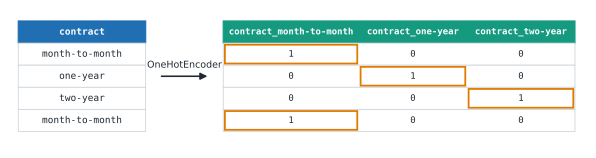

# Lesson 16: Text categories and missing values

**You'll learn:** one-hot encoding, OneHotEncoder and handle_unknown, ordinal encoding with a given order, missing values, SimpleImputer strategies, add_indicator, ColumnTransformer.

▶ **Practise this lesson in the [sandbox](https://kishoremadanagopal.github.io/learning/ml/#encoding-and-missing)**: run every example and check your exercise answers.

## Key terms

- **Encoding:** turning categories (text) into numbers a model can use.
- **One-hot encoding:** one 0/1 column per category, with a single 1 in each row.
- **OneHotEncoder:** scikit-learn's one-hot transformer; remembers the categories it saw in training.
- **handle_unknown="ignore":** makes OneHotEncoder encode a category it never saw as all zeros instead of failing.
- **Ordinal encoding:** one column of numbers for categories with a real order, like basic < standard < premium.
- **OrdinalEncoder:** scikit-learn's ordinal transformer; pass categories= to set the order.
- **Missing value:** an empty cell, shown as NaN in pandas.
- **Imputation:** filling missing values with a sensible guess.
- **SimpleImputer:** fills gaps with the mean, median, most frequent value or a constant, learned from training data.
- **Missing indicator:** a 0/1 column saying whether a value was missing (add_indicator=True).
- **ColumnTransformer:** applies different transformers to different columns and joins the results.
- **Sparse matrix:** a compact format that stores only the non-zero values; OneHotEncoder's default output.
- **passthrough:** in a ColumnTransformer, keeps the listed columns unchanged.

Models only understand numbers, and most can't handle blanks. Real tables have both text and gaps. Two kinds of transformer fix them: **encoders** turn categories into numbers, **imputers** fill missing values.

## One-hot encoding

You can't just number the categories (month-to-month = 0, one-year = 1, two-year = 2): the model would think "two-year" is twice "one-year". **One-hot encoding** makes one 0/1 column per category instead:



```python
import pandas as pd
from sklearn.preprocessing import OneHotEncoder

churn = pd.read_csv("churn.csv")
encoder = OneHotEncoder(sparse_output=False, handle_unknown="ignore")
encoded = encoder.fit_transform(churn[["contract"]])

print(encoder.categories_)
print(encoder.get_feature_names_out())
print(encoded[:4])
print(churn["contract"].head(4).tolist())
```

- `handle_unknown="ignore"` means a category the encoder never saw in training (say, a new "three-year" contract) becomes all zeros instead of an error. Always set it for real data.
- `sparse_output=False` returns a normal array you can print. (By default it returns a compact **sparse** matrix, which is better for columns with thousands of categories.)
- You used `pd.get_dummies` in Lesson 14. It's handy for exploring, but `OneHotEncoder` **remembers** the categories it learned in training, so the test data and future data get exactly the same columns.

## Ordinal encoding: when order is real

Some categories **do** have an order: basic < standard < premium, small < medium < large, survey answers 1 to 5. Then a single column of numbers is right, as long as you give the order yourself:

```python
import pandas as pd
from sklearn.preprocessing import OrdinalEncoder

churn = pd.read_csv("churn.csv")
encoder = OrdinalEncoder(categories=[["basic", "standard", "premium"]])
churn["plan_level"] = encoder.fit_transform(churn[["plan"]])
print(churn[["plan", "plan_level"]].drop_duplicates().sort_values("plan_level"))
```

Without `categories=`, the encoder sorts alphabetically (basic, premium, standard), which gets the order wrong.

## Missing values

The `age` column of `churn.csv` has gaps. Most scikit-learn models refuse to train on them:

*This example raises an error on purpose.*

```python
import pandas as pd
from sklearn.linear_model import LogisticRegression

churn = pd.read_csv("churn.csv")
print("missing ages:", churn["age"].isna().sum())
LogisticRegression().fit(churn[["tenure_months", "age"]], churn["churned"])
```

You could drop the rows with gaps, but you'd lose data, and you'd still need a plan when a **new** customer arrives without an age. `SimpleImputer` fills each gap with a value learned from the training data:

| `strategy=` | Fills with | Good for |
|---|---|---|
| `"median"` | the column's median | numbers, especially skewed ones |
| `"mean"` | the column's mean | numbers without outliers |
| `"most_frequent"` | the most common value | categories (text) |
| `"constant"` | a value you choose (`fill_value=`) | e.g. "unknown" |

```python
import pandas as pd
from sklearn.impute import SimpleImputer

churn = pd.read_csv("churn.csv")
imputer = SimpleImputer(strategy="median", add_indicator=True)
filled = imputer.fit_transform(churn[["age"]])

print("learned median:", imputer.statistics_)
print(imputer.get_feature_names_out())
print(filled[churn["age"].isna().to_numpy()][:3])   # three rows that were missing
```

`add_indicator=True` adds a 0/1 column saying "this value was missing". Sometimes **whether** something is missing is itself a clue (customers who didn't give their age might behave differently).

## ColumnTransformer: the right step for each column

Real tables mix numbers and text, so different columns need different steps. `ColumnTransformer` applies each transformer to its own list of columns and glues the results side by side:

```python
import pandas as pd
from sklearn.compose import ColumnTransformer
from sklearn.preprocessing import OneHotEncoder, StandardScaler
from sklearn.impute import SimpleImputer
from sklearn.pipeline import make_pipeline

churn = pd.read_csv("churn.csv")
numeric = ["tenure_months", "monthly_charge", "support_calls", "age", "data_gb"]
categorical = ["contract", "plan"]

prep = ColumnTransformer([
    ("num", make_pipeline(SimpleImputer(strategy="median"), StandardScaler()), numeric),
    ("cat", OneHotEncoder(handle_unknown="ignore"), categorical),
])
X_ready = prep.fit_transform(churn)
print(X_ready.shape)
print(prep.get_feature_names_out())
```

Each entry is `(a name, the transformer, the columns)`. Columns you don't list (like `customer_id` and `churned`) are dropped. The numeric columns get "fill the gaps, then scale"; the text columns get one-hot encoded. 5 numbers + 3 contracts + 3 plans = 11 columns.

## What it buys you

The housing data has a text column you've ignored so far: `neighborhood`. Adding it with a `ColumnTransformer`:

```python
import pandas as pd
from sklearn.model_selection import train_test_split
from sklearn.compose import ColumnTransformer
from sklearn.preprocessing import OneHotEncoder
from sklearn.pipeline import make_pipeline
from sklearn.linear_model import LinearRegression
from sklearn.metrics import mean_absolute_error

housing = pd.read_csv("housing.csv")
numeric = ["area_sqm", "bedrooms", "age_years", "distance_km"]
X_train, X_test, y_train, y_test = train_test_split(
    housing[numeric + ["neighborhood"]], housing["price_k"], test_size=0.25, random_state=5)

without = LinearRegression().fit(X_train[numeric], y_train)
prep = ColumnTransformer([
    ("num", "passthrough", numeric),                                  # "passthrough" keeps columns as they are
    ("cat", OneHotEncoder(handle_unknown="ignore"), ["neighborhood"]),
])
with_hood = make_pipeline(prep, LinearRegression()).fit(X_train, y_train)

print("MAE without neighborhood:", round(mean_absolute_error(y_test, without.predict(X_test[numeric])), 1))
print("MAE with neighborhood:   ", round(mean_absolute_error(y_test, with_hood.predict(X_test)), 1))
print("R² with neighborhood:    ", round(with_hood.score(X_test, y_test), 3))
```

The typical error drops from about 41 thousand to 27 thousand, and R² rises from 0.82 to 0.92. One text column, properly encoded, was worth more than any model change so far.

## Common mistakes

- Numbering unordered categories (0, 1, 2), which invents an order that isn't there.
- Using OrdinalEncoder without categories=, so the order is alphabetical instead of the real one.
- Forgetting handle_unknown="ignore", so the model crashes on the first new category.
- Filling gaps with statistics computed on all the data instead of the training data.

## Exercises

### 1. Encode the plans

Make a `OneHotEncoder(sparse_output=False, handle_unknown="ignore")` called `encoder`, fit it on the `plan` column of `churn.csv`, and store the transformed array in `plan_encoded` and the new column names (from `get_feature_names_out()`) in `names`.

Starter code:

```python
import pandas as pd
from sklearn.preprocessing import OneHotEncoder

churn = pd.read_csv("churn.csv")

```

### 2. Every column, prepared

Build a `ColumnTransformer` called `prep` for `churn.csv` that fills the missing values of `age` and `tenure_months` with their **median** (no scaling needed here) and one-hot encodes `contract` with `handle_unknown="ignore"`. Fit it on the training rows, and store the transformed **test** rows in `X_test_ready`.

Starter code:

```python
import pandas as pd
from sklearn.model_selection import train_test_split
from sklearn.compose import ColumnTransformer
from sklearn.preprocessing import OneHotEncoder
from sklearn.impute import SimpleImputer

churn = pd.read_csv("churn.csv")
X_train, X_test = train_test_split(churn, test_size=0.25, random_state=0)

```

**In the sandbox:** exercises 31–32. Press **Check** to test your answer.

<details>
<summary>Hints</summary>

1. Use double brackets, `churn[["plan"]]`: encoders also want a table.
2. One entry per group of columns: `("num", SimpleImputer(strategy="median"), [...])` and `("cat", OneHotEncoder(handle_unknown="ignore"), ["contract"])`.

</details>

<details>
<summary>Answers</summary>

**1. Encode the plans**

```python
import pandas as pd
from sklearn.preprocessing import OneHotEncoder

churn = pd.read_csv("churn.csv")
encoder = OneHotEncoder(sparse_output=False, handle_unknown="ignore")
plan_encoded = encoder.fit_transform(churn[["plan"]])
names = encoder.get_feature_names_out()
print(names, plan_encoded[:3])
```

**2. Every column, prepared**

```python
import pandas as pd
from sklearn.model_selection import train_test_split
from sklearn.compose import ColumnTransformer
from sklearn.preprocessing import OneHotEncoder
from sklearn.impute import SimpleImputer

churn = pd.read_csv("churn.csv")
X_train, X_test = train_test_split(churn, test_size=0.25, random_state=0)

prep = ColumnTransformer([
    ("num", SimpleImputer(strategy="median"), ["age", "tenure_months"]),
    ("cat", OneHotEncoder(handle_unknown="ignore"), ["contract"]),
])
prep.fit(X_train)
X_test_ready = prep.transform(X_test)
print(prep.get_feature_names_out())
print(X_test_ready[:3])
```

</details>

## Quick quiz

1. Why not encode contract types as 0, 1, 2 in one column?
   - A) The model would treat them as ordered numbers, as if two-year were "twice" one-year
   - B) Because numbers take more memory
   - C) It's fine for every model

2. What does handle_unknown="ignore" do in OneHotEncoder?
   - A) Encodes a category never seen in training as all zeros instead of raising an error
   - B) Drops rows with missing values
   - C) Ignores the column completely

3. Which SimpleImputer strategy suits a text column?
   - A) "mean"
   - B) "median"
   - C) "most_frequent"

4. What does ColumnTransformer do?
   - A) Applies different transformers to different columns and joins the results
   - B) Changes column names
   - C) Transposes the table

<details>
<summary>Quiz answers</summary>

1. **A) The model would treat them as ordered numbers, as if two-year were "twice" one-year**: Unordered categories need one-hot encoding. Ordinal encoding is only for categories with a real order.
2. **A) Encodes a category never seen in training as all zeros instead of raising an error**: New categories appear in real life; this keeps predictions working.
3. **C) "most_frequent"**: You can't average text; the most common value (or a constant like "unknown") works.
4. **A) Applies different transformers to different columns and joins the results**: It's how you scale numbers and encode text in one step.

</details>

---
Previous: [Lesson 15](15-scaling.md) · Next: [Lesson 17: Pipelines and data leakage](17-pipelines-and-leakage.md)
