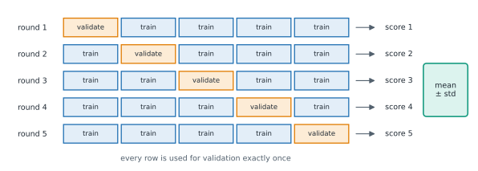

# Lesson 18: Cross-validation

**You'll learn:** the luck of one split, k-fold cross-validation, cross_val_score, mean and standard deviation of scores, stratified folds, scoring names, comparing models, cross_validate, the role of the test set.

▶ **Practise this lesson in the [sandbox](https://kishoremadanagopal.github.io/learning/ml/#cross-validation)**: run every example and check your exercise answers.

## Key terms

- **Cross-validation (CV):** scoring a model on several different train/validation splits and averaging.
- **Fold:** one of the equal parts the data is cut into for cross-validation.
- **Validation fold:** the fold held out to score the model in one round of CV.
- **Validation set:** data used to compare and choose models; separate from the final test set.
- **k-fold:** cross-validation with k folds, each used once for validation.
- **StratifiedKFold:** k-fold that keeps the class mix the same in every fold; the default for classifiers.
- **KFold:** plain k-fold; pass shuffle=True when rows are in some order.
- **cross_val_score:** returns one score per fold.
- **cross_validate:** like cross_val_score, but with several metrics, fit times and optional training scores.
- **scoring:** the metric name used in CV and search, such as "roc_auc" or "neg_mean_absolute_error".

A single train/test split depends on luck: which rows happened to land in the test set. Change `random_state` and the score moves:

```python
import pandas as pd
from sklearn.model_selection import train_test_split
from sklearn.neighbors import KNeighborsClassifier
from sklearn.pipeline import make_pipeline
from sklearn.preprocessing import StandardScaler

fruit = pd.read_csv("fruit.csv")
X = fruit[["width_cm", "height_cm", "weight_g"]]
y = fruit["fruit"]

for seed in range(6):
    X_train, X_test, y_train, y_test = train_test_split(X, y, test_size=0.25, random_state=seed, stratify=y)
    model = make_pipeline(StandardScaler(), KNeighborsClassifier(5)).fit(X_train, y_train)
    print(f"split {seed}: test accuracy {model.score(X_test, y_test):.3f}")
```

Same model, same data, accuracy anywhere from 0.79 to 0.89. If you compared two models on one split, the "winner" could just be the luckier one.

## K-fold cross-validation

**Cross-validation** (CV) uses every row for testing once. With **5-fold** CV:



1. Cut the data into 5 equal parts (**folds**).
2. Train on 4 folds and score on the 5th (the **validation fold**).
3. Repeat 5 times, so each fold is the validation fold once.
4. Report the **mean** of the 5 scores, and their **standard deviation** as the wobble.

```python
import pandas as pd
from sklearn.model_selection import cross_val_score
from sklearn.neighbors import KNeighborsClassifier
from sklearn.pipeline import make_pipeline
from sklearn.preprocessing import StandardScaler

fruit = pd.read_csv("fruit.csv")
X = fruit[["width_cm", "height_cm", "weight_g"]]
y = fruit["fruit"]

model = make_pipeline(StandardScaler(), KNeighborsClassifier(5))
scores = cross_val_score(model, X, y, cv=5)
print(scores.round(3))
print(f"accuracy {scores.mean():.3f} ± {scores.std():.3f}")
```

`cross_val_score` does the splitting, fitting and scoring for you. It refits a fresh copy of the model each round, and because the scaler is inside the pipeline, it's refit on each round's training folds: no leakage.

Details worth knowing:

- For classifiers, `cv=5` automatically uses **stratified** folds (each fold keeps the class mix).
- For regression, folds are taken **in order** without shuffling. If your rows are sorted (by date, by price…), pass `cv=KFold(5, shuffle=True, random_state=0)`.
- `scoring=` picks the metric: `"accuracy"`, `"roc_auc"`, `"f1"`, `"recall"`, `"r2"`, `"neg_mean_absolute_error"`… Error metrics are **negated** (`neg_`) because scikit-learn always treats higher as better; flip the sign back to read them.
- 5 or 10 folds are the usual choices. More folds means more training data per round but more time.

## Comparing models fairly

```python
import pandas as pd
from sklearn.model_selection import train_test_split, cross_val_score
from sklearn.compose import ColumnTransformer
from sklearn.preprocessing import OneHotEncoder, StandardScaler
from sklearn.impute import SimpleImputer
from sklearn.pipeline import Pipeline, make_pipeline
from sklearn.dummy import DummyClassifier
from sklearn.linear_model import LogisticRegression
from sklearn.ensemble import RandomForestClassifier, HistGradientBoostingClassifier

churn = pd.read_csv("churn.csv")
X = churn.drop(columns=["customer_id", "churned"])
y = churn["churned"]
X_train, X_test, y_train, y_test = train_test_split(X, y, test_size=0.25, random_state=0, stratify=y)

numeric = ["tenure_months", "monthly_charge", "support_calls", "age", "data_gb"]
prep = ColumnTransformer([
    ("num", make_pipeline(SimpleImputer(strategy="median"), StandardScaler()), numeric),
    ("cat", OneHotEncoder(handle_unknown="ignore"), ["contract", "plan"]),
])
candidates = {
    "baseline": DummyClassifier(),
    "logistic regression": LogisticRegression(),
    "random forest": RandomForestClassifier(n_estimators=200, min_samples_leaf=3, random_state=0),
    "gradient boosting": HistGradientBoostingClassifier(learning_rate=0.05, max_depth=3, random_state=0),
}
for name, model in candidates.items():
    scores = cross_val_score(Pipeline([("prep", prep), ("model", model)]), X_train, y_train, cv=5, scoring="roc_auc")
    print(f"{name:<20} AUC {scores.mean():.3f} ± {scores.std():.3f}")
```

The three real models are within about 0.01 of each other, much less than their wobble (±0.03 to 0.06). The honest conclusion: **they're about equally good** on this data. When that happens, prefer the simplest, fastest and easiest to explain: here, logistic regression.

## Where the test set fits in

Cross-validation runs on the **training** set and is for **making choices**: which model, which features, which settings. The test set stays locked away and is used **once**, at the very end, to report the final model's score.

| Data | Used for |
|---|---|
| Training folds | fitting models |
| Validation folds (CV) | comparing and choosing |
| Test set | one final, honest score |

If you choose using test scores, the test set quietly becomes part of training, and your final number is optimistic.

`cross_validate` gives several metrics at once, and training scores too, which is handy for spotting overfitting:

```python
import pandas as pd
from sklearn.model_selection import cross_validate
from sklearn.tree import DecisionTreeClassifier

churn = pd.read_csv("churn.csv")
X = churn[["tenure_months", "monthly_charge", "support_calls", "data_gb"]]
y = churn["churned"]

result = cross_validate(DecisionTreeClassifier(random_state=0), X, y, cv=5,
                        scoring=["accuracy", "roc_auc"], return_train_score=True)
print("train AUC:     ", result["train_roc_auc"].mean().round(3))
print("validation AUC:", result["test_roc_auc"].mean().round(3))
```

A perfect training AUC against about 0.6 on the validation folds: the unlimited tree is overfitting, exactly as Lesson 13 found with one split. (`cross_validate` calls the validation scores `test_...`.)

## Common mistakes

- Comparing models on one split and trusting a difference smaller than the scores' wobble.
- Doing preprocessing outside the pipeline, so each fold's validation rows leak into training.
- Using the test set to choose between models. That's the validation folds' job.
- Forgetting that neg_ metrics are negative, and picking the "smallest" when higher is better.

## Exercises

### 1. Score with five folds

Store the 5-fold cross-validation **accuracy** scores of `make_pipeline(StandardScaler(), LogisticRegression())` on the fruit data in `scores`, and their mean in `mean_acc`.

Starter code:

```python
import pandas as pd
from sklearn.model_selection import cross_val_score
from sklearn.pipeline import make_pipeline
from sklearn.preprocessing import StandardScaler
from sklearn.linear_model import LogisticRegression

fruit = pd.read_csv("fruit.csv")
X = fruit[["width_cm", "height_cm", "weight_g"]]
y = fruit["fruit"]

```

### 2. Which k, fairly?

Using 5-fold cross-validated accuracy on the fruit data, compare `make_pipeline(StandardScaler(), KNeighborsClassifier(k))` for k = 1, 5, 9 and 15. Store a dictionary `cv_means` mapping each k to its mean CV accuracy, and the best k in `best_k` (smaller k on a tie).

Starter code:

```python
import pandas as pd
from sklearn.model_selection import cross_val_score
from sklearn.pipeline import make_pipeline
from sklearn.preprocessing import StandardScaler
from sklearn.neighbors import KNeighborsClassifier

fruit = pd.read_csv("fruit.csv")
X = fruit[["width_cm", "height_cm", "weight_g"]]
y = fruit["fruit"]

```

**In the sandbox:** exercises 35–36. Press **Check** to test your answer.

<details>
<summary>Hints</summary>

1. `cross_val_score(model, X, y, cv=5)` returns an array of 5 scores.
2. Fill the dictionary in a loop. For the best k, `max(cv_means, key=cv_means.get)` works; to prefer the smaller k on a tie, use `key=lambda k: (cv_means[k], -k)`.

</details>

<details>
<summary>Answers</summary>

**1. Score with five folds**

```python
import pandas as pd
from sklearn.model_selection import cross_val_score
from sklearn.pipeline import make_pipeline
from sklearn.preprocessing import StandardScaler
from sklearn.linear_model import LogisticRegression

fruit = pd.read_csv("fruit.csv")
X = fruit[["width_cm", "height_cm", "weight_g"]]
y = fruit["fruit"]

scores = cross_val_score(make_pipeline(StandardScaler(), LogisticRegression()), X, y, cv=5)
mean_acc = scores.mean()
print(scores.round(3), round(mean_acc, 3))
```

**2. Which k, fairly?**

```python
import pandas as pd
from sklearn.model_selection import cross_val_score
from sklearn.pipeline import make_pipeline
from sklearn.preprocessing import StandardScaler
from sklearn.neighbors import KNeighborsClassifier

fruit = pd.read_csv("fruit.csv")
X = fruit[["width_cm", "height_cm", "weight_g"]]
y = fruit["fruit"]

cv_means = {}
for k in [1, 5, 9, 15]:
    cv_means[k] = cross_val_score(make_pipeline(StandardScaler(), KNeighborsClassifier(k)), X, y, cv=5).mean()
best_k = max(cv_means, key=lambda k: (cv_means[k], -k))
print({k: round(v, 3) for k, v in cv_means.items()}, best_k)
```

</details>

## Quick quiz

1. Why use cross-validation instead of one train/test split to compare models?
   - A) One split's score depends on luck; CV averages over several splits
   - B) CV needs less data
   - C) CV makes models train faster

2. In 5-fold CV, how many times is each row used for validation?
   - A) Exactly once
   - B) Five times
   - C) Never

3. Why does scikit-learn report "neg_mean_absolute_error"?
   - A) It always treats higher scores as better, so errors are negated
   - B) Because errors can be negative
   - C) It's a different metric from MAE

4. Two models score 0.814 ± 0.03 and 0.813 ± 0.06 in CV. What's the sensible conclusion?
   - A) They're about equally good; prefer the simpler one
   - B) The first is clearly better
   - C) Cross-validation failed

<details>
<summary>Quiz answers</summary>

1. **A) One split's score depends on luck; CV averages over several splits**: Averaging over folds gives a steadier score and shows how much it wobbles.
2. **A) Exactly once**: Each fold is the validation fold in one round.
3. **A) It always treats higher scores as better, so errors are negated**: Flip the sign to read the usual MAE.
4. **A) They're about equally good; prefer the simpler one**: A difference far smaller than the wobble isn't a real difference.

</details>

---
Previous: [Lesson 17](17-pipelines-and-leakage.md) · Next: [Lesson 19: Tuning hyperparameters](19-tuning.md)
