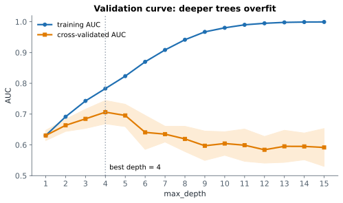

# Lesson 19: Tuning hyperparameters

**You'll learn:** hyperparameters, validation curves, GridSearchCV, step__parameter names, best_params_ and best_score_, refit, cv_results_, C in logistic regression, RandomizedSearchCV, nested CV.

▶ **Practise this lesson in the [sandbox](https://kishoremadanagopal.github.io/learning/ml/#tuning)**: run every example and check your exercise answers.

## Key terms

- **Tuning:** searching for the hyperparameter values that give the best validation score.
- **Validation curve:** training and validation scores plotted against one hyperparameter.
- **GridSearchCV:** tries every combination of the listed hyperparameter values with cross-validation.
- **RandomizedSearchCV:** tries a fixed number of random combinations; faster for big search spaces.
- **Parameter grid:** a dictionary of hyperparameter names and the values to try.
- **best_params_:** the winning hyperparameter values of a search.
- **best_score_:** the winning mean cross-validation score.
- **best_estimator_:** the model refitted on all the training data with the best settings.
- **refit:** retraining the best setting on the whole training set after the search (on by default).
- **C:** logistic regression's regularisation setting: smaller C means a stronger penalty.
- **Nested cross-validation:** a search inside each round of an outer CV, for an honest estimate of the whole tuning process.

Every model has settings you choose: `n_neighbors`, `max_depth`, `alpha`, `C`, `learning_rate`. These **hyperparameters** often matter as much as the choice of model. **Tuning** means trying different values and keeping the best, judged by cross-validation.

## A validation curve

Before searching, it helps to **see** how one setting affects training and validation scores:



```python
import pandas as pd
from sklearn.model_selection import validation_curve
from sklearn.tree import DecisionTreeClassifier

churn = pd.read_csv("churn.csv")
X = churn[["tenure_months", "monthly_charge", "support_calls", "data_gb"]]
y = churn["churned"]

depths = [1, 2, 3, 4, 5, 6, 8, 10, 15]
train_scores, val_scores = validation_curve(
    DecisionTreeClassifier(random_state=0), X, y,
    param_name="max_depth", param_range=depths, cv=5, scoring="roc_auc")

for d, tr, va in zip(depths, train_scores.mean(axis=1), val_scores.mean(axis=1)):
    print(f"max_depth={d:>2}  train AUC {tr:.3f}  validation AUC {va:.3f}")
```

It's the complexity curve from Lesson 7, measured with cross-validation: the validation score peaks at a middle depth, then overfitting sets in.

## GridSearchCV: try every combination

`GridSearchCV` tries **every combination** of the values you list, scores each with cross-validation, and keeps the best. Inside a pipeline, name parameters as **`step__parameter`** (two underscores):

```python
import pandas as pd
from sklearn.model_selection import train_test_split, GridSearchCV
from sklearn.pipeline import Pipeline
from sklearn.preprocessing import StandardScaler
from sklearn.neighbors import KNeighborsClassifier

fruit = pd.read_csv("fruit.csv")
X_train, X_test, y_train, y_test = train_test_split(
    fruit[["width_cm", "height_cm", "weight_g"]], fruit["fruit"], test_size=0.25, random_state=0, stratify=fruit["fruit"])

pipe = Pipeline([("scale", StandardScaler()), ("knn", KNeighborsClassifier())])
grid = {
    "knn__n_neighbors": [1, 3, 5, 7, 9, 15, 25],
    "knn__weights": ["uniform", "distance"],      # "distance": closer neighbours get a bigger vote
}
search = GridSearchCV(pipe, grid, cv=5, scoring="accuracy")
search.fit(X_train, y_train)

print("best settings:", search.best_params_)
print("best CV accuracy:", round(search.best_score_, 3))
print("test accuracy:   ", round(search.score(X_test, y_test), 3))
```

7 × 2 = 14 combinations × 5 folds = 70 fits, done for you. Then:

- `best_params_` and `best_score_` (the best **mean CV** score) tell you what won.
- By default the search **refits** the winning settings on the whole training set, so `search` itself is the final model: `search.predict(...)` and `search.score(...)` use it. `search.best_estimator_` is that refitted pipeline.
- The test score is checked **once**, at the end. It may be a bit lower than the CV score: the best CV score is slightly optimistic, because it was the maximum of many tries.

`search.cv_results_` holds every combination's scores; it reads nicely as a DataFrame:

```python
import pandas as pd
from sklearn.model_selection import GridSearchCV
from sklearn.compose import ColumnTransformer
from sklearn.preprocessing import OneHotEncoder, StandardScaler
from sklearn.impute import SimpleImputer
from sklearn.pipeline import Pipeline, make_pipeline
from sklearn.linear_model import LogisticRegression

churn = pd.read_csv("churn.csv")
X = churn.drop(columns=["customer_id", "churned"])
y = churn["churned"]
numeric = ["tenure_months", "monthly_charge", "support_calls", "age", "data_gb"]
prep = ColumnTransformer([
    ("num", make_pipeline(SimpleImputer(strategy="median"), StandardScaler()), numeric),
    ("cat", OneHotEncoder(handle_unknown="ignore"), ["contract", "plan"]),
])
pipe = Pipeline([("prep", prep), ("model", LogisticRegression(max_iter=1000))])

search = GridSearchCV(pipe, {"model__C": [0.001, 0.01, 0.1, 1, 10, 100]}, cv=5, scoring="roc_auc").fit(X, y)
results = pd.DataFrame(search.cv_results_)[["param_model__C", "mean_test_score", "std_test_score"]]
print(results.round(3))
```

For logistic regression, **`C`** is the regularisation knob, but **backwards** from Ridge's `alpha`: `C` is 1 ÷ penalty strength, so **small C = strong penalty = simpler model**. Very small C (0.001) shrinks everything and underfits; from about C = 0.1 upward the score levels off.

## RandomizedSearchCV: when the grid is huge

A grid with 4 settings of 5 values each is 5⁴ = 625 combinations, times 5 folds. `RandomizedSearchCV` instead tries a fixed number (`n_iter`) of **random** combinations. It finds nearly-as-good settings much faster, and it's the usual choice for models with many hyperparameters, like gradient boosting:

```python
import pandas as pd
from sklearn.model_selection import RandomizedSearchCV
from sklearn.ensemble import HistGradientBoostingClassifier

churn = pd.read_csv("churn.csv")
X = pd.get_dummies(churn.drop(columns=["customer_id", "churned"]), dtype=int)
y = churn["churned"]

space = {
    "learning_rate": [0.01, 0.03, 0.05, 0.1, 0.2],
    "max_depth": [2, 3, 4, 6, None],
    "max_iter": [100, 200, 400],
    "min_samples_leaf": [10, 20, 40],
}
search = RandomizedSearchCV(HistGradientBoostingClassifier(random_state=0), space, n_iter=12, cv=5,
                            scoring="roc_auc", random_state=0)
search.fit(X, y)
print(search.best_params_)
print("best CV AUC:", round(search.best_score_, 3))
```

12 random tries out of 225 possible combinations. (This one takes about 10 seconds in the browser: 60 models are trained.)

## Good habits

- Tune on the **training** set with CV. Touch the test set once.
- Start **coarse** (0.001, 0.01, 0.1, 1, 10), then zoom in around the best value.
- Don't chase tiny CV differences: within the wobble, prefer the simpler setting.
- If you must report a really honest estimate of "tuning + model" together, **nested cross-validation** wraps the whole search inside another CV loop.

## Common mistakes

- Tuning on the test set, then reporting the test score as if it were unseen.
- Writing parameter names without the step prefix in a pipeline grid (use "model__C", not "C").
- Making grids so large the search takes hours; use RandomizedSearchCV or a coarse grid first.
- Reading C like alpha. They work in opposite directions.

## Exercises

### 1. Grid search a tree

Use `GridSearchCV` with 5 folds and `scoring="roc_auc"` to tune a `DecisionTreeClassifier(random_state=0)` on the churn training data, trying `max_depth` in [2, 3, 4, 5, 6] and `min_samples_leaf` in [1, 10, 30]. Call it `search`. Store the best settings in `best_params` and the **test** AUC of the refitted best tree in `test_auc`.

Starter code:

```python
import pandas as pd
from sklearn.model_selection import train_test_split, GridSearchCV
from sklearn.tree import DecisionTreeClassifier
from sklearn.metrics import roc_auc_score

churn = pd.read_csv("churn.csv")
X = churn[["tenure_months", "monthly_charge", "support_calls", "data_gb"]]
y = churn["churned"]
X_train, X_test, y_train, y_test = train_test_split(X, y, test_size=0.25, random_state=0, stratify=y)

```

### 2. Tune alpha

Tune the Ridge penalty for the wiggly degree-10 energy model. Search `model__alpha` over [0.001, 0.01, 0.1, 1, 10] with `GridSearchCV(pipe, ..., cv=5, scoring="neg_root_mean_squared_error")` on the training data. Store the best alpha in `best_alpha` and the **test** RMSE of the refitted search in `test_rmse` (a positive number).

Starter code:

```python
import pandas as pd
from sklearn.model_selection import train_test_split, GridSearchCV
from sklearn.pipeline import Pipeline
from sklearn.preprocessing import PolynomialFeatures, StandardScaler
from sklearn.linear_model import Ridge
from sklearn.metrics import root_mean_squared_error

energy = pd.read_csv("energy.csv")
X_train, X_test, y_train, y_test = train_test_split(
    energy[["temperature_c"]], energy["energy_kwh"], test_size=0.3, random_state=1)
pipe = Pipeline([("poly", PolynomialFeatures(10)), ("scale", StandardScaler()), ("model", Ridge())])

```

**In the sandbox:** exercises 37–38. Press **Check** to test your answer.

<details>
<summary>Hints</summary>

1. After `search.fit(X_train, y_train)`, `search.best_params_` holds the winner and `search.predict_proba(X_test)` uses the refitted best tree.
2. The parameter name is `"model__alpha"` because the Ridge step is called `"model"`. Compute the test RMSE with `root_mean_squared_error(y_test, search.predict(X_test))`.

</details>

<details>
<summary>Answers</summary>

**1. Grid search a tree**

```python
import pandas as pd
from sklearn.model_selection import train_test_split, GridSearchCV
from sklearn.tree import DecisionTreeClassifier
from sklearn.metrics import roc_auc_score

churn = pd.read_csv("churn.csv")
X = churn[["tenure_months", "monthly_charge", "support_calls", "data_gb"]]
y = churn["churned"]
X_train, X_test, y_train, y_test = train_test_split(X, y, test_size=0.25, random_state=0, stratify=y)

grid = {"max_depth": [2, 3, 4, 5, 6], "min_samples_leaf": [1, 10, 30]}
search = GridSearchCV(DecisionTreeClassifier(random_state=0), grid, cv=5, scoring="roc_auc")
search.fit(X_train, y_train)
best_params = search.best_params_
test_auc = roc_auc_score(y_test, search.predict_proba(X_test)[:, 1])
print(best_params, round(search.best_score_, 3), round(test_auc, 3))
```

**2. Tune alpha**

```python
import pandas as pd
from sklearn.model_selection import train_test_split, GridSearchCV
from sklearn.pipeline import Pipeline
from sklearn.preprocessing import PolynomialFeatures, StandardScaler
from sklearn.linear_model import Ridge
from sklearn.metrics import root_mean_squared_error

energy = pd.read_csv("energy.csv")
X_train, X_test, y_train, y_test = train_test_split(
    energy[["temperature_c"]], energy["energy_kwh"], test_size=0.3, random_state=1)
pipe = Pipeline([("poly", PolynomialFeatures(10)), ("scale", StandardScaler()), ("model", Ridge())])

search = GridSearchCV(pipe, {"model__alpha": [0.001, 0.01, 0.1, 1, 10]}, cv=5, scoring="neg_root_mean_squared_error")
search.fit(X_train, y_train)
best_alpha = search.best_params_["model__alpha"]
test_rmse = root_mean_squared_error(y_test, search.predict(X_test))
print(best_alpha, round(-search.best_score_, 1), round(test_rmse, 1))
```

</details>

## Quick quiz

1. In a pipeline with a step named "knn", how do you name its n_neighbors in a grid?
   - A) "knn__n_neighbors"
   - B) "n_neighbors"
   - C) "knn.n_neighbors"

2. What does GridSearchCV do after finding the best settings (by default)?
   - A) Refits a model with those settings on the whole training set
   - B) Deletes the other models and stops
   - C) Scores the test set automatically

3. Why is best_score_ usually a little optimistic?
   - A) It's the maximum of many CV scores, so some luck is baked in
   - B) It's computed on training data
   - C) It includes the test set

4. For LogisticRegression, a smaller C means:
   - A) A stronger penalty and a simpler model
   - B) A weaker penalty
   - C) More iterations

<details>
<summary>Quiz answers</summary>

1. **A) "knn__n_neighbors"**: Step name, two underscores, parameter name.
2. **A) Refits a model with those settings on the whole training set**: refit=True means the search object becomes the final model.
3. **A) It's the maximum of many CV scores, so some luck is baked in**: Picking the best of many tries favours the luckiest one a bit. The test set gives the honest final number.
4. **A) A stronger penalty and a simpler model**: C is the inverse of the penalty strength, the opposite direction from Ridge's alpha.

</details>

---
Previous: [Lesson 18](18-cross-validation.md) · Next: [Lesson 20: Clustering with k-means](20-kmeans.md)
