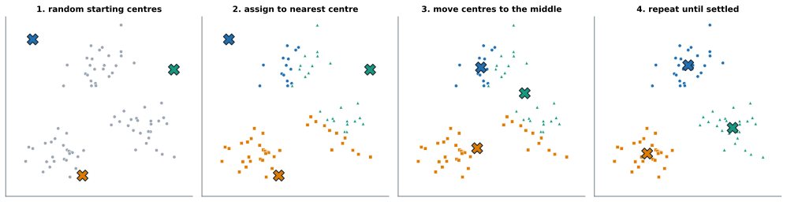
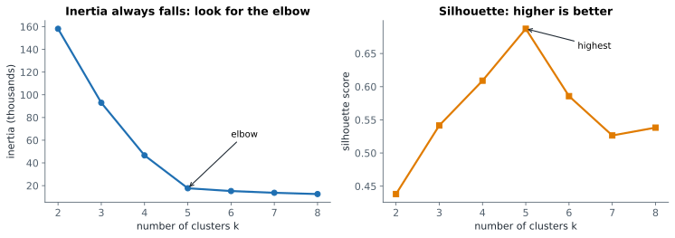

# Lesson 20: Clustering with k-means

**You'll learn:** clustering without labels, the k-means steps, centroids, fit_predict, inertia and the elbow, silhouette score, describing clusters, scaling, limits of k-means.

▶ **Practise this lesson in the [sandbox](https://kishoremadanagopal.github.io/learning/ml/#kmeans)**: run every example and check your exercise answers.

## Key terms

- **Clustering:** grouping similar rows without any labels.
- **Customer segmentation:** clustering customers into groups that behave alike, so each can be treated differently.
- **k-means:** a clustering method that alternates between assigning rows to the nearest centre and moving each centre to the average of its rows.
- **Centroid:** the centre of a cluster: the average of its rows.
- **n_init:** how many random starts k-means tries, keeping the best.
- **fit_predict:** fits a clustering model and returns each row's cluster number.
- **Inertia:** the total squared distance from each row to its cluster centre; lower means tighter clusters.
- **Elbow method:** choosing k where adding more clusters stops reducing inertia much.
- **Silhouette score:** from −1 to 1, how much closer rows are to their own cluster than to the nearest other one.
- **Cluster profile:** the average of each feature within each cluster, used to describe what the cluster means.
- **DBSCAN:** a clustering method that finds groups of any shape and can leave odd points unassigned.

So far every dataset had answers to learn from. Often you don't: a shop has customers but no list of "customer types". **Clustering** finds groups of similar rows by itself. Marketing teams use it for **customer segments**; it's also used to group documents, products or sensor readings.

The `shoppers.csv` file has 200 customers with their income, a **spending score** (1–100, how much they spend relative to others), age and visits per month. No labels.

```python
import pandas as pd
import matplotlib.pyplot as plt

shoppers = pd.read_csv("shoppers.csv")
print(shoppers.head())

plt.scatter(shoppers["annual_income_k"], shoppers["spending_score"])
plt.xlabel("annual income (thousands)")
plt.ylabel("spending score")
plt.title("200 shoppers: can you see the groups?")
plt.show()
```

Your eye picks out about five blobs. k-means finds them with arithmetic.

## How k-means works

You choose **k**, the number of clusters. Then:

1. Place k **centres** (centroids) at random points.
2. **Assign** every row to its nearest centre.
3. **Move** each centre to the average of the rows assigned to it.
4. Repeat steps 2 and 3 until nothing changes.



Because the start is random, different starts can end in different groupings. `n_init=10` runs it 10 times and keeps the best (the tightest clusters); `random_state` makes it repeatable.

```python
import pandas as pd
import matplotlib.pyplot as plt
from sklearn.cluster import KMeans

shoppers = pd.read_csv("shoppers.csv")
X = shoppers[["annual_income_k", "spending_score"]]

kmeans = KMeans(n_clusters=5, n_init=10, random_state=0)
shoppers["cluster"] = kmeans.fit_predict(X)

print(shoppers["cluster"].value_counts().sort_index())
print(pd.DataFrame(kmeans.cluster_centers_, columns=X.columns).round(1))

plt.scatter(X["annual_income_k"], X["spending_score"], c=shoppers["cluster"], cmap="tab10")
plt.scatter(kmeans.cluster_centers_[:, 0], kmeans.cluster_centers_[:, 1], marker="X", s=200, color="black")
plt.xlabel("annual income (thousands)")
plt.ylabel("spending score")
plt.title("Five shopper segments")
plt.show()
```

`fit_predict` fits and returns each row's cluster number. There's no `y` anywhere: that's what makes it unsupervised. The cluster numbers (0 to 4) are just names, in no particular order.

## Choosing k

There's no test set to tell you the right k. Two common guides:

- **Inertia** (the elbow method): the total squared distance from each row to its centre. It always falls as k grows (more centres, shorter distances), so look for the **elbow**, where adding clusters stops helping much.
- **Silhouette score** (−1 to 1): how much closer each row is to its own cluster than to the next nearest one. Higher is better.



```python
import pandas as pd
from sklearn.cluster import KMeans
from sklearn.metrics import silhouette_score

shoppers = pd.read_csv("shoppers.csv")
X = shoppers[["annual_income_k", "spending_score"]]

for k in range(2, 9):
    km = KMeans(n_clusters=k, n_init=10, random_state=0).fit(X)
    print(f"k={k}  inertia {km.inertia_:>8.0f}   silhouette {silhouette_score(X, km.labels_):.3f}")
```

Both agree on **k = 5** here. Real data is rarely this tidy; often the "right" k is the one whose groups are **useful** and **explainable** to the people who'll act on them.

## Describe the clusters

A cluster is only useful once you can say what it **means**. Average each feature per cluster, including features you didn't cluster on:

```python
import pandas as pd
from sklearn.cluster import KMeans

shoppers = pd.read_csv("shoppers.csv")
X = shoppers[["annual_income_k", "spending_score"]]
shoppers["cluster"] = KMeans(n_clusters=5, n_init=10, random_state=0).fit_predict(X)

profile = shoppers.groupby("cluster")[["annual_income_k", "spending_score", "age", "visits_per_month"]].mean().round(1)
profile["customers"] = shoppers["cluster"].value_counts().sort_index()
print(profile)
```

Now you can name them: high earners who spend a lot (and visit often), high earners who spend little (older, rarely visit: a group worth winning over), younger lower-income big spenders, careful low-income spenders, and a large middle group. Age and visits weren't used for clustering, yet they differ between groups: a sign the segments are real.

## Scale when features differ

k-means uses distances, so like KNN it needs **scaled** features when units differ. Income (12–108) and spending score (1–99) happen to have similar ranges, which is why the example above worked unscaled. Add age and visits (0–12) and you should scale:

```python
import pandas as pd
from sklearn.pipeline import make_pipeline
from sklearn.preprocessing import StandardScaler
from sklearn.cluster import KMeans

shoppers = pd.read_csv("shoppers.csv")
X = shoppers[["annual_income_k", "spending_score", "age", "visits_per_month"]]

model = make_pipeline(StandardScaler(), KMeans(n_clusters=5, n_init=10, random_state=0))
shoppers["cluster"] = model.fit_predict(X)
print(shoppers.groupby("cluster")[X.columns].mean().round(1))
```

## Limits of k-means

- You must choose k.
- It assumes roundish, similar-sized blobs. Long, curved or very uneven groups confuse it (`DBSCAN` and `AgglomerativeClustering` in scikit-learn handle other shapes).
- Every row is forced into some cluster, even a strange one that fits nowhere.

## Common mistakes

- Clustering unscaled features with very different units.
- Picking the k with the lowest inertia. It always falls as k grows.
- Treating cluster numbers as meaningful order or as labels that stay the same between runs.
- Stopping at "we found 5 clusters" without describing what each one is.

## Exercises

### 1. Segment the shoppers

Cluster the shoppers on `annual_income_k` and `spending_score` (unscaled) with `KMeans(n_clusters=4, n_init=10, random_state=1)`. Store the model in `km`, each row's cluster in a new column `shoppers["segment"]`, and the model's inertia in `inertia`.

Starter code:

```python
import pandas as pd
from sklearn.cluster import KMeans

shoppers = pd.read_csv("shoppers.csv")
X = shoppers[["annual_income_k", "spending_score"]]

```

### 2. Pick k by silhouette

For the **scaled** four-feature shopper data below, try k from 2 to 7 with `KMeans(n_clusters=k, n_init=10, random_state=0)`. Store a dictionary `sil` mapping each k to its silhouette score (computed on the **scaled** data), and the k with the highest score in `best_k`.

Starter code:

```python
import pandas as pd
from sklearn.preprocessing import StandardScaler
from sklearn.cluster import KMeans
from sklearn.metrics import silhouette_score

shoppers = pd.read_csv("shoppers.csv")
X_scaled = StandardScaler().fit_transform(shoppers[["annual_income_k", "spending_score", "age", "visits_per_month"]])

```

**In the sandbox:** exercises 39–40. Press **Check** to test your answer.

<details>
<summary>Hints</summary>

1. `km.fit_predict(X)` returns the cluster numbers; after fitting, `km.inertia_` holds the inertia.
2. `silhouette_score(X_scaled, labels)` needs the same data the clusters were made from, plus the labels.

</details>

<details>
<summary>Answers</summary>

**1. Segment the shoppers**

```python
import pandas as pd
from sklearn.cluster import KMeans

shoppers = pd.read_csv("shoppers.csv")
X = shoppers[["annual_income_k", "spending_score"]]

km = KMeans(n_clusters=4, n_init=10, random_state=1)
shoppers["segment"] = km.fit_predict(X)
inertia = km.inertia_
print(shoppers["segment"].value_counts(), round(inertia))
```

**2. Pick k by silhouette**

```python
import pandas as pd
from sklearn.preprocessing import StandardScaler
from sklearn.cluster import KMeans
from sklearn.metrics import silhouette_score

shoppers = pd.read_csv("shoppers.csv")
X_scaled = StandardScaler().fit_transform(shoppers[["annual_income_k", "spending_score", "age", "visits_per_month"]])

sil = {}
for k in range(2, 8):
    labels = KMeans(n_clusters=k, n_init=10, random_state=0).fit_predict(X_scaled)
    sil[k] = silhouette_score(X_scaled, labels)
best_k = max(sil, key=sil.get)
print({k: round(v, 3) for k, v in sil.items()}, best_k)
```

</details>

## Quick quiz

1. What makes k-means "unsupervised"?
   - A) It groups rows without any labels to learn from
   - B) It runs without supervision from the programmer
   - C) It needs no data

2. What happens to inertia as k increases?
   - A) It always goes down, so you look for the elbow instead of the minimum
   - B) It always goes up
   - C) It's lowest at the right k

3. Why scale features before k-means?
   - A) It uses distances, so features in bigger units would dominate the grouping
   - B) k-means only accepts values between 0 and 1
   - C) Scaling chooses k automatically

4. You've found 5 clusters. What's the next essential step?
   - A) Describe each cluster (averages of the features) so people can understand and act on it
   - B) Delete the smallest cluster
   - C) Compute accuracy against the labels

<details>
<summary>Quiz answers</summary>

1. **A) It groups rows without any labels to learn from**: There's no y: the model only looks at the features.
2. **A) It always goes down, so you look for the elbow instead of the minimum**: More centres always mean shorter distances. At k = number of rows, inertia is 0.
3. **A) It uses distances, so features in bigger units would dominate the grouping**: Same reason as KNN.
4. **A) Describe each cluster (averages of the features) so people can understand and act on it**: Unlabelled groups are only useful once you can explain them.

</details>

---
Previous: [Lesson 19](19-tuning.md) · Next: [Lesson 21: Dimensionality reduction with PCA](21-pca.md)
