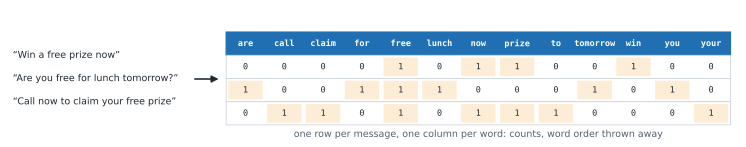

# Lesson 22: Classifying text

**You'll learn:** bag of words, CountVectorizer, vocabulary and document-term matrix, sparse matrices, stop words and n-grams, TF-IDF, Naive Bayes, a spam filter, top words, embeddings and LLMs.

▶ **Practise this lesson in the [sandbox](https://kishoremadanagopal.github.io/learning/ml/#text-classification)**: run every example and check your exercise answers.

## Key terms

- **Bag of words:** representing a text by how many times each word appears, ignoring the order.
- **Vocabulary:** all the distinct words a vectorizer learned from the training texts.
- **Document-term matrix:** a table with one row per text and one column per word, holding counts or weights.
- **CountVectorizer:** turns texts into word counts.
- **TfidfVectorizer:** turns texts into TF-IDF weights.
- **TF-IDF:** term frequency × inverse document frequency: a word's count, scaled down if it appears in many texts.
- **Stop words:** very common words (the, a, to) often removed because they carry little meaning.
- **n-gram:** a run of n neighbouring words, such as "free prize" (a 2-gram, or bigram).
- **Naive Bayes:** a fast probabilistic classifier that combines how likely each word is in each class.
- **Embedding:** a list of numbers produced by a language model that captures a text's meaning; similar meanings get similar numbers.
- **Large language model (LLM):** a very large model trained on text that can follow instructions, such as labelling a message.
- **Evals:** tests that measure how well an AI system (such as an LLM) performs, using held-out labelled examples.

Models need numbers, but much of the world's data is text: emails, reviews, support tickets. The classic way to turn text into numbers is the **bag of words**: count how often each word appears, and ignore the order.



## CountVectorizer

```python
from sklearn.feature_extraction.text import CountVectorizer

messages = [
    "Win a free prize now",
    "Are you free for lunch tomorrow?",
    "Call now to claim your free prize",
]
vectorizer = CountVectorizer()
counts = vectorizer.fit_transform(messages)

print(vectorizer.get_feature_names_out())
print(counts.toarray())
```

`fit` learns the **vocabulary** (every distinct word in the training texts, lower-cased, punctuation removed); `transform` counts them. The result is a **document-term matrix**: one row per message, one column per word. It's **sparse** (mostly zeros), so scikit-learn stores only the non-zero counts; `.toarray()` shows it in full. Words that weren't in the training vocabulary are simply ignored at prediction time.

Useful options:

- `stop_words="english"` drops very common words (the, a, to…).
- `ngram_range=(1, 2)` also counts **pairs** of neighbouring words ("free prize", "call now"), which keeps a little word order.
- `min_df=2` ignores words that appear in fewer than 2 messages.

## TF-IDF

Plain counts give common words a lot of weight. **TF-IDF** (term frequency × inverse document frequency) scales each count down if the word appears in many messages, so distinctive words stand out. `TfidfVectorizer` works exactly like `CountVectorizer`; it's usually the better default.

## A spam filter

`messages.csv` has 400 text messages labelled `spam` or `ham` (normal). The vectorizer goes in a pipeline like any other transformer, and the pipeline takes raw text:

```python
import pandas as pd
from sklearn.model_selection import train_test_split
from sklearn.feature_extraction.text import TfidfVectorizer
from sklearn.linear_model import LogisticRegression
from sklearn.naive_bayes import MultinomialNB
from sklearn.feature_extraction.text import CountVectorizer
from sklearn.pipeline import make_pipeline
from sklearn.metrics import confusion_matrix

data = pd.read_csv("messages.csv")
print(data["label"].value_counts())
X_train, X_test, y_train, y_test = train_test_split(
    data["text"], data["label"], test_size=0.25, random_state=0, stratify=data["label"])

for name, model in [("Naive Bayes + counts", make_pipeline(CountVectorizer(), MultinomialNB())),
                    ("LogisticRegression + TF-IDF", make_pipeline(TfidfVectorizer(), LogisticRegression()))]:
    model.fit(X_train, y_train)
    print(f"{name}: accuracy {model.score(X_test, y_test):.3f}")
    print(confusion_matrix(y_test, model.predict(X_test), labels=["ham", "spam"]))
```

Note that `X` here is a **single column of text** (`data["text"]`, one pair of brackets): text vectorizers expect a list of strings, not a table.

**Naive Bayes** is a classic, very fast text model: it learns how likely each word is in spam and in ham, and combines those probabilities (it "naively" treats words as independent, which works surprisingly well). Both models do extremely well here, because spam messages use quite different words from normal ones.

## Which words give spam away?

For a linear model on TF-IDF, each word gets a coefficient: positive pushes towards spam, negative towards ham.

```python
import pandas as pd
from sklearn.model_selection import train_test_split
from sklearn.feature_extraction.text import TfidfVectorizer
from sklearn.linear_model import LogisticRegression
from sklearn.pipeline import make_pipeline

data = pd.read_csv("messages.csv")
X_train, X_test, y_train, y_test = train_test_split(
    data["text"], data["label"], test_size=0.25, random_state=0, stratify=data["label"])
model = make_pipeline(TfidfVectorizer(), LogisticRegression()).fit(X_train, y_train)

words = pd.Series(model[-1].coef_[0], index=model[0].get_feature_names_out()).sort_values()
print("most 'ham' words: ", words.head(6).index.tolist())
print("most 'spam' words:", words.tail(6).index.tolist())

new = ["Congratulations! You won a free cruise, call now",
       "Are you free for lunch tomorrow?",
       "Your parcel fee is unpaid, pay at www.post-fee.biz"]
for text, p in zip(new, model.predict_proba(new)[:, 1]):
    print(f"{p:.2f}  {text}")
```

("spam" comes after "ham" alphabetically, so column 1 of `predict_proba` is the spam probability.) The first new message is only borderline (about 0.5), even though a person would call it spam at once. Words like "free" and "won" also appear in normal messages here ("Are you free…", "We won the quiz…"), and "cruise" and "congratulations" never appeared in a training spam message, so the model can't use them. A bag of words only knows the words it has seen.

## Beyond bag-of-words: embeddings and LLMs (2026)

Bag-of-words ignores meaning: "cheap" and "inexpensive" are unrelated columns, and "not good" looks a lot like "good". Modern systems usually go further:

| Approach | How it works | Strengths | Costs |
|---|---|---|---|
| **Bag-of-words / TF-IDF + linear model** | count words, as in this lesson | fast, cheap, explainable, runs anywhere | misses meaning and word order |
| **Embeddings + classic model** | a pre-trained language model turns each text into a vector of numbers that captures meaning; then train logistic regression on those vectors | understands synonyms and phrasing; needs fewer labels | needs an embedding model (a library or an API) |
| **Ask an LLM** | describe the categories in a prompt and let a large language model label each text, with no training | no labelled data needed to start; handles new categories easily | slower and costlier per message; must be checked carefully |

Whichever you use, the rules from this course stay the same: hold out labelled test examples, measure precision and recall, watch for leakage, and compare against a simple baseline. Evaluating LLM systems this way is called running **evals**, and it's a core skill for AI engineers.

## Common mistakes

- Passing a DataFrame with double brackets to a text vectorizer. It wants one column of strings: df["text"].
- Fitting the vectorizer on all texts before splitting. Its vocabulary must come from the training texts (use a pipeline).
- Expecting a bag-of-words model to understand synonyms or negation.

## Exercises

### 1. Count the words

Use a `CountVectorizer` called `vectorizer` on the four `reviews` below. Store the document-term matrix as a normal (dense) array in `matrix`, and the number of distinct words in the vocabulary in `n_words`.

Starter code:

```python
from sklearn.feature_extraction.text import CountVectorizer

reviews = [
    "Great phone, great battery",
    "Battery died after a week",
    "Great value for money",
    "The screen cracked after a day",
]

```

### 2. Your own spam filter

Build `model = make_pipeline(TfidfVectorizer(ngram_range=(1, 2)), MultinomialNB())`, fit it on the training messages, and store its test accuracy in `acc`. Then store its prediction (`"spam"` or `"ham"`) for the message `"Claim your FREE gift card now, text WIN to 80082"` in `verdict`.

Starter code:

```python
import pandas as pd
from sklearn.model_selection import train_test_split
from sklearn.feature_extraction.text import TfidfVectorizer
from sklearn.naive_bayes import MultinomialNB
from sklearn.pipeline import make_pipeline

data = pd.read_csv("messages.csv")
X_train, X_test, y_train, y_test = train_test_split(
    data["text"], data["label"], test_size=0.3, random_state=2, stratify=data["label"])

```

**In the sandbox:** exercises 43–44. Press **Check** to test your answer.

<details>
<summary>Hints</summary>

1. `fit_transform` returns a sparse matrix; `.toarray()` turns it into a normal array. Notice that the single letter "a" isn't in the vocabulary: by default, words need at least two characters.
2. predict wants a list of texts, even for one message: `model.predict(["..."])[0]`.

</details>

<details>
<summary>Answers</summary>

**1. Count the words**

```python
from sklearn.feature_extraction.text import CountVectorizer

reviews = [
    "Great phone, great battery",
    "Battery died after a week",
    "Great value for money",
    "The screen cracked after a day",
]
vectorizer = CountVectorizer()
matrix = vectorizer.fit_transform(reviews).toarray()
n_words = len(vectorizer.get_feature_names_out())
print(vectorizer.get_feature_names_out())
print(matrix)
print(n_words)
```

**2. Your own spam filter**

```python
import pandas as pd
from sklearn.model_selection import train_test_split
from sklearn.feature_extraction.text import TfidfVectorizer
from sklearn.naive_bayes import MultinomialNB
from sklearn.pipeline import make_pipeline

data = pd.read_csv("messages.csv")
X_train, X_test, y_train, y_test = train_test_split(
    data["text"], data["label"], test_size=0.3, random_state=2, stratify=data["label"])

model = make_pipeline(TfidfVectorizer(ngram_range=(1, 2)), MultinomialNB()).fit(X_train, y_train)
acc = model.score(X_test, y_test)
verdict = model.predict(["Claim your FREE gift card now, text WIN to 80082"])[0]
print(round(acc, 3), verdict)
```

</details>

## Quick quiz

1. What does a bag-of-words representation keep?
   - A) How many times each word appears in each text
   - B) The order of the words
   - C) The meaning of each sentence

2. Why does TF-IDF often beat raw counts?
   - A) It down-weights words that appear in many texts, so distinctive words count more
   - B) It translates the text
   - C) It keeps word order

3. A word that never appeared in training shows up in a new message. A CountVectorizer pipeline will:
   - A) Ignore it
   - B) Crash
   - C) Add a new column automatically

4. You use an LLM to label support tickets. How should you check it?
   - A) Compare its labels with human labels on held-out tickets, using precision and recall
   - B) Trust it because LLMs are accurate
   - C) Measure how fast it answers

<details>
<summary>Quiz answers</summary>

1. **A) How many times each word appears in each text**: It counts words and throws the order away.
2. **A) It down-weights words that appear in many texts, so distinctive words count more**: Common words carry little information about the class.
3. **A) Ignore it**: The vocabulary is fixed at fit time.
4. **A) Compare its labels with human labels on held-out tickets, using precision and recall**: Same rules as any model: test on labelled examples it wasn't tuned on. That's an eval.

</details>

---
Previous: [Lesson 21](21-pca.md) · Next: [Lesson 23: From model to product, responsibly](23-model-to-product.md)
