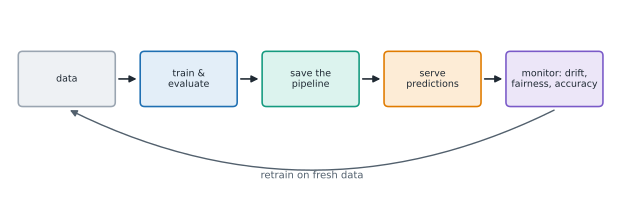

# Lesson 23: From model to product, responsibly

**You'll learn:** saving and loading pipelines with joblib, version and security warnings, serving predictions, data and concept drift, monitoring, fairness per group and proxies, model cards, classic ML vs LLMs.

▶ **Practise this lesson in the [sandbox](https://kishoremadanagopal.github.io/learning/ml/#model-to-product)**: run every example and check your exercise answers.

## Key terms

- **joblib:** a library that saves Python objects, such as fitted pipelines, to files and loads them back.
- **Serialisation:** saving an object to a file or bytes so it can be loaded later.
- **Serving:** making a model's predictions available to other software, often as a web API.
- **FastAPI:** a popular Python library for building web APIs, often used to serve models.
- **Data drift:** a change in the input data compared with the training data.
- **Concept drift:** a change in the relationship between features and the label.
- **Monitoring:** tracking a live model's inputs, predictions and accuracy over time.
- **Retraining:** fitting the model again on fresher data.
- **Fairness:** a model working comparably well for different groups of people.
- **Proxy:** a feature that indirectly reveals another one, such as a postcode standing in for ethnicity or income.
- **Model card:** a short document describing a model's intended use, data, performance, groups checked and limits.
- **EU AI Act:** the European Union's law setting rules for AI systems according to their risk.

A model in a notebook helps nobody. To be useful it has to be **saved**, **served** (made available to other software), **monitored**, and **trusted**. This lesson walks through each step.



## Saving and loading a pipeline

Save the **whole pipeline**, not just the model, so the preparation steps travel with it. `joblib` comes with scikit-learn:

```python
import joblib
import pandas as pd
from sklearn.compose import ColumnTransformer
from sklearn.preprocessing import OneHotEncoder, StandardScaler
from sklearn.impute import SimpleImputer
from sklearn.pipeline import Pipeline, make_pipeline
from sklearn.linear_model import LogisticRegression

churn = pd.read_csv("churn.csv")
X = churn.drop(columns=["customer_id", "churned"])
numeric = ["tenure_months", "monthly_charge", "support_calls", "age", "data_gb"]
prep = ColumnTransformer([
    ("num", make_pipeline(SimpleImputer(strategy="median"), StandardScaler()), numeric),
    ("cat", OneHotEncoder(handle_unknown="ignore"), ["contract", "plan"]),
])
pipe = Pipeline([("prep", prep), ("model", LogisticRegression())]).fit(X, churn["churned"])

joblib.dump(pipe, "churn_model.joblib")            # save to a file
loaded = joblib.load("churn_model.joblib")         # later, maybe on another computer

print(loaded.predict_proba(X.head(3))[:, 1].round(3))
print(pipe.predict_proba(X.head(3))[:, 1].round(3))
```

Two warnings:

- **Load with the same scikit-learn version** you saved with (here 1.8). Record the version next to the file.
- **Never load a model file from someone you don't trust.** joblib and pickle files can run code when loaded. The `skops` library offers a safer format for sharing.

## Serving predictions

In production, a model usually sits behind a small function or web service (for example, built with **FastAPI**): other software sends a customer's details and gets a probability back. The heart of it is just this:

```python
import joblib
import pandas as pd
from sklearn.compose import ColumnTransformer
from sklearn.preprocessing import OneHotEncoder, StandardScaler
from sklearn.impute import SimpleImputer
from sklearn.pipeline import Pipeline, make_pipeline
from sklearn.linear_model import LogisticRegression

churn = pd.read_csv("churn.csv")
X = churn.drop(columns=["customer_id", "churned"])
numeric = ["tenure_months", "monthly_charge", "support_calls", "age", "data_gb"]
prep = ColumnTransformer([
    ("num", make_pipeline(SimpleImputer(strategy="median"), StandardScaler()), numeric),
    ("cat", OneHotEncoder(handle_unknown="ignore"), ["contract", "plan"]),
])
joblib.dump(Pipeline([("prep", prep), ("model", LogisticRegression())]).fit(X, churn["churned"]), "churn_model.joblib")

MODEL = joblib.load("churn_model.joblib")           # load once, when the service starts

def churn_risk(customer: dict) -> float:
    """Return the probability that one customer leaves."""
    row = pd.DataFrame([customer])
    return float(MODEL.predict_proba(row)[0, 1])

print(round(churn_risk({"contract": "month-to-month", "plan": "basic", "tenure_months": 1,
                        "monthly_charge": 33.0, "support_calls": 5, "age": None, "data_gb": 28.0}), 3))
```

## Monitoring: models get stale

A model is trained on the past. When the world changes, it quietly gets worse:

- **Data drift**: the inputs change. A marketing campaign brings in many brand-new customers, so tenure looks very different from the training data.
- **Concept drift**: the relationship changes. A competitor's cheap offer makes even happy customers leave, so the old patterns no longer predict churn.

Simple checks catch a lot. Compare live data with the training data, and track predictions over time:

```python
import numpy as np
import pandas as pd

churn = pd.read_csv("churn.csv")
rng = np.random.default_rng(3)
# a made-up "next month": a campaign brought in many new customers, so tenure is much lower
next_month = churn.sample(300, random_state=1).copy()
next_month["tenure_months"] = rng.integers(1, 7, 300)

compare = pd.DataFrame({
    "training mean": churn[["tenure_months", "monthly_charge", "support_calls"]].mean(),
    "next month mean": next_month[["tenure_months", "monthly_charge", "support_calls"]].mean(),
}).round(1)
compare["change %"] = ((compare["next month mean"] / compare["training mean"] - 1) * 100).round(0)
print(compare)
```

Tenure has dropped by about 90%: a red flag. The model has seen relatively few customers like these, and its predictions for them deserve less trust. Teams set alerts for shifts like this, track accuracy once the real outcomes arrive, and **retrain** on fresh data regularly.

## Fairness: check every group

A model can work well on average and badly for some group of people. Before using a model on people, **compute your metrics per group**:

```python
import pandas as pd
from sklearn.model_selection import train_test_split
from sklearn.compose import ColumnTransformer
from sklearn.preprocessing import OneHotEncoder, StandardScaler
from sklearn.impute import SimpleImputer
from sklearn.pipeline import Pipeline, make_pipeline
from sklearn.linear_model import LogisticRegression
from sklearn.metrics import recall_score

churn = pd.read_csv("churn.csv")
X = churn.drop(columns=["customer_id", "churned"])
y = churn["churned"]
X_train, X_test, y_train, y_test = train_test_split(X, y, test_size=0.25, random_state=0, stratify=y)
numeric = ["tenure_months", "monthly_charge", "support_calls", "age", "data_gb"]
prep = ColumnTransformer([
    ("num", make_pipeline(SimpleImputer(strategy="median"), StandardScaler()), numeric),
    ("cat", OneHotEncoder(handle_unknown="ignore"), ["contract", "plan"]),
])
pipe = Pipeline([("prep", prep), ("model", LogisticRegression())]).fit(X_train, y_train)
flagged = (pipe.predict_proba(X_test)[:, 1] >= 0.3).astype(int)

report = pd.DataFrame({"age group": pd.cut(X_test["age"], [0, 35, 55, 100], labels=["18-35", "36-55", "56+"]),
                       "left": y_test, "flagged": flagged}).dropna()
for group, rows in report.groupby("age group", observed=True):
    print(f"{group:>6}: customers {len(rows):>3}  churn rate {rows['left'].mean():.2f}  "
          f"flagged {rows['flagged'].mean():.2f}  recall {recall_score(rows['left'], rows['flagged']):.2f}")
```

Here the model catches leavers in every age group, though less well among older customers. Things to keep in mind:

- **Small groups give shaky numbers.** A group with 13 leavers can swing a lot by chance; report the counts alongside the rates.
- **Removing a sensitive column doesn't remove bias.** Other columns (postcode, job, shopping habits) can act as **proxies** for age, gender or ethnicity.
- **The stakes decide how careful to be.** Offering a discount is low-stakes; decisions about loans, jobs, housing, healthcare or policing can harm people and are regulated in many places (for example under the EU AI Act). They need careful testing, human oversight and a way for people to challenge the result.

## Document it: a model card

A **model card** is a short document that travels with a model. It answers:

| Section | Example for the churn model |
|---|---|
| Intended use | Rank current customers for retention calls; not for pricing or credit decisions |
| Training data | 1,000 customers, one snapshot; age missing for 6% |
| Performance | Test AUC 0.84; at threshold 0.3: recall about 0.75, precision about 0.53 |
| Groups checked | Age bands, plan, contract (with counts) |
| Limits | Not trained on customers who joined via campaigns; retrain monthly |
| Version | scikit-learn 1.8, trained on (date) |

## Classic ML or an LLM?

In 2026 many teams can also solve a problem by prompting a large language model. A rough guide:

| Use classic ML (this course) when… | Consider an LLM when… |
|---|---|
| the data is a table of numbers and categories | the input is free text, images or conversation |
| you have labelled examples (hundreds or more) | you have few or no labels yet |
| you need fast, cheap predictions at scale | volume is modest and flexibility matters |
| decisions must be explained and audited | the task changes often (new categories, new rules) |

They're not rivals: LLM features (like text embeddings) often feed classic models, and every LLM system needs the same discipline you've learned: held-out test data, the right metrics, baselines, leakage checks and monitoring.

## Common mistakes

- Saving only the model and redoing the preparation by hand at prediction time.
- Loading a model file from an untrusted source; it can run code.
- Assuming a model keeps working after launch. Monitor it and retrain.
- Checking fairness only on averages, or trusting a rate computed on a handful of people.

## Exercises

### 1. Save, load, compare

Fit the pipeline below on all the housing data, save it to `"house_model.joblib"` with `joblib.dump`, load it back into `loaded`, and set `same_predictions` to `True` if `loaded.predict(X)` equals `pipe.predict(X)` for every row (use `np.allclose`).

Starter code:

```python
import joblib
import numpy as np
import pandas as pd
from sklearn.compose import ColumnTransformer
from sklearn.preprocessing import OneHotEncoder, StandardScaler
from sklearn.pipeline import Pipeline
from sklearn.linear_model import Ridge

housing = pd.read_csv("housing.csv")
X = housing.drop(columns=["home_id", "price_k"])
y = housing["price_k"]
prep = ColumnTransformer([
    ("num", StandardScaler(), ["area_sqm", "bedrooms", "age_years", "distance_km"]),
    ("cat", OneHotEncoder(handle_unknown="ignore"), ["neighborhood"]),
])
pipe = Pipeline([("prep", prep), ("model", Ridge())]).fit(X, y)

```

### 2. Recall by contract

Using the fitted pipeline and the 0.3-threshold predictions below, compute recall separately for each contract type in the test set. Store a dictionary `recall_by_contract` mapping each contract type to its recall, and a dictionary `leavers_by_contract` mapping each type to how many test customers of that type really left.

Starter code:

```python
import pandas as pd
from sklearn.model_selection import train_test_split
from sklearn.compose import ColumnTransformer
from sklearn.preprocessing import OneHotEncoder, StandardScaler
from sklearn.impute import SimpleImputer
from sklearn.pipeline import Pipeline, make_pipeline
from sklearn.linear_model import LogisticRegression
from sklearn.metrics import recall_score

churn = pd.read_csv("churn.csv")
X = churn.drop(columns=["customer_id", "churned"])
y = churn["churned"]
X_train, X_test, y_train, y_test = train_test_split(X, y, test_size=0.25, random_state=0, stratify=y)
numeric = ["tenure_months", "monthly_charge", "support_calls", "age", "data_gb"]
prep = ColumnTransformer([
    ("num", make_pipeline(SimpleImputer(strategy="median"), StandardScaler()), numeric),
    ("cat", OneHotEncoder(handle_unknown="ignore"), ["contract", "plan"]),
])
pipe = Pipeline([("prep", prep), ("model", LogisticRegression())]).fit(X_train, y_train)
flagged = (pipe.predict_proba(X_test)[:, 1] >= 0.3).astype(int)

```

**In the sandbox:** exercises 45–46. Press **Check** to test your answer.

<details>
<summary>Hints</summary>

1. `joblib.dump(pipe, "house_model.joblib")`, then `loaded = joblib.load("house_model.joblib")`.
2. Put contract, the real outcome and the flags in one DataFrame, then loop over `groupby("contract")`. `zero_division=0` avoids a warning for a group with no leavers flagged. Look at the counts before trusting any group's recall.

</details>

<details>
<summary>Answers</summary>

**1. Save, load, compare**

```python
import joblib
import numpy as np
import pandas as pd
from sklearn.compose import ColumnTransformer
from sklearn.preprocessing import OneHotEncoder, StandardScaler
from sklearn.pipeline import Pipeline
from sklearn.linear_model import Ridge

housing = pd.read_csv("housing.csv")
X = housing.drop(columns=["home_id", "price_k"])
y = housing["price_k"]
prep = ColumnTransformer([
    ("num", StandardScaler(), ["area_sqm", "bedrooms", "age_years", "distance_km"]),
    ("cat", OneHotEncoder(handle_unknown="ignore"), ["neighborhood"]),
])
pipe = Pipeline([("prep", prep), ("model", Ridge())]).fit(X, y)

joblib.dump(pipe, "house_model.joblib")
loaded = joblib.load("house_model.joblib")
same_predictions = bool(np.allclose(loaded.predict(X), pipe.predict(X)))
print(same_predictions)
```

**2. Recall by contract**

```python
import pandas as pd
from sklearn.model_selection import train_test_split
from sklearn.compose import ColumnTransformer
from sklearn.preprocessing import OneHotEncoder, StandardScaler
from sklearn.impute import SimpleImputer
from sklearn.pipeline import Pipeline, make_pipeline
from sklearn.linear_model import LogisticRegression
from sklearn.metrics import recall_score

churn = pd.read_csv("churn.csv")
X = churn.drop(columns=["customer_id", "churned"])
y = churn["churned"]
X_train, X_test, y_train, y_test = train_test_split(X, y, test_size=0.25, random_state=0, stratify=y)
numeric = ["tenure_months", "monthly_charge", "support_calls", "age", "data_gb"]
prep = ColumnTransformer([
    ("num", make_pipeline(SimpleImputer(strategy="median"), StandardScaler()), numeric),
    ("cat", OneHotEncoder(handle_unknown="ignore"), ["contract", "plan"]),
])
pipe = Pipeline([("prep", prep), ("model", LogisticRegression())]).fit(X_train, y_train)
flagged = (pipe.predict_proba(X_test)[:, 1] >= 0.3).astype(int)

report = pd.DataFrame({"contract": X_test["contract"], "left": y_test, "flagged": flagged})
recall_by_contract, leavers_by_contract = {}, {}
for contract, rows in report.groupby("contract"):
    recall_by_contract[contract] = recall_score(rows["left"], rows["flagged"], zero_division=0)
    leavers_by_contract[contract] = int(rows["left"].sum())
print(recall_by_contract)
print(leavers_by_contract)
```

</details>

## Quick quiz

1. Why save the whole pipeline instead of just the model?
   - A) So the exact same preparation (imputing, scaling, encoding) is applied to new data
   - B) Pipelines are smaller files
   - C) Models can't be saved on their own

2. A model's accuracy slowly drops months after launch, though nothing in the code changed. The likely cause is:
   - A) Drift: the data or the relationship it learned has changed
   - B) A bug in scikit-learn
   - C) Overfitting during training

3. You remove the "gender" column from a hiring model. Is it now fair?
   - A) Not necessarily: other columns can act as proxies, so you must still measure outcomes per group
   - B) Yes, completely
   - C) Only if accuracy stays the same

4. Why must you never load a .joblib file from an unknown source?
   - A) Loading it can run arbitrary code on your computer
   - B) It might be the wrong size
   - C) It will overwrite your data

<details>
<summary>Quiz answers</summary>

1. **A) So the exact same preparation (imputing, scaling, encoding) is applied to new data**: The model only understands data prepared the way it was during training.
2. **A) Drift: the data or the relationship it learned has changed**: The world moves on; monitor and retrain.
3. **A) Not necessarily: other columns can act as proxies, so you must still measure outcomes per group**: Bias can come in through correlated features. Measure, don't assume.
4. **A) Loading it can run arbitrary code on your computer**: joblib and pickle files execute code when loaded.

</details>

---
Previous: [Lesson 22](22-text-classification.md) · Next: [Lesson 24: Final project: a churn model, start to finish](24-final-project.md)
