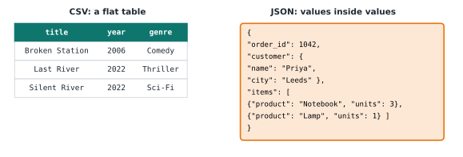

# Lesson 3: JSON data

**You'll learn:** JSON syntax, `json.loads`, `json.dumps`, `json.load`, `json.dump`, nested data, `.get()`.

▶ **Practise this lesson in the [sandbox](https://kishoremadanagopal.github.io/learning/python-data/#json-data)**: run every example and check your exercise answers.

## Key terms

- **JSON:** a text format for structured data made of objects, arrays, strings, numbers, `true`/`false` and `null`.
- **JSON object:** a set of key-value pairs in `{ }`, which becomes a Python dictionary.
- **JSON array:** an ordered list of values in `[ ]`, which becomes a Python list.
- **null:** JSON's "no value", which becomes Python's `None`.
- **json.loads / json.dumps:** convert JSON text to Python objects, and Python objects to JSON text.
- **json.load / json.dump:** the same, but reading from or writing to a file.
- **Nested data:** values inside values, such as a list of items inside an order.
- **API:** a way for programs to talk to each other over the internet, usually sending JSON.

**JSON** (JavaScript Object Notation) is the most common way programs send data to each other. Web APIs, configuration files, AI model responses and app exports all use it. If CSV is a flat table, JSON is a tree: values can contain other values.

```text
{
  "title": "Broken Station",
  "year": 2006,
  "genres": ["Comedy", "Drama"],
  "awards": null,
  "streaming": true
}
```

JSON maps almost exactly onto Python types:

| JSON | Python | Example |
|---|---|---|
| object `{ }` | `dict` | `{"year": 2006}` |
| array `[ ]` | `list` | `["Comedy", "Drama"]` |
| string | `str` | `"Broken Station"` (always double quotes) |
| number | `int` or `float` | `2006`, `7.6` |
| `true` / `false` | `True` / `False` | lowercase in JSON |
| `null` | `None` | means "no value" |

## Text to Python: json.loads

`json.loads` (load **s**tring) turns JSON text into Python objects:

```python
import json

text = '{"title": "Broken Station", "year": 2006, "genres": ["Comedy", "Drama"], "awards": null}'
movie = json.loads(text)

print(type(movie))
print(movie["title"], movie["year"])
print(movie["genres"][0])
print(movie["awards"])
```

## Python to text: json.dumps

`json.dumps` (dump **s**tring) goes the other way. `indent=2` makes it readable:

```python
import json

report = {"region": "North", "orders": 198, "top_products": ["Pen Pack", "Notebook"], "final": True}
print(json.dumps(report))
print(json.dumps(report, indent=2))
```

Notice how `True` became `true`. JSON text is what you'd send to an API or save to a file.

## Reading a JSON file

`json.load(f)` (no **s**) reads straight from an open file. `movies.json` holds a list of 40 film records:

```python
import json

with open("movies.json") as f:
    movies = json.load(f)

print(type(movies), len(movies))
print(movies[0])
for m in movies[:3]:
    print(m["title"], "-", m["genre"], "-", m["rating"])
```

## Nested data

Real JSON is often nested several levels deep. You reach inside one step at a time, chaining `[...]`:



```python
import json

order = json.loads("""
{
  "order_id": 1042,
  "customer": {"name": "Priya Patel", "address": {"city": "Leeds", "postcode": "LS1 4AP"}},
  "items": [
    {"product": "Notebook", "units": 3, "price": 4.5},
    {"product": "Desk Lamp", "units": 1, "price": 35.0}
  ]
}
""")

print(order["customer"]["address"]["city"])
for item in order["items"]:
    print(item["product"], item["units"] * item["price"])
total = sum(item["units"] * item["price"] for item in order["items"])
print("Order total:", total)
```

When you meet unfamiliar JSON, print it with `json.dumps(data, indent=2)` and read the structure first.

## Missing keys

Records don't always have every key, and some values are `null`. `dict.get(key, default)` returns a default instead of crashing:

```python
import json

with open("movies.json") as f:
    movies = json.load(f)

no_box_office = [m["title"] for m in movies if m["box_office_musd"] is None]
print(len(no_box_office), "films have no box office figure:")
print(no_box_office)

print(movies[0].get("director", "unknown director"))
```

## Writing a JSON file

`json.dump(data, f)` writes to an open file:

```python
import json

summary = {"films": 40, "genres": ["Drama", "Comedy", "Action"]}
with open("summary.json", "w") as f:
    json.dump(summary, f, indent=2)

print(open("summary.json").read())
```

## Invalid JSON

JSON is strict. Single quotes, trailing commas and Python's `True`/`None` are not allowed, and `json.loads` raises an error that points at the problem:

*This example raises an error on purpose.*

```python
import json

json.loads("{'title': 'Broken Station'}")
```

## Common mistakes

- Writing JSON by hand with single quotes or `True`. JSON needs double quotes and lowercase `true`/`false`/`null`; let `json.dumps` write it for you.
- Mixing up `loads` and `load`. The `s` versions work with strings; the others work with open files.
- Assuming every record has every key. Use `record.get("key", default)` or check `is None` first.

## Exercises

### 1. The best-rated film

Load `movies.json` and find the film with the highest `rating`. Store its title in `best`.

Starter code:

```python
import json

best = ""

print(best)
```

### 2. Build a JSON report

Make a dictionary with three keys: `"course"` set to `"Python for Data"`, `"lessons_done"` set to `3`, and `"topics"` set to the list `["csv", "json"]`. Turn it into JSON text with `json.dumps` and store the text in `report_json`.

Starter code:

```python
import json

```

**In the sandbox:** exercises 5–6. Press **Check** to test your answer.

<details>
<summary>Hints</summary>

1. Keep track of the best record so far in a loop, or use `max(movies, key=lambda m: m["rating"])` and take its `"title"`.
2. Build the dictionary first, then `report_json = json.dumps(report)`.

</details>

<details>
<summary>Answers</summary>

**1. The best-rated film**

```python
import json

with open("movies.json") as f:
    movies = json.load(f)

top = movies[0]
for m in movies:
    if m["rating"] > top["rating"]:
        top = m
best = top["title"]

print(best)
```

**2. Build a JSON report**

```python
import json

report = {"course": "Python for Data", "lessons_done": 3, "topics": ["csv", "json"]}
report_json = json.dumps(report, indent=2)

print(report_json)
```

</details>

## Quick quiz

1. What does the JSON value `null` become in Python?
   - A) `0`
   - B) `None`
   - C) `"null"`

2. Which function turns JSON **text** into Python objects?
   - A) `json.loads`
   - B) `json.dumps`
   - C) `json.dump`

3. Why does `json.loads("{'a': 1}")` fail?
   - A) JSON can't hold numbers
   - B) JSON strings must use double quotes
   - C) The dictionary is too short

<details>
<summary>Quiz answers</summary>

1. **B) `None`**: `null` means "no value", which Python writes as `None`.
2. **A) `json.loads`**: `loads` = load from a string. `dumps` goes the other way, and `load`/`dump` work with files.
3. **B) JSON strings must use double quotes**: JSON only allows double quotes, so `'a'` is invalid. Python's single-quote style doesn't work in JSON.

</details>

---
Previous: [Lesson 2](02-files-and-csv.md) · Next: [Lesson 4: Crunching data with plain Python](04-crunching-with-python.md)
