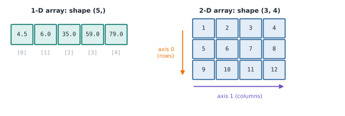

# Lesson 5: NumPy arrays

**You'll learn:** `np.array`, vectorised maths, speed, `shape`, `ndim`, `dtype`, `arange`, `linspace`, `zeros`, `ones`.

▶ **Practise this lesson in the [sandbox](https://kishoremadanagopal.github.io/learning/python-data/#numpy-arrays)**: run every example and check your exercise answers.

## Key terms

- **NumPy array (ndarray):** a grid of numbers that all share one type, built for fast maths.
- **Vectorisation:** doing an operation on every item of an array at once, without a loop.
- **Shape:** the size of an array along each dimension, like `(3, 4)` for 3 rows and 4 columns.
- **ndim:** the number of dimensions: 1 for a row of numbers, 2 for a table.
- **dtype:** the data type shared by every item in an array, such as `int64` or `float64`.
- **np.arange:** makes evenly spaced numbers, like `range()`.
- **np.linspace:** makes a set number of evenly spaced values between two ends.

A **NumPy array** is a grid of numbers that all have the same type. It looks like a list, but it's built for maths: you can add, multiply or average a million numbers with one short line, and it runs far faster than a loop.

```python
import numpy as np

prices = np.array([4.5, 6.0, 35.0, 59.0, 79.0])
print(prices)
print(type(prices))
```

## Arrays do maths on every item

This is the big difference from lists. Watch what `* 2` does to each:

```python
import numpy as np

as_list = [1, 2, 3]
as_array = np.array([1, 2, 3])

print(as_list * 2)    # a list repeats itself
print(as_array * 2)   # an array doubles every number
print(as_array + 10)
print(as_array * as_array)
```

Doing the same operation to every item without writing a loop is called **vectorisation**. Here's the payoff: adding 20% tax to every price.

```python
import numpy as np

prices = np.array([4.5, 6.0, 35.0, 59.0, 79.0])
with_tax = prices * 1.2
print(with_tax)
```

## How much faster?

Let's time a loop against NumPy on a million numbers:

```python
import time
import numpy as np

numbers = list(range(1_000_000))
start = time.perf_counter()
total = 0
for n in numbers:
    total += n * n
loop_time = time.perf_counter() - start

arr = np.arange(1_000_000)
start = time.perf_counter()
total2 = (arr * arr).sum()
numpy_time = time.perf_counter() - start

print(total == total2)
print(f"NumPy was about {loop_time / numpy_time:.0f} times faster")
```

The exact number changes each run and from computer to computer, but NumPy usually wins by 10 to 100 times. That's why pandas, scikit-learn and PyTorch are all built on arrays.

## Shape, size and dtype

Every array knows its **shape** (how many items along each direction), its **size** (total items) and its **dtype** (the type of every item):



```python
import numpy as np

scores = np.array([[72, 85, 90],
                   [64, 70, 58]])

print(scores.shape)   # (rows, columns)
print(scores.ndim)    # number of dimensions
print(scores.size)
print(scores.dtype)
```

A 1-D array is a row of numbers; a 2-D array is a table (rows and columns). Machine learning uses 3-D and bigger arrays too, such as a stack of images.

Because every item shares one dtype, NumPy converts mixed inputs to the most general type:

```python
import numpy as np

print(np.array([1, 2, 3]).dtype)       # all whole numbers
print(np.array([1, 2, 3.5]).dtype)     # one float makes them all floats
print(np.array([1, 2, 3.5]))
print(np.array([1, 2, 3]).astype(float))
```

## Ready-made arrays

You don't always type the numbers in. These functions create arrays for you:

| Function | Makes |
|---|---|
| `np.arange(start, stop, step)` | evenly spaced numbers, like `range` (stop not included) |
| `np.linspace(start, stop, n)` | `n` evenly spaced numbers, stop included |
| `np.zeros(n)` / `np.ones(n)` | `n` zeros or ones |
| `np.full(n, value)` | `n` copies of a value |

```python
import numpy as np

print(np.arange(0, 10, 2))
print(np.linspace(0, 1, 5))
print(np.zeros(3))
print(np.ones((2, 3)))
print(np.full(4, 7))
```

`np.ones((2, 3))` takes the shape as a tuple: 2 rows, 3 columns.

## Common mistakes

- Expecting a list to do maths: `[1, 2] * 2` repeats the list. Convert it with `np.array()` first.
- Passing a shape without brackets: `np.zeros(3, 4)` is an error; write `np.zeros((3, 4))`.
- Forgetting that `np.arange(0, 10)` stops at 9, just like `range`.

## Exercises

### 1. Prices with a discount

Make an array called `prices` holding `899.0, 249.0, 79.0, 189.0` (in that order). Then make `sale` by taking 15% off every price (multiply by 0.85). Don't use a loop.

Starter code:

```python
import numpy as np

```

### 2. Build a grid

Create a 2-D array called `grid` of zeros with **3 rows and 4 columns**, and store its shape in `grid_shape`.

Starter code:

```python
import numpy as np

```

**In the sandbox:** exercises 9–10. Press **Check** to test your answer.

<details>
<summary>Hints</summary>

1. `sale = prices * 0.85` multiplies every item at once.
2. Pass the shape as a tuple: `np.zeros((3, 4))`. The shape is in `grid.shape`.

</details>

<details>
<summary>Answers</summary>

**1. Prices with a discount**

```python
import numpy as np

prices = np.array([899.0, 249.0, 79.0, 189.0])
sale = prices * 0.85
print(sale)
```

**2. Build a grid**

```python
import numpy as np

grid = np.zeros((3, 4))
grid_shape = grid.shape
print(grid)
print(grid_shape)
```

</details>

## Quick quiz

1. What does `np.array([1, 2, 3]) * 2` give?
   - A) `[1, 2, 3, 1, 2, 3]`
   - B) `[2 4 6]`
   - C) An error

2. An array has shape `(4, 6)`. How many numbers does it hold?
   - A) 10
   - B) 24
   - C) 6

3. Why is `np.array([1, 2, 3.5]).dtype` a float type?
   - A) Every item in an array shares one type, so the whole numbers become floats
   - B) NumPy always uses floats
   - C) Because the array has three items

<details>
<summary>Quiz answers</summary>

1. **B) `[2 4 6]`**: Arrays apply maths to every item. It's lists that repeat themselves when multiplied.
2. **B) 24**: Shape `(4, 6)` means 4 rows and 6 columns, so 4 × 6 = 24 items.
3. **A) Every item in an array shares one type, so the whole numbers become floats**: An array has a single dtype. One float forces the rest to be stored as floats too.

</details>

---
Previous: [Lesson 4](04-crunching-with-python.md) · Next: [Lesson 6: Indexing, slicing and filtering arrays](06-array-indexing.md)
