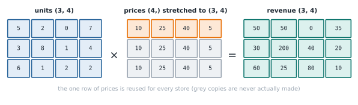

# Lesson 7: Maths on whole arrays

**You'll learn:** array-with-array maths, broadcasting, ufuncs, `np.where`, `np.nan`, `np.isnan`, scaling.

▶ **Practise this lesson in the [sandbox](https://kishoremadanagopal.github.io/learning/python-data/#vectorised-math)**: run every example and check your exercise answers.

## Key terms

- **Element-wise:** done item by item, matching positions in two arrays.
- **Broadcasting:** NumPy stretching a smaller array (or a single number) to match a bigger one.
- **ufunc (universal function):** a fast NumPy function that works on every item, like `np.sqrt`.
- **np.where:** chooses between two values item by item based on a condition.
- **np.nanmean:** an average that skips missing (`nan`) values.
- **Scaling (normalising):** rescaling numbers to a common range such as 0 to 1.

In the last two lessons you multiplied an array by a number. This lesson covers the rest of array maths: arrays with arrays, rows with tables, and NumPy's library of functions.

## Array with array

When two arrays have the same shape, maths happens item by item, matching positions:

```python
import numpy as np

units = np.array([3, 1, 12, 2])
price = np.array([35.0, 899.0, 4.5, 249.0])
revenue = units * price
print(revenue)
print("Total:", revenue.sum())
```

Shapes that don't match give an error:

*This example raises an error on purpose.*

```python
import numpy as np

print(np.array([1, 2, 3]) + np.array([10, 20]))
```

## Broadcasting

NumPy will stretch a smaller array to fit a bigger one when it can. This is called **broadcasting**. A single number broadcasts to every item, and a row broadcasts down every row of a table:



```python
import numpy as np

# 3 stores x 4 products: units sold
units = np.array([[5, 2, 0, 7],
                  [3, 8, 1, 4],
                  [6, 1, 2, 2]])
prices = np.array([10.0, 25.0, 40.0, 5.0])   # one price per product

revenue = units * prices     # the price row is used for every store
print(revenue)
print("Per store:", revenue.sum(axis=1))
```

The rule: shapes line up from the right, and each pair of sizes must be equal or one of them must be 1. Here `(3, 4)` and `(4,)` line up on the 4.

## Maths functions (ufuncs)

NumPy has fast versions of every maths function. They work on whole arrays and are called **ufuncs** (universal functions):

```python
import numpy as np

x = np.array([1.0, 4.0, 9.0, 16.0])
print(np.sqrt(x))
print(np.round(np.log(x), 3))
print(np.abs(np.array([-3, 2, -7])))
print(np.round(np.array([2.456, 3.14159]), 2))
print(np.maximum(np.array([1, 5, 3]), np.array([4, 2, 6])))
```

## np.where: if/else for every item

`np.where(condition, a, b)` picks from `a` where the condition is true and from `b` where it's false. It's the array version of an `if`:

```python
import numpy as np

scores = np.array([45, 72, 38, 90, 61])
result = np.where(scores >= 50, "pass", "fail")
print(result)

capped = np.where(scores > 80, 80, scores)
print(capped)
```

## Missing values: nan

`np.nan` marks a missing number. It spreads: any maths with `nan` gives `nan`. The `nan` functions skip it:

```python
import numpy as np

temps = np.array([12.0, np.nan, 14.5, 13.0])
print(temps.mean())         # nan: one missing value spoils it
print(np.nanmean(temps))    # ignores the missing value
print(np.isnan(temps))
print("Missing:", np.isnan(temps).sum())
```

Note `np.nan == np.nan` is `False`, so always test with `np.isnan()`, never `==`.

## A worked example: normalising

A common step before machine learning is **scaling** numbers to the range 0 to 1, so big and small features count equally. With arrays it's one line:

```python
import numpy as np

ages = np.array([18, 25, 40, 33, 61, 52])
scaled = (ages - ages.min()) / (ages.max() - ages.min())
print(np.round(scaled, 2))
```

## Common mistakes

- Adding arrays of different lengths. Shapes must match or be broadcastable; check `.shape` first.
- Testing for missing values with `== np.nan`, which is always `False`. Use `np.isnan()`.
- Using Python's `math.sqrt` on an array. It only takes single numbers; use `np.sqrt`.

## Exercises

### 1. Line totals

`units` and `prices` describe five order lines. Make `line_totals` (units × price for each line) and `grand_total` (the sum of all lines).

Starter code:

```python
import numpy as np

units = np.array([2, 10, 1, 4, 3])
prices = np.array([249.0, 4.5, 899.0, 35.0, 59.0])

```

### 2. Grade labels

Use `np.where` to turn `scores` into an array called `grades` that holds `"pass"` for scores of **60 or more** and `"retake"` otherwise.

Starter code:

```python
import numpy as np

scores = np.array([58, 73, 91, 60, 44, 67])

```

**In the sandbox:** exercises 13–14. Press **Check** to test your answer.

<details>
<summary>Hints</summary>

1. Multiply the two arrays directly, then call `.sum()` on the result.
2. `np.where(scores >= 60, "pass", "retake")`.

</details>

<details>
<summary>Answers</summary>

**1. Line totals**

```python
import numpy as np

units = np.array([2, 10, 1, 4, 3])
prices = np.array([249.0, 4.5, 899.0, 35.0, 59.0])
line_totals = units * prices
grand_total = line_totals.sum()
print(line_totals, grand_total)
```

**2. Grade labels**

```python
import numpy as np

scores = np.array([58, 73, 91, 60, 44, 67])
grades = np.where(scores >= 60, "pass", "retake")
print(grades)
```

</details>

## Quick quiz

1. What does broadcasting let you do?
   - A) Send arrays over the internet
   - B) Combine arrays of different shapes by stretching the smaller one
   - C) Print an array on several lines

2. What is `np.array([1.0, np.nan, 3.0]).mean()`?
   - A) `2.0`
   - B) `nan`
   - C) An error

3. What does `np.where(a > 0, a, 0)` do?
   - A) Replaces negative numbers (and zeros) with 0 and keeps positive ones
   - B) Finds the position of the first positive number
   - C) Removes negative numbers from the array

<details>
<summary>Quiz answers</summary>

1. **B) Combine arrays of different shapes by stretching the smaller one**: A single number or a row is "stretched" to match a bigger array, so you don't have to copy it yourself.
2. **B) `nan`**: Any maths involving `nan` gives `nan`. Use `np.nanmean` to skip missing values.
3. **A) Replaces negative numbers (and zeros) with 0 and keeps positive ones**: It chooses item by item: `a` where the condition is true, `0` where it isn't. The length stays the same.

</details>

---
Previous: [Lesson 6](06-array-indexing.md) · Next: [Lesson 8: Summarising arrays](08-array-statistics.md)
