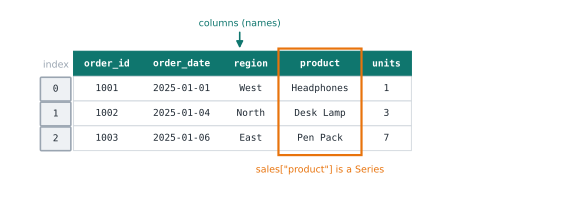

# Lesson 11: DataFrames and loading data

**You'll learn:** `pd.DataFrame`, `read_csv`, `read_json`, `head`, `tail`, `shape`, `columns`, `dtypes`, `info`, `describe`.

▶ **Practise this lesson in the [sandbox](https://kishoremadanagopal.github.io/learning/python-data/#dataframes)**: run every example and check your exercise answers.

## Key terms

- **DataFrame:** a table of rows and named columns; each column is a Series.
- **pd.read_csv / pd.read_json:** load a CSV or JSON file into a DataFrame.
- **head / tail:** the first / last rows of a table (5 by default).
- **shape:** a table's size as (rows, columns).
- **dtypes:** the data type of each column.
- **info():** a summary of columns, types and non-missing counts.
- **describe():** summary statistics for each number column.
- **Non-null count:** how many values in a column are present (not missing).

A **DataFrame** is a table: rows and named columns, where each column is a Series. It's the object you'll use in almost every line of pandas.



## Making a DataFrame

From a dictionary of lists (each key becomes a column):

```python
import pandas as pd

df = pd.DataFrame({
    "product": ["Laptop", "Notebook", "Desk Lamp"],
    "price": [899.0, 4.5, 35.0],
    "in_stock": [True, True, False],
})
print(df)
```

From a list of dictionaries (each dictionary becomes a row), which is exactly what you get from JSON or `csv.DictReader`:

```python
import pandas as pd

rows = [{"city": "Leeds", "temp": 14.2}, {"city": "Mumbai", "temp": 31.0}]
print(pd.DataFrame(rows))
```

## Loading files

In practice you'll load data far more than you'll type it. One line reads a whole CSV, with the number columns already converted:

```python
import pandas as pd

sales = pd.read_csv("sales.csv")
print(sales.head())
```

`head()` shows the first 5 rows (`head(10)` for 10); `tail()` shows the last ones. When a table is wider than the screen, pandas hides the middle columns behind `...`.

JSON files of records load the same way:

```python
import pandas as pd

movies = pd.read_json("movies.json")
print(movies.head(3))
```

## Your first look at any dataset

These five checks are the first thing every analyst does with new data:

```python
import pandas as pd

sales = pd.read_csv("sales.csv")
print(sales.shape)           # (rows, columns)
print(list(sales.columns))   # the column names
print(sales.dtypes)          # the type of each column
```

`info()` puts the size, columns, types and missing counts on one screen:

```python
import pandas as pd

sales = pd.read_csv("sales.csv")
sales.info()
```

The "Non-Null Count" tells you how many values are present in each column. If it's less than the number of rows, some values are missing.

## The dtypes you'll see

| dtype | What it holds |
|---|---|
| `int64` | whole numbers |
| `float64` | decimals (and any number column with missing values) |
| `str` | text |
| `bool` | True / False |
| `datetime64` | dates and times (Part 4) |

## describe(): numbers at a glance

`describe()` summarises every number column. It's the fastest way to spot strange values, like a negative price or an age of 230:

```python
import pandas as pd

sales = pd.read_csv("sales.csv")
print(sales.describe().round(2))
```

Add `include="all"` to describe the text columns too: their number of distinct values and the most common one.

```python
import pandas as pd

customers = pd.read_csv("customers.csv")
print(customers.describe(include="all"))
```

## The index

Every DataFrame has an index labelling its rows, just like a Series. `read_csv` gives the default 0, 1, 2… You'll set your own in the next lesson.

```python
import pandas as pd

products = pd.read_csv("products.csv")
print(products.index)
print(products.columns)
```

## Common mistakes

- Calling `df.shape()` with brackets. `shape` is an attribute, not a method: write `df.shape`.
- Skipping the first look. Always check `shape`, `info()` and `describe()` before analysing: they reveal missing values and impossible numbers.
- Trusting the type of a column without checking. A number column with one stray word loads as text (`str`).

## Exercises

### 1. Load the weather

Load `weather.csv` into a DataFrame called `weather`, store the number of rows in `n_rows`, and print the first 3 rows.

Starter code:

```python
import pandas as pd

```

### 2. Build a table

Create a DataFrame called `team` with two columns: `name` holding `"Ada"`, `"Grace"` and `"Alan"`, and `score` holding `91`, `88` and `79`.

Starter code:

```python
import pandas as pd

```

**In the sandbox:** exercises 21–22. Press **Check** to test your answer.

<details>
<summary>Hints</summary>

1. `len(weather)` or `weather.shape[0]` gives the number of rows.
2. Pass a dictionary: `{"name": [...], "score": [...]}`.

</details>

<details>
<summary>Answers</summary>

**1. Load the weather**

```python
import pandas as pd

weather = pd.read_csv("weather.csv")
n_rows = len(weather)        # or weather.shape[0]
print(weather.head(3))
```

**2. Build a table**

```python
import pandas as pd

team = pd.DataFrame({
    "name": ["Ada", "Grace", "Alan"],
    "score": [91, 88, 79],
})
print(team)
```

</details>

## Quick quiz

1. What is a DataFrame's single column, taken on its own?
   - A) A Series
   - B) A list
   - C) A NumPy array

2. `df.shape` is `(1095, 4)`. What does that mean?
   - A) 1095 columns and 4 rows
   - B) 1095 rows and 4 columns
   - C) 1095 missing values

3. Which command shows column types and how many values are missing in each?
   - A) `df.head()`
   - B) `df.info()`
   - C) `df.shape`

<details>
<summary>Quiz answers</summary>

1. **A) A Series**: Every column of a DataFrame is a Series, sharing the table's index.
2. **B) 1095 rows and 4 columns**: Shape is always (rows, columns).
3. **B) `df.info()`**: `info()` lists each column with its non-null count and dtype.

</details>

---
Previous: [Lesson 10](10-pandas-series.md) · Next: [Lesson 12: Selecting columns and rows](12-selecting-data.md)
