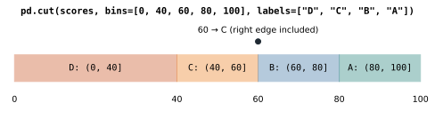

# Lesson 26: Mapping, applying and binning

**You'll learn:** `map` with a dictionary, `apply` with functions and lambdas, `apply(axis=1)`, `np.select`, `pd.cut`, `pd.qcut`.

▶ **Practise this lesson in the [sandbox](https://kishoremadanagopal.github.io/learning/python-data/#map-apply-and-bins)**: run every example and check your exercise answers.

## Key terms

- **map:** replaces each value using a dictionary (or function).
- **apply:** runs a function on every value of a Series, or every row with `axis=1`.
- **np.select:** chooses a result from several conditions, first match wins.
- **Bin:** a range of values grouped together, like ages 30–44.
- **pd.cut:** sorts numbers into bins with edges you choose.
- **pd.qcut:** sorts numbers into bins holding roughly equal numbers of rows.
- **Quantile:** the value below which a given share of the data falls (the 0.25 quantile is the first quartile).

Sometimes the transformation you need isn't built in: a code that needs translating, a custom rule, or numbers that should become bands like "low / medium / high". This lesson covers the three tools for that.

## map: translate values

`map` with a dictionary swaps each value for its partner. Values not in the dictionary become missing, which helps you spot codes you forgot:

```python
import pandas as pd

sales = pd.read_csv("sales.csv")
managers = {"North": "Asha", "South": "Ben", "East": "Chen", "West": "Dana"}
sales["manager"] = sales["region"].map(managers)
print(sales[["region", "manager"]].drop_duplicates())
```

## apply with your own function

`apply` runs a function on every value of a Series. Write the rule as a normal `def`, then apply it:

```python
import pandas as pd

def size_label(units):
    if units >= 10:
        return "bulk"
    elif units >= 4:
        return "medium"
    return "single"

sales = pd.read_csv("sales.csv")
sales["order_size"] = sales["units"].apply(size_label)
print(sales["order_size"].value_counts())
```

A `lambda` works for short rules:

```python
import pandas as pd

customers = pd.read_csv("customers.csv")
customers["initials"] = customers["name"].apply(lambda n: "".join(word[0] for word in n.split()))
print(customers[["name", "initials"]].head(3))
```

## apply on rows

With `axis=1`, `apply` gives your function a whole **row**, so the rule can use several columns:

```python
import pandas as pd

def shipping(row):
    if row["category"] == "Electronics" and row["units"] >= 2:
        return 0.0
    return 4.99

sales = pd.read_csv("sales.csv")
sales["shipping"] = sales.apply(shipping, axis=1)
print(sales.groupby("shipping").size())
```

Row-by-row `apply` is a hidden loop, so it's slow on big tables. Prefer vectorised tools when you can. The same rule with `np.where`:

```python
import numpy as np
import pandas as pd

sales = pd.read_csv("sales.csv")
free = (sales["category"] == "Electronics") & (sales["units"] >= 2)
sales["shipping"] = np.where(free, 0.0, 4.99)
print(sales.groupby("shipping").size())
```

## np.select: several conditions

For more than two outcomes, `np.select` takes a list of conditions and a matching list of results; the first true condition wins:

```python
import numpy as np
import pandas as pd

students = pd.read_csv("students.csv")
conditions = [students["math"] >= 80, students["math"] >= 60, students["math"] >= 40]
grades = ["A", "B", "C"]
students["grade"] = np.select(conditions, grades, default="Fail")
print(students["grade"].value_counts().sort_index())
```

## cut: numbers into bands

`pd.cut` sorts numbers into **bins** (bands) you define. Each bin includes its right edge, so with the edges below a score of 60 is a "C":



```python
import pandas as pd

students = pd.read_csv("students.csv")
students["band"] = pd.cut(students["math"], bins=[0, 40, 60, 80, 100], labels=["D", "C", "B", "A"])
print(students[["student", "math", "band"]].head())
print(students["band"].value_counts().sort_index())
```

Age groups are a classic use:

```python
import pandas as pd

customers = pd.read_csv("customers.csv")
customers["age_group"] = pd.cut(customers["age"], bins=[17, 29, 44, 59, 100],
                                labels=["18-29", "30-44", "45-59", "60+"])
print(customers.groupby("age_group", observed=True)["customer_id"].count())
```

`observed=True` tells groupby to show only the bands that actually occur.

## qcut: equal-sized groups

`pd.qcut` makes bins with (roughly) the same number of rows in each, using quantiles. It's how you'd split customers into "top 25%, next 25%…":

```python
import pandas as pd

sales = pd.read_csv("sales.csv")
sales["revenue"] = sales["units"] * sales["unit_price"]
sales["value_band"] = pd.qcut(sales["revenue"], q=4, labels=["low", "mid-low", "mid-high", "high"])
print(sales["value_band"].value_counts())
print(sales.groupby("value_band", observed=True)["revenue"].agg(["min", "max"]))
```

## Common mistakes

- Reaching for `apply(axis=1)` first. It's slow on big tables; try `np.where`, `np.select` or vectorised maths.
- Getting the `cut` edges wrong: bins include the right edge, so with edges `[0, 60, 100]` a score of 60 lands in the first bin.
- Forgetting that `map` turns unknown values into missing. Check with `isna().sum()` afterwards.

## Exercises

### 1. Supplier lookup

Add a `supplier` column to `sales` by mapping each product to its supplier with the dictionary built from `products.csv` (`dict(zip(products["product"], products["supplier"]))`). Then store the number of orders per supplier in `orders_per_supplier`.

Starter code:

```python
import pandas as pd

sales = pd.read_csv("sales.csv")
products = pd.read_csv("products.csv")

```

### 2. Attendance bands

Load `students.csv` and add `attendance_band` using `pd.cut` with the edges `[0, 75, 90, 100]` and the labels `"low"`, `"ok"`, `"great"`. Then store the **average math score per band** in `math_by_band` (use `observed=True`).

Starter code:

```python
import pandas as pd

students = pd.read_csv("students.csv")

```

**In the sandbox:** exercises 51–52. Press **Check** to test your answer.

<details>
<summary>Hints</summary>

1. Build the dictionary, then `sales["product"].map(lookup)`. Count with `value_counts()`.
2. `pd.cut(students["attendance_pct"], bins=[0, 75, 90, 100], labels=[...])`.

</details>

<details>
<summary>Answers</summary>

**1. Supplier lookup**

```python
import pandas as pd

sales = pd.read_csv("sales.csv")
products = pd.read_csv("products.csv")
lookup = dict(zip(products["product"], products["supplier"]))
sales["supplier"] = sales["product"].map(lookup)
orders_per_supplier = sales["supplier"].value_counts()
print(orders_per_supplier)
```

**2. Attendance bands**

```python
import pandas as pd

students = pd.read_csv("students.csv")
students["attendance_band"] = pd.cut(students["attendance_pct"], bins=[0, 75, 90, 100],
                                     labels=["low", "ok", "great"])
math_by_band = students.groupby("attendance_band", observed=True)["math"].mean()
print(math_by_band.round(1))
```

</details>

## Quick quiz

1. What does `s.map({"N": "North"})` do to a value `"S"`?
   - A) Leaves it as "S"
   - B) Makes it missing, since "S" isn't in the dictionary
   - C) Raises an error

2. Why prefer `np.where` over `df.apply(func, axis=1)` when possible?
   - A) It's vectorised, so much faster on big tables
   - B) `apply` gives wrong answers
   - C) `np.where` works on text only

3. How do `cut` and `qcut` differ?
   - A) They're the same
   - B) `cut` uses edges you choose; `qcut` makes groups of roughly equal size
   - C) `qcut` only works on dates

<details>
<summary>Quiz answers</summary>

1. **B) Makes it missing, since "S" isn't in the dictionary**: Unmapped values become NaN, which helps you spot codes you didn't cover.
2. **A) It's vectorised, so much faster on big tables**: Row-wise `apply` is a Python loop in disguise. Vectorised tools do the work in fast compiled code.
3. **B) `cut` uses edges you choose; `qcut` makes groups of roughly equal size**: `cut` bins by value ranges; `qcut` bins by quantiles so each bin has a similar count.

</details>

---
Previous: [Lesson 25](25-reshaping-data.md) · Next: [Lesson 27: Trends over time](27-time-series.md)
