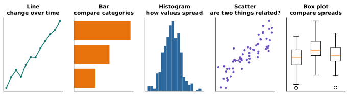

# Lesson 29: Choosing the right chart

**You'll learn:** bar and horizontal bar charts, `bar_label`, histograms, scatter plots, box plots, why to avoid pie charts.

▶ **Practise this lesson in the [sandbox](https://kishoremadanagopal.github.io/learning/python-data/#chart-types)**: run every example and check your exercise answers.

## Key terms

- **Bar chart:** bars whose lengths compare values across categories.
- **Histogram:** bars counting how many values fall in each range (bin), showing a distribution's shape.
- **Distribution:** how the values of a variable are spread out.
- **Scatter plot:** one dot per row, placed by two numbers, to show whether they're related.
- **Box plot:** a summary of a distribution: median, quartiles, typical range and outliers.
- **Correlation:** two variables tending to rise or fall together.
- **Causation:** one thing actually causing another. Correlation alone doesn't show it.

Every chart type answers a particular kind of question. Pick the question first, then the chart:

| Question | Chart | matplotlib |
|---|---|---|
| How does a value change over time? | line | `ax.plot` |
| How do categories compare? | bar | `ax.bar` / `ax.barh` |
| How are values spread out? | histogram | `ax.hist` |
| Are two numbers related? | scatter | `ax.scatter` |
| How do spreads compare between groups? | box plot | `ax.boxplot` |



## Bar charts: comparing categories

```python
import pandas as pd
import matplotlib.pyplot as plt

sales = pd.read_csv("sales.csv")
sales["revenue"] = sales["units"] * sales["unit_price"]
by_region = sales.groupby("region")["revenue"].sum().sort_values()

fig, ax = plt.subplots(figsize=(6, 3.5))
ax.bar(by_region.index, by_region.values, color="tab:blue")
ax.set_title("North brings in the most revenue")
ax.set_ylabel("Revenue (£)")
plt.show()
```

With long category names, or many of them, a **horizontal** bar chart (`barh`) is easier to read. Sort the values so the ranking jumps out, and label each bar with `bar_label`:

```python
import pandas as pd
import matplotlib.pyplot as plt

sales = pd.read_csv("sales.csv")
sales["revenue"] = sales["units"] * sales["unit_price"]
by_product = sales.groupby("product")["revenue"].sum().sort_values()

fig, ax = plt.subplots(figsize=(7, 4))
bars = ax.barh(by_product.index, by_product.values / 1000, color="tab:green")
ax.bar_label(bars, fmt="%.0fk", padding=3)
ax.set_title("Laptops earn the most, despite few orders")
ax.set_xlabel("Revenue (£ thousands)")
plt.show()
```

Bar charts must start at zero: bar length *is* the value, so a cut-off axis exaggerates differences.

## Histograms: how values are spread

A **histogram** splits a number column into bins and shows how many values fall in each. It shows the shape of the data: where most values are, how spread out, and whether it's lopsided.

```python
import pandas as pd
import matplotlib.pyplot as plt

students = pd.read_csv("students.csv")
fig, ax = plt.subplots(figsize=(6, 3.5))
ax.hist(students["math"], bins=10, color="tab:purple", edgecolor="white")
ax.axvline(students["math"].mean(), color="black", linestyle="--", label="mean")
ax.set_title("Most students score between 40 and 80 in math")
ax.set_xlabel("Math score")
ax.set_ylabel("Number of students")
ax.legend()
plt.show()
```

`axvline` draws a vertical reference line, here at the mean.

## Scatter plots: are two things related?

Each point is one row, placed by two numbers. If the points slope upwards, the two values tend to rise together:

```python
import pandas as pd
import matplotlib.pyplot as plt

students = pd.read_csv("students.csv")
fig, ax = plt.subplots(figsize=(6, 4))
ax.scatter(students["hours_studied"], students["math"], alpha=0.7)
ax.set_title("More study hours, higher math scores")
ax.set_xlabel("Hours studied per week")
ax.set_ylabel("Math score")
plt.show()
```

Colour can add a third variable. Here each class gets its own colour:

```python
import pandas as pd
import matplotlib.pyplot as plt

students = pd.read_csv("students.csv")
fig, ax = plt.subplots(figsize=(6, 4))
for name, group in students.groupby("class"):
    ax.scatter(group["attendance_pct"], group["math"], label=f"Class {name}", alpha=0.75)
ax.set_xlabel("Attendance (%)")
ax.set_ylabel("Math score")
ax.set_title("Attendance and math score, by class")
ax.legend()
plt.show()
```

A relationship in a scatter plot doesn't prove that one thing **causes** the other. You'll learn how to measure and test relationships in the statistics course.

## Box plots: comparing spreads

A **box plot** summarises a distribution in five numbers: the box spans the middle half (first to third quartile), the line inside is the median, the whiskers reach to the typical range, and dots beyond them are outliers. Side by side, box plots compare groups at a glance:

```python
import pandas as pd
import matplotlib.pyplot as plt

weather = pd.read_csv("weather.csv").dropna()
cities = ["London", "New York", "Mumbai"]
data = [weather.loc[weather["city"] == c, "temp_c"] for c in cities]

fig, ax = plt.subplots(figsize=(6, 3.5))
ax.boxplot(data, tick_labels=cities)
ax.set_title("New York has the widest range of temperatures")
ax.set_ylabel("Daily temperature (°C)")
plt.show()
```

## What about pie charts?

Pie charts are hard to read: people judge angles badly, so slices of 23% and 27% look the same. A sorted bar chart almost always works better. If you do use one, keep it to two or three slices.

## Common mistakes

- Starting a bar chart's axis above zero, which exaggerates differences.
- Using a line chart for categories that have no order (like products). Lines imply a sequence; use bars.
- Reading a scatter plot as proof of cause and effect.

## Exercises

### 1. Orders per segment

Join `sales.csv` with `customers.csv` on `customer_id`, count the orders per `segment`, and draw them as a **bar chart** (vertical or horizontal) with a title.

Starter code:

```python
import pandas as pd
import matplotlib.pyplot as plt

sales = pd.read_csv("sales.csv")
customers = pd.read_csv("customers.csv")

```

### 2. Runtime and rating

Load `movies.json` and draw a **scatter plot** with `runtime_min` on the x axis and `rating` on the y axis. Label both axes.

Starter code:

```python
import pandas as pd
import matplotlib.pyplot as plt

movies = pd.read_json("movies.json")

```

**In the sandbox:** exercises 57–58. Press **Check** to test your answer.

<details>
<summary>Hints</summary>

1. Merge, then `value_counts()` on `segment`, then `ax.bar(counts.index, counts.values)`.
2. `ax.scatter(movies["runtime_min"], movies["rating"])`, then set both labels.

</details>

<details>
<summary>Answers</summary>

**1. Orders per segment**

```python
import pandas as pd
import matplotlib.pyplot as plt

sales = pd.read_csv("sales.csv")
customers = pd.read_csv("customers.csv")
orders = sales.merge(customers, on="customer_id")
per_segment = orders["segment"].value_counts().sort_values()

fig, ax = plt.subplots(figsize=(6, 3))
ax.barh(per_segment.index, per_segment.values)
ax.set_title("Consumers place most of the orders")
ax.set_xlabel("Orders")
plt.show()
```

**2. Runtime and rating**

```python
import pandas as pd
import matplotlib.pyplot as plt

movies = pd.read_json("movies.json")
fig, ax = plt.subplots(figsize=(6, 4))
ax.scatter(movies["runtime_min"], movies["rating"])
ax.set_xlabel("Runtime (minutes)")
ax.set_ylabel("Rating")
ax.set_title("Longer films aren't rated much higher")
plt.show()
```

</details>

## Quick quiz

1. Which chart shows how exam scores are spread out?
   - A) Line chart
   - B) Histogram
   - C) Pie chart

2. Why must a bar chart's axis start at zero?
   - A) The bar's length represents the value, so a cut axis exaggerates differences
   - B) matplotlib requires it
   - C) To fit the labels

3. A scatter plot shows that ice-cream sales and sunburn rise together. What can you conclude?
   - A) Ice cream causes sunburn
   - B) They're related; something else (sunny weather) may drive both
   - C) Nothing at all

<details>
<summary>Quiz answers</summary>

1. **B) Histogram**: A histogram counts how many values fall in each range, showing the shape of the distribution.
2. **A) The bar's length represents the value, so a cut axis exaggerates differences**: If the axis starts at 90, a bar of 95 looks twice as long as one of 92.
3. **B) They're related; something else (sunny weather) may drive both**: Correlation isn't causation. A third factor often explains both.

</details>

---
Previous: [Lesson 28](28-matplotlib-basics.md) · Next: [Lesson 30: Charts straight from pandas](30-pandas-plotting.md)
