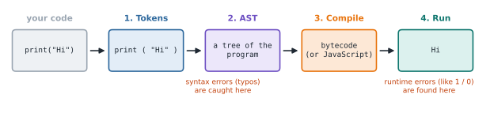

# Lesson 1: How Python runs your code

**You'll learn:** what a program is, `print()`, syntax vs runtime errors, how code is compiled.

▶ **Practise this lesson in the [sandbox](https://kishoremadanagopal.github.io/learning/python/#how-python-runs)**: run every example and check your exercise answers.

## Key terms

- **Program:** a list of instructions for a computer, run from top to bottom.
- **Python:** a popular, readable programming language. The standard version is called CPython.
- **Function:** a named piece of code that does a job, like `print`. You call it with parentheses: `print("hi")`.
- **Output:** what a program shows on the screen.
- **Syntax:** the grammar rules of a language. Breaking them gives a *syntax error* before anything runs.
- **Token:** the smallest meaningful piece of code, like `print`, `(` or `"hello"`.
- **AST (Abstract Syntax Tree):** the tree Python builds to represent the structure of your program.
- **Bytecode:** the low-level instructions CPython compiles your code into before running it.
- **Interpreter:** the program that reads and runs your Python code.

A **program** is a list of instructions written for a computer. Python reads your instructions from top to bottom and carries them out one at a time.

Here is a complete Python program. Press **Run** on it and watch the output panel.

```python
print("Hello, world!")
print("I am learning Python.")
```

Two lines of code produced two lines of output. `print` is a built-in **function**: you give it a value inside the parentheses, and it shows that value on the screen.

## What happens when you press Run

Python does not understand your text directly. It processes it in stages, and the editor lets you look at each one using the tabs above the output:

1. **Tokens**: Python splits your text into small pieces called tokens, like `print`, `(`, `"Hello, world!"` and `)`.
2. **AST**: it arranges those tokens into a tree that shows the structure of your program. This is where *syntax errors* (grammar mistakes) are caught.
3. **Compile**: the tree is turned into low-level instructions. Regular Python (CPython) produces *bytecode*. This course runs Python inside your browser with Brython, which produces JavaScript instead.
4. **Run**: the instructions execute and you see the result.



You don't need to memorise these stages now. Just remember that a typo is caught *before* anything runs, while a mistake like dividing by zero is only found *while* the program runs.

## Your first error

Errors are normal. Every programmer sees hundreds of them every week. Run this and read the message:

*This example raises an error on purpose.*

```python
print("Hello)
```

Python tells you the file, the line number, and what went wrong: the text was never closed with a `"`. Fix it by adding the missing quote and run it again.

## How to use this course

- In the sandbox, every code block has a **Run** button that loads it into the editor. Change the code and run it again. Breaking things on purpose is a great way to learn.
- Each lesson ends with **exercises**. Write your answer in the editor and press **Check**. Your progress is saved in this browser.
- Short **quizzes** check that the ideas stuck.

## Common mistakes

- Forgetting the closing quote or bracket: `print("Hello)` is a syntax error. Every `(` needs a `)` and every `"` needs a matching `"`.
- Capitalising built-in names: `Print("hi")` gives `NameError`. Python is case-sensitive.
- Panicking at red text. An error message is information: read the last line first, then the line number.

## Exercises

### 1. Say hello

Write a program that prints exactly these two lines:

```text
Hello, Python!
Let's learn together.
```

**In the sandbox:** exercise 1. Press **Check** to test your answer.

<details>
<summary>Hints</summary>

1. Use two print() calls. The second line contains an apostrophe, so wrap it in double quotes: "Let's learn together."

</details>

<details>
<summary>Answers</summary>

**1. Say hello**

```python
print("Hello, Python!")
print("Let's learn together.")
```

</details>

## Quick quiz

1. What does `print("2 + 2")` display?
   - A) 4
   - B) 2 + 2
   - C) Nothing, it's an error

2. When is a syntax error detected?
   - A) Before the program starts running
   - B) Only when that line runs
   - C) After the program finishes

<details>
<summary>Quiz answers</summary>

1. **B) 2 + 2**: The quotes make it text, so Python prints the characters exactly as written. Without quotes, `print(2 + 2)` would print 4.
2. **A) Before the program starts running**: Syntax errors are found while Python parses your code into a tree, before any line runs. That's why a typo on line 50 stops line 1 from running too.

</details>

---
Back to the [course home](../README.md) · Next: [Lesson 2: Printing and comments](02-print-and-comments.md)
