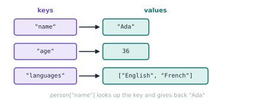

# Lesson 14: Dictionaries

**You'll learn:** key-value pairs, adding/changing/removing, `.get()`, `.items()`, counting, nested data.

▶ **Practise this lesson in the [sandbox](https://kishoremadanagopal.github.io/learning/python/#dictionaries)**: run every example and check your exercise answers.

## Key terms

- **Dictionary (dict):** a collection of key-value pairs in braces.
- **Key:** the label used to look up a value. Keys must be unique and hashable.
- **Value:** the data stored under a key.
- **KeyError:** raised when you look up a key that doesn't exist.
- **.get(key, default):** looks up a key, returning a default instead of raising an error.
- **.items():** gives each key together with its value.
- **JSON:** a text format for data that maps closely onto dicts and lists.

A **dictionary** (`dict`) maps **keys** to **values**, like a real dictionary maps words to definitions. Instead of looking items up by position, you look them up by key.

```python
person = {
    "name": "Ada",
    "age": 36,
    "languages": ["English", "French"],
}
print(person["name"])
print(person["languages"][1])
```



## Adding, changing and removing

```python
stock = {"apples": 10, "pears": 4}
stock["bananas"] = 6        # add a new key
stock["apples"] -= 3        # change a value
del stock["pears"]          # remove a key
print(stock)
print(len(stock), "products")
```

## Missing keys

Looking up a key that doesn't exist raises a `KeyError`. Use `in` to check first, or `.get()` to supply a default:

```python
prices = {"tea": 2.5, "coffee": 3.0}
print("juice" in prices)
print(prices.get("juice"))         # None
print(prices.get("juice", 0))      # default value
```

## Looping over a dictionary

```python
scores = {"Ana": 91, "Ben": 78, "Cy": 85}
for name in scores:                 # keys
    print(name)
for name, score in scores.items():  # key and value
    print(f"{name}: {score}")
print(list(scores.values()))
```

Dictionaries remember the order in which keys were added.

## Counting with a dictionary

Counting things is one of the most common dictionary jobs:

```python
text = "the cat and the hat and the bat"
counts = {}
for word in text.split():
    counts[word] = counts.get(word, 0) + 1
print(counts)

top = max(counts, key=counts.get)
print("Most common:", top)
```

## Keys must be immutable

Strings, numbers and tuples can be keys. Lists can't, because they can change.

```python
distances = {("London", "Paris"): 344, ("Paris", "Rome"): 1105}
print(distances[("London", "Paris")])
```

## Nested data

Real-world data (like JSON from a web API) is often dictionaries inside lists inside dictionaries:

```python
users = [
    {"name": "Ana", "roles": ["admin", "dev"]},
    {"name": "Ben", "roles": ["dev"]},
]
for user in users:
    if "admin" in user["roles"]:
        print(user["name"], "is an admin")
```

## Common mistakes

- Using `d[key]` when the key might be missing. Use `in` or `.get()`.
- Looping with `for k in d` and expecting values. That gives keys; use `.items()` for both.
- Using a list as a key. Keys must be immutable; use a tuple.
- Forgetting the default in counting: `counts[w] = counts.get(w) + 1` fails on the first word. Use `counts.get(w, 0)`.

## Exercises

### 1. Word frequency

Write `word_counts(text)` that returns a dictionary mapping each **lowercased** word to how many times it appears. Split on whitespace with `.split()`.

`word_counts("The cat saw the dog")` → `{'the': 2, 'cat': 1, 'saw': 1, 'dog': 1}`

Starter code:

```python
def word_counts(text):
    counts = {}

    return counts

print(word_counts("The cat saw the dog"))
```

### 2. Invert a phone book

Write `invert(book)` that swaps keys and values: `{"Ana": "555-1234"}` becomes `{"555-1234": "Ana"}`.

Starter code:

```python
def invert(book):
    return {}

print(invert({"Ana": "555-1234", "Ben": "555-9876"}))
```

**In the sandbox:** exercises 21–22. Press **Check** to test your answer.

<details>
<summary>Hints</summary>

1. Loop over text.lower().split() and use counts[word] = counts.get(word, 0) + 1.
2. Loop with for name, number in book.items(): and set result[number] = name.

</details>

<details>
<summary>Answers</summary>

**1. Word frequency**

```python
def word_counts(text):
    counts = {}
    for word in text.lower().split():
        counts[word] = counts.get(word, 0) + 1
    return counts

print(word_counts("The cat saw the dog"))
```

**2. Invert a phone book**

```python
def invert(book):
    result = {}
    for name, number in book.items():
        result[number] = name
    return result

print(invert({"Ana": "555-1234", "Ben": "555-9876"}))
```

</details>

## Quick quiz

1. What does `{"a": 1}.get("b", 0)` return?
   - A) None
   - B) 0
   - C) KeyError

2. Which can NOT be a dictionary key?
   - A) `"name"`
   - B) `(1, 2)`
   - C) `[1, 2]`

3. What does `for k, v in d.items():` give you?
   - A) Each key and its value
   - B) Each value twice
   - C) Only the keys

<details>
<summary>Quiz answers</summary>

1. **B) 0**: `.get()` returns the default when the key is missing.
2. **C) `[1, 2]`**: Keys must be immutable (hashable). Lists can change, so they can't be keys.
3. **A) Each key and its value**: `.items()` produces (key, value) pairs, which the loop unpacks.

</details>

---
Previous: [Lesson 13](13-tuples-and-unpacking.md) · Next: [Lesson 15: Sets](15-sets.md)
