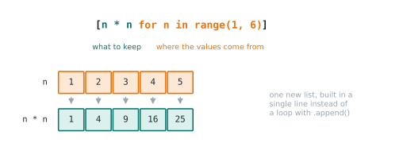

# Lesson 16: Comprehensions

**You'll learn:** list, dict and set comprehensions, filtering with `if`, conditional values, nesting.

▶ **Practise this lesson in the [sandbox](https://kishoremadanagopal.github.io/learning/python/#comprehensions)**: run every example and check your exercise answers.

## Key terms

- **Comprehension:** a compact expression that builds a collection from an iterable.
- **List comprehension:** `[expression for item in iterable if condition]`.
- **Dict comprehension:** `{key: value for item in iterable}`.
- **Set comprehension:** `{expression for item in iterable}`.
- **Filter clause:** the `if` at the end of a comprehension, which drops items.

A **comprehension** builds a new collection from an existing one in a single expression. Compare the loop version with the comprehension:

```python
squares = []
for n in range(1, 6):
    squares.append(n * n)
print(squares)

squares = [n * n for n in range(1, 6)]
print(squares)
```

Read it as: "**n * n** for each **n** in **range(1, 6)**".



## Filtering with if

Add an `if` at the end to keep only some items:

```python
nums = [5, 12, 7, 20, 3, 18]
big = [n for n in nums if n > 10]
print(big)

words = ["apple", "Kiwi", "banana", "Fig"]
short_upper = [w.upper() for w in words if len(w) <= 4]
print(short_upper)
```

## Choosing a value with if/else

To transform every item differently (not filter), put the conditional expression at the **front**:

```python
nums = [1, 2, 3, 4, 5]
labels = ["even" if n % 2 == 0 else "odd" for n in nums]
print(labels)
```

## Dict and set comprehensions

```python
names = ["ana", "ben", "cy"]
lengths = {name: len(name) for name in names}
print(lengths)

prices = {"tea": 2.5, "cake": 4.0, "coffee": 3.0}
cheap = {item: p for item, p in prices.items() if p < 3.5}
print(cheap)

first_letters = {name[0] for name in ["Ana", "Alan", "Ben"]}
print(first_letters)
```

## Nested comprehensions

You can use two `for` clauses. They read in the same order as nested loops:

```python
pairs = [(x, y) for x in range(1, 3) for y in "ab"]
print(pairs)

grid = [[1, 2, 3], [4, 5, 6]]
flat = [n for row in grid for n in row]
print(flat)
```

## When not to use them

If a comprehension needs more than one `if` and two `for`s, or doesn't fit comfortably on a line or two, a regular loop is clearer. Readability beats cleverness.

## Common mistakes

- Putting a filter `if` at the front, or an `if/else` at the end. Filters go last; `a if c else b` goes first.
- Writing comprehensions so long they're hard to read. Switch to a normal loop.
- Using a list comprehension only for its side effects, like `[print(x) for x in items]`. Use a loop.

## Exercises

### 1. Clean the data

Write `clean(values)` that takes a list of strings, strips whitespace, drops empty strings, and converts the rest to integers, using **one list comprehension**.

`clean([" 4", "", "15 ", "  ", "8"])` → `[4, 15, 8]`

Starter code:

```python
def clean(values):
    return values

print(clean([" 4", "", "15 ", "  ", "8"]))
```

### 2. Grade book

Given `scores = {"Ana": 91, "Ben": 58, "Cy": 74, "Dee": 45}`, build a dict comprehension `passed` that keeps only students with 60 or more.

Starter code:

```python
scores = {"Ana": 91, "Ben": 58, "Cy": 74, "Dee": 45}
passed = {}
print(passed)
```

**In the sandbox:** exercises 24–25. Press **Check** to test your answer.

<details>
<summary>Hints</summary>

1. [int(v.strip()) for v in values if v.strip()] — an empty string is falsy, so the if drops it.
2. {name: s for name, s in scores.items() if s >= 60}

</details>

<details>
<summary>Answers</summary>

**1. Clean the data**

```python
def clean(values):
    return [int(v.strip()) for v in values if v.strip()]

print(clean([" 4", "", "15 ", "  ", "8"]))
```

**2. Grade book**

```python
scores = {"Ana": 91, "Ben": 58, "Cy": 74, "Dee": 45}
passed = {name: s for name, s in scores.items() if s >= 60}
print(passed)
```

</details>

## Quick quiz

1. What is `[x * 2 for x in range(3)]`?
   - A) [0, 2, 4]
   - B) [2, 4, 6]
   - C) [0, 1, 2, 0, 1, 2]

2. Where does a filtering `if` go in a list comprehension?
   - A) At the start
   - B) At the end
   - C) Anywhere

<details>
<summary>Quiz answers</summary>

1. **A) [0, 2, 4]**: range(3) gives 0, 1 and 2, each doubled.
2. **B) At the end**: `[x for x in items if condition]`. A conditional *expression* (`a if c else b`) goes at the start instead.

</details>

---
Previous: [Lesson 15](15-sets.md) · Next: [Lesson 17: String methods](17-string-methods.md)
