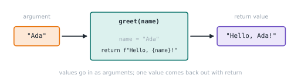

# Lesson 18: Defining functions

**You'll learn:** `def`, parameters, `return`, docstrings, print vs return, returning early.

▶ **Practise this lesson in the [sandbox](https://kishoremadanagopal.github.io/learning/python/#functions-basics)**: run every example and check your exercise answers.

## Key terms

- **Function definition:** creating a function with `def name(parameters):`.
- **Parameter:** a name in the definition that receives a value.
- **Argument:** the value passed in when calling.
- **Return value:** what a function hands back with `return`.
- **Docstring:** the string right under `def` that documents the function.
- **Call:** running a function with `name(arguments)`.
- **DRY (Don't Repeat Yourself):** putting repeated logic in one function.

A **function** is a named, reusable block of code. You've already used many: `print`, `len`, `sorted`. Now you'll write your own.

```python
def greet(name):
    """Return a friendly greeting for name."""
    return f"Hello, {name}!"

message = greet("Ada")
print(message)
print(greet("Alan"))
```

- `def` starts the definition, followed by the name and **parameters** in parentheses.
- The indented block is the **body**. It doesn't run until the function is **called**.
- `return` sends a value back to the caller and ends the function immediately.
- The string right under `def` is a **docstring**: documentation that tools and `help()` can read.

The values you pass in when calling (`"Ada"`) are called **arguments**.



## Why functions?

- **Reuse**: write once, call many times.
- **Names**: `calculate_tax(price)` explains itself better than the raw formula.
- **Testing**: small functions are easy to check in isolation.
- **Don't Repeat Yourself (DRY)**: fix a bug in one place instead of five.

## print vs return

This is the biggest beginner confusion. `print` **shows** a value on screen. `return` **hands it back** so the program can keep using it.

```python
def add_print(a, b):
    print(a + b)

def add_return(a, b):
    return a + b

x = add_print(2, 3)     # shows 5, but x gets nothing
y = add_return(2, 3)    # shows nothing, y gets 5
print("x =", x)
print("y =", y, "and y * 10 =", y * 10)
```

A function without a `return` gives back `None`. Prefer returning values; let the caller decide whether to print.

## Returning early

`return` can appear anywhere. It's often used to handle special cases first, which keeps the main logic unindented:

```python
def describe_age(age):
    if age < 0:
        return "invalid"
    if age < 13:
        return "child"
    if age < 20:
        return "teenager"
    return "adult"

for a in (-1, 8, 15, 42):
    print(a, describe_age(a))
```

## Functions calling functions

```python
def area(width, height):
    return width * height

def paint_needed(width, height, coats=2):
    litres_per_m2 = 0.1
    return area(width, height) * coats * litres_per_m2

print(f"{paint_needed(4, 2.5):.1f} litres")
```

## Common mistakes

- Printing instead of returning, then trying to use the result. A function without `return` gives `None`.
- Forgetting the parentheses when calling: `greet` is the function itself; `greet()` runs it.
- Putting code after `return` and expecting it to run.
- Defining a function and never calling it.

## Exercises

### 1. Average of a list

Write `average(nums)` that **returns** the mean of a list of numbers. If the list is empty, return `0` instead of crashing.

Starter code:

```python
def average(nums):
    print(sum(nums) / len(nums))

result = average([2, 4, 9])
print(result)
```

### 2. BMI category

Write `bmi(weight_kg, height_m)` returning `weight / height ** 2` rounded to 1 decimal place, and `bmi_category(value)` returning `"underweight"` (below 18.5), `"normal"` (below 25), `"overweight"` (below 30) or `"obese"`.

Starter code:

```python
def bmi(weight_kg, height_m):
    pass

def bmi_category(value):
    pass

b = bmi(70, 1.75)
print(b, bmi_category(b))
```

**In the sandbox:** exercises 28–29. Press **Check** to test your answer.

<details>
<summary>Hints</summary>

1. Replace print with return. Handle the empty list first: if not nums: return 0.
2. bmi: return round(weight_kg / height_m ** 2, 1). bmi_category: a chain of if value < ...: return ... checks from low to high.

</details>

<details>
<summary>Answers</summary>

**1. Average of a list**

```python
def average(nums):
    if not nums:
        return 0
    return sum(nums) / len(nums)

result = average([2, 4, 9])
print(result)
```

**2. BMI category**

```python
def bmi(weight_kg, height_m):
    return round(weight_kg / height_m ** 2, 1)

def bmi_category(value):
    if value < 18.5:
        return "underweight"
    if value < 25:
        return "normal"
    if value < 30:
        return "overweight"
    return "obese"

b = bmi(70, 1.75)
print(b, bmi_category(b))
```

</details>

## Quick quiz

1. What does a function return if it has no `return` statement?
   - A) 0
   - B) None
   - C) An empty string

2. What's the difference between a parameter and an argument?
   - A) Parameters are the names in `def`; arguments are the values passed in a call
   - B) They are the same thing
   - C) Arguments are in `def`; parameters are in the call

<details>
<summary>Quiz answers</summary>

1. **B) None**: Every function returns something; without `return`, it's None.
2. **A) Parameters are the names in `def`; arguments are the values passed in a call**: In `def f(x)` x is a parameter; in `f(5)` the 5 is an argument.

</details>

---
Previous: [Lesson 17](17-string-methods.md) · Next: [Lesson 19: Parameters in depth](19-parameters.md)
