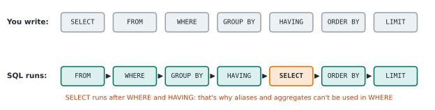

# Lesson 4: HAVING, filtering groups

**You'll learn:** `HAVING`, the difference between `WHERE` and `HAVING`, and the order SQL really runs clauses in.

## Key terms

- **HAVING:** filters groups after `GROUP BY`. Unlike `WHERE`, it can use aggregates.
- **Execution order:** the order SQL actually runs the clauses, which differs from the order you write them.

## Syntax

```sql
SELECT group_column, AGGREGATE(column)
FROM table_name
WHERE row_condition
GROUP BY group_column
HAVING AGGREGATE(column) condition
ORDER BY ...
LIMIT ...;
```

## HAVING

`WHERE` runs *before* groups exist, so it can't use aggregates. `HAVING` runs *after* grouping, so it can.

```sql
SELECT city, COUNT(*) AS num_customers
FROM customers
GROUP BY city
HAVING COUNT(*) > 1;
```

Result: Fremont 2, Oakland 2. San Jose had only 1, so its group was dropped.

## WHERE vs HAVING

| | `WHERE` | `HAVING` |
|---|---|---|
| Filters | individual **rows** | whole **groups** |
| Runs | before `GROUP BY` | after `GROUP BY` |
| Aggregates allowed? | No | Yes |

**The one-row test:** cover every row except one and ask, *"Can I decide keep or drop from this one row alone?"*

- **Yes** → `WHERE`. ("Employees in Sales": the department is right there in the row.)
- **No, I need other rows too** → `HAVING`. ("Departments with fewer than 3 people": one row isn't enough.)

Words like **average, total, count, number of, highest, lowest** in a condition almost always mean `HAVING`.

## Using both

```sql
SELECT city, COUNT(*) AS num_customers
FROM customers
WHERE age > 30              -- 1. drop rows: keeps Maya, Priya, Ana
GROUP BY city               -- 2. make groups: Fremont 2, Oakland 1
HAVING COUNT(*) >= 2;       -- 3. drop groups: keeps Fremont
```

## HAVING vs ORDER BY

- **`HAVING` crosses rows out** ("only customers who spent more than 300"). It needs a full condition: `HAVING SUM(amount) > 300`.
- **`ORDER BY` rearranges** ("highest first"). `DESC` goes here, never in `HAVING`.

## The real execution order

You *write* clauses in this order:
```
SELECT → FROM → WHERE → GROUP BY → HAVING → ORDER BY → LIMIT
```
SQL *runs* them in this order:
```
FROM → WHERE → GROUP BY → HAVING → SELECT → ORDER BY → LIMIT
```




This explains three rules at once:
- Aggregates can't go in `WHERE`, because grouping hasn't happened yet.
- Aliases (names made with `AS`) can't be used in `WHERE` or `HAVING`, because `SELECT` hasn't run yet.
- Aliases **can** be used in `ORDER BY`, because it runs after `SELECT`.

MySQL and SQLite accept aliases in `HAVING` anyway. MSSQL, Oracle, and PostgreSQL don't. **Portable habit:** repeat the aggregate in `HAVING` (`HAVING AVG(age) < 40`), and use the alias in `ORDER BY`.

## Common mistakes

- `HAVING = 1` → needs a full condition: `HAVING COUNT(*) = 1`
- `HAVING age > 50` → a plain column is ambiguous after grouping; use `HAVING MAX(age) > 50`
- `SELECT city, age > 20` → conditions don't go in `SELECT`; `SELECT` only decides what to *show*
- `LIMIT BY salary > 70000` → `LIMIT` only takes a number

## Exercises

Using `employees`:

1. Departments that have more than 2 employees, with the count.
2. Departments whose lowest salary is above 60000.
3. Each department's total years, counting only employees earning at least 60000.
4. Departments whose average years is more than 4, with that average.
5. For employees with at least 3 years: each department's highest salary, keeping only departments where that's above 70000, highest first.

**In the sandbox:** exercises 4, 7, 8, 9, 10.

<details>
<summary>Answers</summary>

```sql
-- 1  → Sales 3, Engineering 3
SELECT department, COUNT(*) AS total_num
FROM employees
GROUP BY department
HAVING COUNT(*) > 2;

-- 2  → Engineering, Marketing
SELECT department FROM employees
GROUP BY department
HAVING MIN(salary) > 60000;

-- 3  → Sales 10, Engineering 15, Marketing 10
SELECT department, SUM(years) AS total_years
FROM employees
WHERE salary >= 60000
GROUP BY department;

-- 4  → Engineering 5, Marketing 5
SELECT department, AVG(years) AS average_years
FROM employees
GROUP BY department
HAVING AVG(years) > 4;

-- 5  → Engineering 105000, Sales 72000
SELECT department, MAX(salary) AS max_salary
FROM employees
WHERE years >= 3
GROUP BY department
HAVING MAX(salary) > 70000
ORDER BY max_salary DESC;
```
</details>

---
Previous: [Lesson 3](03-aggregates-group-by.md) · Next: [Lesson 5: JOINs](05-joins.md)
