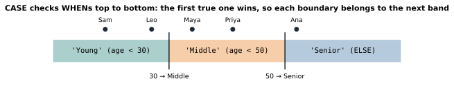

# Lesson 7: CASE, if/then logic inside a query

**You'll learn:** `CASE WHEN ... THEN ... ELSE ... END`, boundary conditions, and conditional counting.

## Key terms

- **CASE:** if/then logic that produces a value for each row.
- **WHEN / THEN:** one rule: when this is true, use that value.
- **ELSE:** the value when no rule matches (NULL if you leave it out).
- **END:** closes the `CASE`.
- **Boundary:** the exact value where one category ends and the next begins.
- **Conditional aggregation:** `SUM(CASE ... THEN 1 ELSE 0 END)`, counting only rows that match.

## Syntax

```sql
CASE
  WHEN condition1 THEN result1
  WHEN condition2 THEN result2
  ELSE default_result
END AS new_column_name
```

## The basic shape

```sql
SELECT name, salary,
  CASE
    WHEN salary >= 90000 THEN 'High'
    WHEN salary >= 65000 THEN 'Medium'
    ELSE 'Low'
  END AS salary_level
FROM employees;
```

- `CASE` starts it and **`END` finishes it**. Forgetting `END` is the most common mistake.
- Each `WHEN condition THEN value` is one rule.
- `ELSE` is the fallback. Without it, unmatched rows get `NULL`.
- The whole block is **one column**, so the line before `CASE` needs a **comma**.

**The labels are your own words.** 'High', 'Medium', and 'Low' don't exist in the table. `CASE` creates a new column in the result; the table itself doesn't change. The *condition* uses a real column (`salary`); the *result* is any text you choose, in quotes.

## The first match wins

SQL checks the `WHEN`s top to bottom and stops at the first true one. So for ranges, go from the **highest** down:

```sql
CASE
  WHEN salary >= 65000 THEN 'Medium'   -- Bob and Dev stop here...
  WHEN salary >= 90000 THEN 'High'     -- ...so this is never reached
  ELSE 'Low'
END
```

## Boundaries: read the word before the number




| Question says | Use |
|---|---|
| "over", "more than", "above" | `>` |
| "at least", "or more", "and over" | `>=` |
| "under", "less than", "below" | `<` |
| "at most", "or less", "up to" | `<=` |

**Test the edge values in your head.** For "Young under 30, Middle 30–49, Senior 50+", check 29, 30, 49, and 50. With `WHEN age > 30 THEN 'Middle'`, a 30-year-old would wrongly land in Young. The sample data has no 30-year-old, so this bug is invisible until real data arrives.

## Conditional counting: SUM(CASE ...)

How many people in each department earn over 70000?

```sql
SELECT department,
  SUM(CASE WHEN salary > 70000 THEN 1 ELSE 0 END) AS above_70k,
  SUM(CASE WHEN salary <= 70000 THEN 1 ELSE 0 END) AS at_or_below_70k
FROM employees
GROUP BY department;
```

**CASE on the inside, SUM on the outside.** The `CASE` turns every row into a 1 or a 0, and `SUM` adds them up per group. Use plain numbers `1` and `0`, not `'1'` in quotes.

Putting it the other way round (`CASE WHEN salary > 70000 THEN COUNT(*) ...`) breaks the GROUP BY rule, since `salary` alone is ambiguous after grouping.

## Grouping BY a CASE

How many customers are in each age group?

```sql
SELECT
  CASE WHEN age >= 50 THEN 'Senior' WHEN age >= 30 THEN 'Middle' ELSE 'Young' END AS age_group,
  COUNT(*) AS num_customers
FROM customers
GROUP BY
  CASE WHEN age >= 50 THEN 'Senior' WHEN age >= 30 THEN 'Middle' ELSE 'Young' END;
```

SQLite and MySQL let you write `GROUP BY age_group`, but MSSQL doesn't (`GROUP BY` runs before `SELECT`), so repeating the `CASE` is the portable version.

## Exercises

1. Each customer's name, age, and group: under 30 'Young', 30–49 'Middle', 50 and over 'Senior'.
2. Each employee's name and 'Veteran' for 5 or more years, otherwise 'Newer'.
3. Each order's product, amount, and 'Big' if the amount is **over** 300, otherwise 'Small'.
4. For each department, the number of employees with **at least** 5 years.
5. Each employee's name, salary, and 'Above 70k' if over 70000, otherwise '70k or less'.
6. Each customer's name, city, and 'East Bay' for Fremont or Oakland, otherwise 'South Bay'.
7. Each employee's name, years, and 'Senior' for at least 6, 'Mid' for at least 3, otherwise 'Junior'.
8. Each order's product, the customer's name, and 'Big' if at least 400, otherwise 'Small'.
9. For each department: how many earn over 70000, and how many earn 70000 or less.
10. **Challenge:** how many customers are in each age group.

**In the sandbox:** exercises 21–30. Type labels exactly as shown, including capitals.

<details>
<summary>Answers</summary>

```sql
-- 1
SELECT name, age,
  CASE WHEN age < 30 THEN 'Young' WHEN age < 50 THEN 'Middle' ELSE 'Senior' END AS age_group
FROM customers;

-- 2
SELECT name, CASE WHEN years >= 5 THEN 'Veteran' ELSE 'Newer' END AS label
FROM employees;

-- 3  (the Desk at exactly 300 is Small)
SELECT product, amount, CASE WHEN amount > 300 THEN 'Big' ELSE 'Small' END AS size
FROM orders;

-- 4  → Engineering 2, Marketing 1, Sales 1
SELECT department, SUM(CASE WHEN years >= 5 THEN 1 ELSE 0 END) AS veterans
FROM employees
GROUP BY department;

-- 5  (Emma at exactly 70000 is '70k or less')
SELECT name, salary, CASE WHEN salary > 70000 THEN 'Above 70k' ELSE '70k or less' END AS pay_band
FROM employees;

-- 6
SELECT name, city,
  CASE WHEN city IN ('Fremont', 'Oakland') THEN 'East Bay' ELSE 'South Bay' END AS region
FROM customers;

-- 7
SELECT name, years,
  CASE WHEN years >= 6 THEN 'Senior' WHEN years >= 3 THEN 'Mid' ELSE 'Junior' END AS level
FROM employees;

-- 8
SELECT o.product, c.name,
  CASE WHEN o.amount >= 400 THEN 'Big' ELSE 'Small' END AS size
FROM customers c
JOIN orders o ON o.customer_id = c.id;

-- 9
SELECT department,
  SUM(CASE WHEN salary > 70000 THEN 1 ELSE 0 END) AS above_70k,
  SUM(CASE WHEN salary <= 70000 THEN 1 ELSE 0 END) AS at_or_below_70k
FROM employees
GROUP BY department;

-- 10 → Middle 2, Senior 1, Young 2 (see "Grouping BY a CASE" above)
```
</details>

---
Previous: [Lesson 6](06-subqueries.md) · Next: [Lesson 8: Handy functions](08-functions.md)
