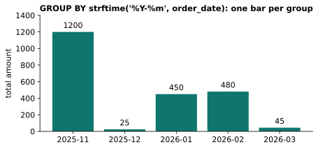

# Lesson 9: Dates

**You'll learn:** date formats, filtering by date, pulling out the year, month and weekday, grouping by month, the start of a month, today's date, and date math, in SQLite with MySQL, PostgreSQL, MSSQL and Oracle side by side.

## Key terms

- **ISO date format:** `YYYY-MM-DD`, which sorts and compares correctly.
- **strftime:** SQLite's function for pulling parts out of a date or formatting it.
- **Format code:** a letter code for a date part, like `%Y` (year) or `%m` (month).
- **julianday:** SQLite's function that turns a date into a day number, for date math.

## Syntax

```sql
WHERE date_col >= 'YYYY-MM-DD' AND date_col < 'YYYY-MM-DD'
strftime('%Y', date_col)           -- year as text
strftime('%Y-%m', date_col)        -- year-month as text
julianday(end) - julianday(start)  -- days between
date(date_col, '+30 days')         -- add days
```

This lesson uses the `order_date` column of `orders` (see [the practice tables](00-the-tables.md)).

## The date format: YYYY-MM-DD

Write dates as year-month-day with leading zeros: `'2026-01-10'`. This format sorts correctly and compares correctly with `<` and `>`, and every database accepts it.

## Filtering by date

```sql
SELECT product, order_date FROM orders
WHERE order_date >= '2026-02-01';                              -- Monitor, Keyboard, Lamp
```

For a range, use "on or after the start, and before the next period":

```sql
WHERE order_date >= '2026-02-01' AND order_date < '2026-03-01'   -- all of February
```

You don't need to know how many days February has, and it still works when dates include a time of day.

## Pulling out parts of a date

| Want | SQLite | MSSQL | Oracle |
|---|---|---|---|
| year | `strftime('%Y', d)` → `'2026'` | `YEAR(d)` → `2026` | `EXTRACT(YEAR FROM d)` |
| month | `strftime('%m', d)` → `'01'` | `MONTH(d)` → `1` | `EXTRACT(MONTH FROM d)` |
| year-month | `strftime('%Y-%m', d)` | `FORMAT(d, 'yyyy-MM')` | `TO_CHAR(d, 'YYYY-MM')` |

⚠️ In SQLite, `strftime` returns **text with leading zeros**. Compare with `= '2025'` and `= '01'`, in quotes. `= 2025` (a number) silently matches nothing.

⚠️ **Letter case matters in format codes.** In SQLite `%m` is month and `%M` is **minute**. `strftime('%Y-%M', ...)` turns every date into `2026-00` and your query returns nothing. MSSQL flips it (`MM` = month, `mm` = minutes), and Oracle uses `MM` and `MI`.

| SQLite code | Means |
|---|---|
| `%Y` | year |
| `%m` | month |
| `%d` | day |
| `%H` / `%M` / `%S` | hour / minute / second |

## Grouping by month or year

```sql
SELECT strftime('%Y-%m', order_date) AS month, SUM(amount) AS total
FROM orders
GROUP BY strftime('%Y-%m', order_date);
```




## Date math

| Want | SQLite | MSSQL |
|---|---|---|
| today | `date('now')` | `GETDATE()` |
| days between | `julianday(end) - julianday(start)` | `DATEDIFF(day, start, end)` |
| add 30 days | `date(d, '+30 days')` | `DATEADD(day, 30, d)` |

`MIN(order_date)` is the earliest date and `MAX(order_date)` the latest.

## "First order" needs MIN, not luck

```sql
-- Correct in every database
SELECT c.name, MIN(o.order_date) AS first_order
FROM orders o
JOIN customers c ON o.customer_id = c.id
GROUP BY c.name;
```

`SELECT c.name, o.order_date ... GROUP BY c.name` may show the right dates in SQLite, but only because it picks a date from whichever row it reads first. It breaks as soon as an older order is added, and MSSQL and Oracle reject it. **A correct result doesn't always mean a correct query.**

To format the result, wrap the format *around* the `MIN`: `FORMAT(MIN(o.order_date), 'yyyy-MM-dd')` in MSSQL, `TO_CHAR(MIN(o.order_date), 'YYYY-MM-DD')` in Oracle.

## More date tools

| Want | SQLite | Example → Result |
|---|---|---|
| today | `date('now')` or `CURRENT_DATE` | `2026-10-02` |
| now (date and time, UTC) | `datetime('now')` or `CURRENT_TIMESTAMP` | `2026-10-02 11:30:00` |
| first day of the month | `date(d, 'start of month')` | `2026-01-25` → `2026-01-01` |
| last day of the month | `date(d, 'start of month', '+1 month', '-1 day')` | `2026-02-14` → `2026-02-28` |
| day of the week | `strftime('%w', d)` (0 = Sunday … 6 = Saturday) | `2026-01-10` → `'6'` |
| day of the year | `strftime('%j', d)` | `2026-03-01` → `'060'` |
| week of the year | `strftime('%W', d)` | |
| add a month | `date(d, '+1 month')` | |

Grouping by `date(order_date, 'start of month')` gives a real date for each month, which sorts and joins better than the text `'2026-01'`.

Weekend orders:

```sql
SELECT product, order_date FROM orders
WHERE strftime('%w', order_date) IN ('0', '6');      -- Desk, Chair, Monitor, Keyboard
```

### Someone's age in whole years

Subtracting years isn't enough: someone born in December isn't a year older in January. Compare the month and day too:

```sql
SELECT strftime('%Y', 'now') - strftime('%Y', '1990-12-15')
     - (strftime('%m-%d', 'now') < '12-15') AS age;
```

The last part is 1 (true) when this year's birthday hasn't happened yet, so it subtracts one year.

## Dates in every database

This is where databases differ most, so look up your database's version when you switch.

| Want | SQLite | MySQL | PostgreSQL | MSSQL | Oracle |
|---|---|---|---|---|---|
| today | `date('now')` | `CURDATE()` | `CURRENT_DATE` | `CAST(GETDATE() AS DATE)` | `TRUNC(SYSDATE)` |
| year (number) | `CAST(strftime('%Y', d) AS INTEGER)` | `YEAR(d)` | `EXTRACT(YEAR FROM d)` | `YEAR(d)` | `EXTRACT(YEAR FROM d)` |
| month start | `date(d, 'start of month')` | `DATE_FORMAT(d, '%Y-%m-01')` | `DATE_TRUNC('month', d)` | `DATETRUNC(month, d)` (2022+) | `TRUNC(d, 'MM')` |
| year-month text | `strftime('%Y-%m', d)` | `DATE_FORMAT(d, '%Y-%m')` | `TO_CHAR(d, 'YYYY-MM')` | `FORMAT(d, 'yyyy-MM')` | `TO_CHAR(d, 'YYYY-MM')` |
| add 30 days | `date(d, '+30 days')` | `DATE_ADD(d, INTERVAL 30 DAY)` | `d + INTERVAL '30 days'` | `DATEADD(day, 30, d)` | `d + 30` |
| days between | `julianday(b) - julianday(a)` | `DATEDIFF(b, a)` | `b - a` (dates) | `DATEDIFF(day, a, b)` | `b - a` |
| weekday name | `CASE strftime('%w', d) ...` | `DAYNAME(d)` | `TO_CHAR(d, 'Day')` | `DATENAME(weekday, d)` | `TO_CHAR(d, 'Day')` |
| last day of month | see above | `LAST_DAY(d)` | `DATE_TRUNC('month', d) + INTERVAL '1 month - 1 day'` | `EOMONTH(d)` | `LAST_DAY(d)` |

⚠️ **The order of `DATEDIFF`'s arguments flips:** MySQL is `DATEDIFF(end, start)`, MSSQL is `DATEDIFF(unit, start, end)`. Getting it backwards makes every answer negative.

Oracle AI Database 26ai adds MSSQL-style `DATEADD` and `DATEDIFF`, so the spellings are slowly converging.

## Debugging tip

When a query runs but returns nothing, put the expression in `SELECT` to see what it actually produces:

```sql
SELECT order_date, strftime('%Y-%M', order_date) FROM orders;   -- shows 2026-00: aha!
```

## Exercises

1. Product and order date of every order placed in January 2026.
2. Products of all orders placed in 2025.
3. The number of orders in each month, shown as year-month.
4. The total amount of orders in each year.
5. Each customer's name and the date of their first order.
6. Each order's product and how many days before 2026-03-31 it was placed.

**In the sandbox:** exercises 38–43.

### More practice

7. Each order's product, order date, and the first day of that month.
8. Product and date of orders placed on a weekend (Saturday or Sunday).

**In the sandbox:** exercises 97–98.

<details>
<summary>Answers</summary>

```sql
-- 1  → Desk, Chair
SELECT product, order_date FROM orders
WHERE order_date >= '2026-01-01' AND order_date < '2026-02-01';

-- 2  → Laptop, Mouse
SELECT product FROM orders
WHERE strftime('%Y', order_date) = '2025';

-- 3
SELECT strftime('%Y-%m', order_date) AS month, COUNT(*) AS num_orders
FROM orders
GROUP BY strftime('%Y-%m', order_date);

-- 4  → 2025: 1225, 2026: 975
SELECT strftime('%Y', order_date) AS year, SUM(amount) AS total
FROM orders
GROUP BY strftime('%Y', order_date);

-- 5
SELECT c.name, MIN(o.order_date) AS first_order
FROM customers c
JOIN orders o ON o.customer_id = c.id
GROUP BY c.name;

-- 6  → Laptop 131, Mouse 119, …
SELECT product, julianday('2026-03-31') - julianday(order_date) AS days_before
FROM orders;

-- 7  → Chair 2026-01-25 → 2026-01-01, ...
SELECT product, order_date, date(order_date, 'start of month') AS month_start
FROM orders;

-- 8  → Desk, Chair, Monitor, Keyboard
SELECT product, order_date
FROM orders
WHERE strftime('%w', order_date) IN ('0', '6');
```
</details>

---
Previous: [Lesson 8](08-functions.md) · Next: [Lesson 10: Changing data](10-insert-update-delete.md)
