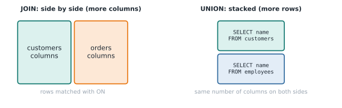

# Lesson 14: UNION, stacking results

**You'll learn:** `UNION`, `UNION ALL`, and the related `INTERSECT` and `EXCEPT`.

## Key terms

- **Set operation:** combines the results of two whole queries.
- **UNION:** stacks results and removes duplicate rows.
- **UNION ALL:** stacks results and keeps everything.

## Syntax

```sql
SELECT col1, col2 FROM table_a
UNION            -- or UNION ALL
SELECT col1, col2 FROM table_b
ORDER BY col1;   -- optional, once, at the very end
```

## JOIN vs UNION




- A **JOIN** puts tables **side by side** (more columns).
- A **UNION** puts results **on top of each other** (more rows).

## UNION

One list of every name, from customers and employees:

```sql
SELECT name FROM customers
UNION
SELECT name FROM employees;
```

That's 13 names. If anyone appeared in both tables, they'd be listed once.

## UNION ALL

```sql
SELECT name, 'Customer' AS type FROM customers
UNION ALL
SELECT name, 'Employee' FROM employees;
```

`UNION ALL` keeps duplicates, and it's faster, since it skips the duplicate check. Use it when you know there are no duplicates or want to keep them. The column names come from the **first** query, so only the first `'Customer'` needs `AS type`.

## The rules

1. Both queries must select the **same number of columns**.
2. Columns are matched **by position**, not by name, so keep them in the same order with compatible types.
3. `ORDER BY` goes **once, at the very end**, and sorts the combined result.

## UNION as "OR across queries"

"Products ordered in 2025 **or** with an amount over 300, each listed once":

```sql
SELECT product FROM orders WHERE strftime('%Y', order_date) = '2025'
UNION
SELECT product FROM orders WHERE amount > 300;
```

Laptop matches both conditions but is listed once, so the result is Laptop, Monitor, Mouse. (For a single table, `WHERE ... OR ...` with `DISTINCT` works too. `UNION` shines when the two parts come from different tables.)

## INTERSECT and EXCEPT

| Operation | Keeps |
|---|---|
| `UNION` | rows in **either** result |
| `INTERSECT` | rows in **both** results |
| `EXCEPT` | rows in the first result **but not** the second |

```sql
SELECT id FROM customers
EXCEPT
SELECT customer_id FROM orders;      -- customers with no orders: 4 (Sam)
```

In Oracle, `EXCEPT` is called `MINUS`.

## Common mistakes

- **Different column counts.** `SELECT name, city ... UNION SELECT name ...` fails.
- **`ORDER BY` in the middle.** Only one `ORDER BY`, after the last query.
- **Using `UNION` when you meant `UNION ALL`.** `UNION` silently removes real duplicates, like two orders with the same product and amount.

## Exercises

1. One list of every name from customers and employees, with no duplicates.
2. One list of everyone with two columns: name, and type ('Customer' or 'Employee').
3. Products ordered in 2025 or with an amount over 300, each listed once.

**In the sandbox:** exercises 65–67.

<details>
<summary>Answers</summary>

All three are shown above.
</details>

---
Previous: [Lesson 13](13-window-functions.md) · Next: [Lesson 15: Views and indexes](15-views-indexes.md)
