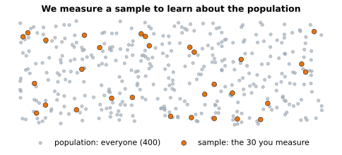

# Lesson 1: What statistics is for

**You'll learn:** populations and samples, statistics and parameters, descriptive vs inferential, kinds of variables.

▶ **Practise this lesson in the [sandbox](https://kishoremadanagopal.github.io/learning/statistics/#what-is-statistics)**: run every example and check your exercise answers.

## Key terms

- **Statistics:** learning about a whole group from data about part of it, and saying how sure you are.
- **Population:** everything or everyone you want to draw conclusions about.
- **Sample:** the part of the population you actually measure.
- **Parameter:** a true number for the whole population, like the average height of every adult.
- **Statistic:** a number calculated from a sample, used to estimate a parameter.
- **Descriptive statistics:** summarising the data you have.
- **Inferential statistics:** drawing conclusions about the population from a sample, with a measure of uncertainty.
- **Variable:** something recorded about each row, such as a score or a city.
- **Categorical variable:** a variable whose values are labels, like city or product.
- **Numerical variable:** a variable whose values are numbers you can do maths with.
- **Ordinal variable:** categories with a natural order, like small, medium, large.

**Statistics** is the art of learning from data when you can't see everything. You can't survey every customer, test every light bulb or wait for every future sale, so you look at **some** of the data and make careful statements about **all** of it.



- The **population** is everything you care about: all customers, all students, every visit to a website.
- A **sample** is the part you actually measure.
- A **statistic** is a number calculated from the sample, like its average. You use it to estimate the matching number for the population, called a **parameter**.

Statistics has two big jobs, and this course follows them in order:

| Job | Question | Parts of this course |
|---|---|---|
| **Descriptive statistics** | "What does this data look like?" | 1 |
| **Inferential statistics** | "What can I conclude about everyone from this sample, and how sure am I?" | 2 to 6 |

## Kinds of variables

A **variable** is anything you record about each row. The kind of variable decides which summaries and charts make sense:

| Kind | Examples | Summaries | Charts |
|---|---|---|---|
| **Numerical, continuous** | height, price, temperature | mean, median, spread | histogram, box plot |
| **Numerical, discrete** (counts) | number of orders, goals | mean, median | bar chart of counts |
| **Categorical** | city, product, yes/no | counts, percentages | bar chart |
| **Ordinal** (categories with an order) | small/medium/large, survey ratings 1–5 | counts, median | bar chart in order |

Let's look at the students dataset, which you'll use a lot:

```python
import pandas as pd

students = pd.read_csv("students.csv")
print(students.head())
print(students.dtypes)
```

`class` is categorical; `hours_studied` is continuous; the scores are discrete numbers but behave like continuous ones because they have many possible values.

## Describing in one line

pandas' `describe()` gives the most common descriptive statistics at once. By the end of Part 1 you'll know what every number in it means:

```python
import pandas as pd

students = pd.read_csv("students.csv")
print(students[["hours_studied", "math"]].describe().round(1))
```

## A sample is not the population

Here's the key idea of the whole course in five lines. We take a random sample of 10 students, several times, and each sample gives a slightly different average:

```python
import pandas as pd

students = pd.read_csv("students.csv")
print("all 60 students:", students["math"].mean().round(1))
for seed in range(5):
    sample = students.sample(10, random_state=seed)
    print("sample of 10:   ", sample["math"].mean().round(1))
```

Samples wobble. Inferential statistics is about measuring that wobble, so you can say "the average is about 57, give or take 4" instead of pretending one sample is the truth.

## Where statistics shows up in data and AI work

- **Analysts** use it to report fairly ("sales rose 8%, which is more than normal monthly noise") and to run **A/B tests**.
- **AI engineers** use it to check whether a model is really better than the last one, to understand training data, and in the probability behind every machine-learning model.

## Common mistakes

- Treating a sample's number as the exact truth. A different sample gives a slightly different answer; statistics measures how different.
- Averaging codes that are really categories, like store IDs or postcodes.
- Generalising from a sample that doesn't represent the population (more on this in Part 3).

## Exercises

### 1. Sample versus everyone

Load `students.csv`. Store the average `science` score of **all** students in `pop_mean`, and the average science score of a random sample of 15 students, taken with `students.sample(15, random_state=1)`, in `sample_mean`.

Starter code:

```python
import pandas as pd

students = pd.read_csv("students.csv")

```

### 2. Name the variable types

Make a dictionary `kinds` that maps each of these columns of `students.csv` to `"categorical"` or `"numerical"`: `"class"`, `"hours_studied"`, `"attendance_pct"`, `"student"`.

Starter code:

```python
kinds = {}
```

**In the sandbox:** exercises 1–2. Press **Check** to test your answer.

<details>
<summary>Hints</summary>

1. `students["science"].mean()`, then the same on `students.sample(15, random_state=1)`.
2. Ask "can I average it?" A name or a class letter can't be averaged.

</details>

<details>
<summary>Answers</summary>

**1. Sample versus everyone**

```python
import pandas as pd

students = pd.read_csv("students.csv")
pop_mean = students["science"].mean()
sample_mean = students.sample(15, random_state=1)["science"].mean()
print(pop_mean, sample_mean)
```

**2. Name the variable types**

```python
kinds = {
    "class": "categorical",
    "hours_studied": "numerical",
    "attendance_pct": "numerical",
    "student": "categorical",
}
print(kinds)
```

</details>

## Quick quiz

1. A poll asks 1,000 voters out of millions. What are the 1,000?
   - A) The population
   - B) A sample
   - C) A parameter

2. Which is descriptive statistics?
   - A) "The average order this month was 54 dollars."
   - B) "Page B will convert better for all future visitors."
   - C) "Our customers in general prefer email."

3. Survey answers on a 1-5 "agree" scale are best described as:
   - A) Continuous
   - B) Ordinal
   - C) Not a variable

<details>
<summary>Quiz answers</summary>

1. **B) A sample**: The sample is the part you measure; the population is everyone you want to draw conclusions about.
2. **A) "The average order this month was 54 dollars."**: Describing the data you have is descriptive. Generalising to everyone is inferential.
3. **B) Ordinal**: They're categories with a natural order, so they're ordinal.

</details>

---
Back to the [course home](../README.md) · Next: [Lesson 2: The centre: mean, median and mode](02-center.md)
