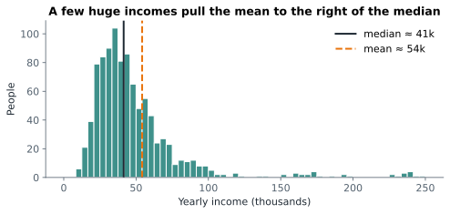

# Lesson 2: The centre: mean, median and mode

**You'll learn:** mean, median, mode, outliers, skew, choosing a "typical" value, weighted mean.

▶ **Practise this lesson in the [sandbox](https://kishoremadanagopal.github.io/learning/statistics/#center)**: run every example and check your exercise answers.

## Key terms

- **Mean:** the sum of the values divided by how many there are; the "average".
- **Median:** the middle value when the values are sorted.
- **Mode:** the most common value.
- **Outlier:** a value far from the others.
- **Skewed:** having a long tail on one side.
- **Robust:** not much affected by outliers. The median is robust; the mean is not.
- **Weighted mean:** an average where some values count more than others.

"What's a typical value?" has three common answers:

| Measure | What it is | pandas |
|---|---|---|
| **Mean** | add everything up, divide by how many | `s.mean()` |
| **Median** | the middle value when sorted | `s.median()` |
| **Mode** | the most common value | `s.mode()` |

```python
import pandas as pd

scores = pd.Series([4, 7, 7, 8, 9, 10, 12])
print("mean  ", scores.mean())
print("median", scores.median())
print("mode  ", scores.mode().tolist())
```

With an even number of values the median is the average of the middle two. `mode()` returns a list because there can be ties.

## Outliers pull the mean

The mean uses every value's size, so one extreme value drags it. The median only cares about order, so it barely moves:

```python
import pandas as pd

salaries = pd.Series([38, 41, 44, 46, 52])          # thousands
print(salaries.mean(), salaries.median())

salaries_with_ceo = pd.concat([salaries, pd.Series([900])])
print(salaries_with_ceo.mean().round(1), salaries_with_ceo.median())
```

One CEO turned an average salary of 44k into 187k, but the median only moved from 44 to 45. That's why house prices and incomes are usually reported as medians.



When data has a long tail on one side (it's **skewed**), the mean is pulled towards the tail. In the picture, most people earn 20–60k, but a few very high earners stretch the tail to the right, so the mean (54k) sits above the median (41k). **Rule of thumb:** if the mean and median are far apart, report the median, or both.

## Which one to use

| Data | Best "typical" value |
|---|---|
| roughly symmetric, no extreme values | mean (or median: they agree) |
| skewed or with outliers (incomes, prices, waiting times) | median |
| categories (most popular city, product) | mode |

## Centre by group

Combining `groupby` with these summaries answers "typical value for each group":

```python
import pandas as pd

sales = pd.read_csv("sales.csv")
sales["revenue"] = sales["units"] * sales["unit_price"]
print(sales.groupby("category")["revenue"].agg(["mean", "median"]).round(1))
```

For Electronics, the mean order (about 730) is more than double the median (about 320): a few laptop orders drag it up. Which number you report changes the story, so say which you used.

## Weighted mean

Sometimes values count unequally. A **weighted mean** multiplies each value by its weight, adds them up, and divides by the total weight. NumPy's `np.average` does it:

```python
import numpy as np

grades = np.array([72, 85, 90])      # coursework, midterm, final
weights = np.array([0.2, 0.3, 0.5])  # how much each counts
print(np.average(grades, weights=weights))
print(grades.mean())                 # the unweighted mean is different
```

## Common mistakes

- Reporting the mean for skewed data like incomes, waiting times or order values. Check the median too.
- Forgetting that `mode()` can return several values. Use `mode()[0]` for one.
- Comparing means of groups without looking at how many rows each group has.

## Exercises

### 1. Typical order

Load `sales.csv` and add `revenue` (units × unit_price). Store the **mean** revenue per order in `mean_rev` and the **median** in `median_rev`. Then set `report` to the string `"median"` if the mean is more than 20% above the median, otherwise `"mean"`.

Starter code:

```python
import pandas as pd

sales = pd.read_csv("sales.csv")

```

### 2. Most common product

Load `sales.csv` and store the most frequently ordered `product` (the mode) in `top_product`, as a string.

Starter code:

```python
import pandas as pd

sales = pd.read_csv("sales.csv")

```

**In the sandbox:** exercises 3–4. Press **Check** to test your answer.

<details>
<summary>Hints</summary>

1. "More than 20% above" means `mean_rev > 1.2 * median_rev`.
2. `mode()` returns a Series; take its first item with `[0]`.

</details>

<details>
<summary>Answers</summary>

**1. Typical order**

```python
import pandas as pd

sales = pd.read_csv("sales.csv")
sales["revenue"] = sales["units"] * sales["unit_price"]
mean_rev = sales["revenue"].mean()
median_rev = sales["revenue"].median()
report = "median" if mean_rev > 1.2 * median_rev else "mean"
print(mean_rev, median_rev, report)
```

**2. Most common product**

```python
import pandas as pd

sales = pd.read_csv("sales.csv")
top_product = sales["product"].mode()[0]
print(top_product)
```

</details>

## Quick quiz

1. House prices in a city have a few mansions. Which "typical price" is most honest?
   - A) Mean
   - B) Median
   - C) Mode

2. In a right-skewed dataset, where is the mean compared with the median?
   - A) Higher (pulled towards the long right tail)
   - B) Lower
   - C) Always equal

3. What does `s.mode()` return?
   - A) A single number
   - B) A Series, because several values can tie for most common
   - C) The middle value

<details>
<summary>Quiz answers</summary>

1. **B) Median**: The few very expensive homes pull the mean up; the median shows what a typical home costs.
2. **A) Higher (pulled towards the long right tail)**: The long tail of big values drags the mean in their direction.
3. **B) A Series, because several values can tie for most common**: Take `s.mode()[0]` when you want one value.

</details>

---
Previous: [Lesson 1](01-what-is-statistics.md) · Next: [Lesson 3: Spread: range, IQR and standard deviation](03-spread.md)
