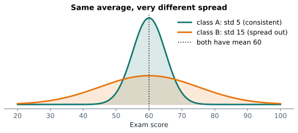
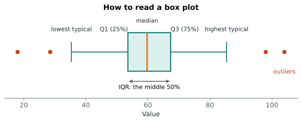

# Lesson 3: Spread: range, IQR and standard deviation

**You'll learn:** range, quartiles, IQR, variance, standard deviation, `n - 1`, box plots, coefficient of variation.

▶ **Practise this lesson in the [sandbox](https://kishoremadanagopal.github.io/learning/statistics/#spread)**: run every example and check your exercise answers.

## Key terms

- **Spread (variability):** how far values are spread out.
- **Range:** the largest value minus the smallest.
- **Quartiles:** the values that split sorted data into four equal parts: Q1, the median and Q3.
- **IQR (interquartile range):** Q3 minus Q1, the spread of the middle 50%.
- **Deviation:** a value's distance from the mean.
- **Variance:** the average squared deviation (dividing by n − 1 for a sample).
- **Standard deviation (std):** the square root of the variance: the typical distance from the mean.
- **Box plot:** a chart of the quartiles, whiskers and outliers.
- **Coefficient of variation (CV):** the standard deviation divided by the mean.

Two classes can have the same average score but be completely different: in one everyone scored about 60, in the other scores ranged from 20 to 100. The average alone hides that. **Spread** (also called variability or dispersion) measures it.



## Range

The simplest measure: largest minus smallest. It's easy to understand but uses only the two most extreme values, so one outlier wrecks it.

```python
import pandas as pd

students = pd.read_csv("students.csv")
math = students["math"]
print("range:", math.max() - math.min())
```

## Interquartile range (IQR)

The **quartiles** split sorted data into four equal parts. Q1 has 25% of values below it, Q2 is the median (50%), and Q3 has 75% below it. The **IQR** is Q3 − Q1: the spread of the middle half of the data. Outliers can't affect it.

```python
import pandas as pd

students = pd.read_csv("students.csv")
q1, q3 = students["math"].quantile([0.25, 0.75])
print("Q1:", q1, " Q3:", q3, " IQR:", q3 - q1)
```

## Variance and standard deviation

The **standard deviation** (std) is the most used measure of spread. Think of it as "the typical distance of a value from the mean". It's built in three steps:

1. find each value's distance from the mean (its **deviation**);
2. square the deviations (so negatives don't cancel positives) and average them: that's the **variance**;
3. take the square root, so the units are the same as the data again: that's the **standard deviation**.

```python
import numpy as np

x = np.array([4, 7, 7, 8, 9])
deviations = x - x.mean()
variance = (deviations ** 2).sum() / (len(x) - 1)
print("deviations:", deviations)
print("variance:  ", variance)
print("std:       ", np.sqrt(variance))
print("pandas std:", round(float(np.std(x, ddof=1)), 4))
```

Why divide by `n − 1` instead of `n`? A sample's values sit closer to their own mean than to the population's mean, so dividing by `n` slightly underestimates the spread. Dividing by `n − 1` corrects it. This is the **sample** standard deviation, and it's what pandas' `.std()` uses. (NumPy's `np.std` divides by `n` unless you pass `ddof=1`, a common source of tiny mismatches.)

```python
import pandas as pd

students = pd.read_csv("students.csv")
print(students[["math", "science", "english"]].agg(["mean", "std"]).round(1))
```

## Reading a box plot

A **box plot** draws the quartiles, so you can see the centre, spread and outliers at a glance:



- the **box** spans Q1 to Q3 (the middle 50%, whose width is the IQR);
- the line inside is the **median**;
- the **whiskers** reach the furthest values within 1.5 × IQR of the box;
- dots beyond the whiskers are **outliers**.

Box plots shine when comparing groups:

```python
import pandas as pd
import matplotlib.pyplot as plt

students = pd.read_csv("students.csv")
fig, ax = plt.subplots(figsize=(6, 3.5))
ax.boxplot([students["math"], students["science"], students["english"]], tick_labels=["math", "science", "english"])
ax.set_ylabel("score")
ax.set_title("Score spread by subject")
plt.show()
```

## Coefficient of variation

Comparing the spread of things measured in different units (house prices and house sizes) is unfair with the std alone. The **coefficient of variation** divides the std by the mean, giving spread as a share of the typical value:

```python
import pandas as pd

housing = pd.read_csv("housing.csv")
for col in ["price_k", "area_sqm"]:
    cv = housing[col].std() / housing[col].mean()
    print(f"{col}: std {housing[col].std():.1f}, CV {cv:.0%}")
```

## Common mistakes

- Mixing up variance and standard deviation. Variance is in squared units; report the std.
- Getting slightly different answers from NumPy and pandas. `np.std` divides by n; pandas divides by n − 1. Use `ddof=1` in NumPy for samples.
- Describing data with an average alone. Always add a measure of spread.

## Exercises

### 1. Spread of science scores

Load `students.csv`. For the `science` column, store the range in `sci_range`, the IQR in `sci_iqr` and the standard deviation (pandas' `.std()`) in `sci_std`.

Starter code:

```python
import pandas as pd

students = pd.read_csv("students.csv")

```

### 2. Standard deviation by hand

Without using `.std()` or `np.std`, calculate the sample standard deviation of `x` and store it in `sd`. Follow the three steps: deviations, variance (divide by n − 1), square root.

Starter code:

```python
import numpy as np

x = np.array([12, 15, 11, 18, 14, 20])

```

**In the sandbox:** exercises 5–6. Press **Check** to test your answer.

<details>
<summary>Hints</summary>

1. `quantile(0.75) - quantile(0.25)` is the IQR.
2. `variance = ((x - x.mean()) ** 2).sum() / (len(x) - 1)`, then `np.sqrt(variance)`.

</details>

<details>
<summary>Answers</summary>

**1. Spread of science scores**

```python
import pandas as pd

students = pd.read_csv("students.csv")
sci = students["science"]
sci_range = sci.max() - sci.min()
sci_iqr = sci.quantile(0.75) - sci.quantile(0.25)
sci_std = sci.std()
print(sci_range, sci_iqr, sci_std)
```

**2. Standard deviation by hand**

```python
import numpy as np

x = np.array([12, 15, 11, 18, 14, 20])
deviations = x - x.mean()
variance = (deviations ** 2).sum() / (len(x) - 1)
sd = np.sqrt(variance)
print(sd)
```

</details>

## Quick quiz

1. Which measure of spread is not affected by a single extreme outlier?
   - A) Range
   - B) IQR
   - C) Standard deviation

2. What does a standard deviation of 15 on an exam (mean 60) roughly mean?
   - A) Scores typically sit about 15 points from 60
   - B) Every score is between 45 and 75
   - C) 15 students scored 60

3. In a box plot, what does the box itself show?
   - A) The full range of the data
   - B) The middle 50% of values, from Q1 to Q3
   - C) The mean plus or minus one standard deviation

<details>
<summary>Quiz answers</summary>

1. **B) IQR**: The IQR uses only the middle 50% of values, so the extremes don't matter.
2. **A) Scores typically sit about 15 points from 60**: The std is the typical distance from the mean, not a hard limit.
3. **B) The middle 50% of values, from Q1 to Q3**: The box spans the interquartile range, with the median inside.

</details>

---
Previous: [Lesson 2](02-center.md) · Next: [Lesson 4: Shape, z-scores and outliers](04-shape-and-outliers.md)
