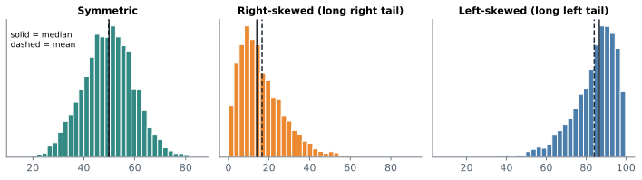
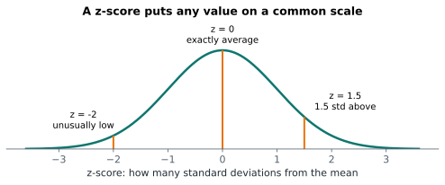

# Lesson 4: Shape, z-scores and outliers

**You'll learn:** histograms and bins, symmetric and skewed shapes, `skew()`, log transform, z-scores, outlier rules.

▶ **Practise this lesson in the [sandbox](https://kishoremadanagopal.github.io/learning/statistics/#shape-and-outliers)**: run every example and check your exercise answers.

## Key terms

- **Distribution:** how the values of a variable are spread across possible values.
- **Histogram:** bars counting how many values fall into each range (bin).
- **Bin:** one range of values in a histogram.
- **Right-skewed:** a long tail of large values; the mean is above the median.
- **Left-skewed:** a long tail of small values; the mean is below the median.
- **Bimodal:** having two peaks, often two groups mixed together.
- **z-score:** (value − mean) / std: how many standard deviations a value is from the mean.
- **Standardising:** converting values to z-scores so different variables share one scale.
- **Log transform:** analysing log(x) instead of x to pull in a long right tail.

Centre and spread are two numbers. The **shape** of the data is the rest of the story, and a histogram shows it best.



| Shape | Looks like | Mean vs median | Real examples |
|---|---|---|---|
| **Symmetric** | a hill with matching sides | about equal | heights, measurement errors |
| **Right-skewed** | long tail to the right | mean > median | incomes, house prices, waiting times |
| **Left-skewed** | long tail to the left | mean < median | age at retirement, easy exam scores |

Other shapes to watch for: **bimodal** (two hills, usually two groups mixed together) and **uniform** (flat).

## Drawing a histogram

The number of **bins** (bars) changes what you see. Try a few:

```python
import pandas as pd
import matplotlib.pyplot as plt

sales = pd.read_csv("sales.csv")
sales["revenue"] = sales["units"] * sales["unit_price"]

fig, axes = plt.subplots(1, 2, figsize=(9, 3))
axes[0].hist(sales["revenue"], bins=10, color="teal")
axes[0].set_title("10 bins")
axes[1].hist(sales["revenue"], bins=40, color="teal")
axes[1].set_title("40 bins")
for ax in axes:
    ax.set_xlabel("order revenue")
plt.show()
```

Order revenue is strongly right-skewed: most orders are small, a few laptop orders are huge.

## Measuring skew

`skew()` puts a number on it: about 0 means symmetric, positive means a right tail, negative a left tail. Beyond about ±1, the skew is strong.

```python
import pandas as pd

sales = pd.read_csv("sales.csv")
sales["revenue"] = sales["units"] * sales["unit_price"]
students = pd.read_csv("students.csv")
print("revenue skew:", round(sales["revenue"].skew(), 2))
print("math skew:   ", round(students["math"].skew(), 2))
```

A common fix for strong right skew is to analyse the **logarithm** of the values, which pulls the long tail in. `np.log(sales["revenue"])` is much more symmetric.

## z-scores: how unusual is a value?

A **z-score** says how many standard deviations a value is from the mean:

z = (value − mean) / std



z-scores put different measurements on one scale. Is 80 in math or 75 in english the better result?

```python
import pandas as pd

students = pd.read_csv("students.csv")
for subject, score in [("math", 80), ("english", 75)]:
    m, sd = students[subject].mean(), students[subject].std()
    print(f"{subject}: {score} has z = {(score - m) / sd:.2f}")
```

The math score is further above its own class average, so it's the more impressive one, even though english scores might look similar.

## Two ways to flag outliers

| Rule | Outlier if | Good for |
|---|---|---|
| **z-score rule** | \|z\| > 3 | roughly symmetric data |
| **IQR rule** (the box plot rule) | below Q1 − 1.5 × IQR or above Q3 + 1.5 × IQR | any shape, including skewed |

```python
import pandas as pd

housing = pd.read_csv("housing.csv")
price = housing["price_k"]

z = (price - price.mean()) / price.std()
print("z-rule outliers:", int((z.abs() > 3).sum()))

q1, q3 = price.quantile([0.25, 0.75])
iqr = q3 - q1
outside = (price < q1 - 1.5 * iqr) | (price > q3 + 1.5 * iqr)
print("IQR-rule outliers:", int(outside.sum()))
```

An outlier is a reason to **look**, not a reason to delete. It might be a typing error, or your most important customer.

## Common mistakes

- Trusting one histogram. Try a few bin counts; the shape can change.
- Using the z-score rule on strongly skewed data, where the mean and std are themselves distorted.
- Deleting outliers automatically. Investigate first.

## Exercises

### 1. Standardise the scores

Load `students.csv` and add a column `math_z`: each student's math z-score (using the column's mean and pandas `.std()`). Store the name of the student with the **highest** z-score in `top_student`.

Starter code:

```python
import pandas as pd

students = pd.read_csv("students.csv")

```

### 2. IQR outliers in rain

Load `weather.csv` and keep only London. Using the IQR rule on `rain_mm`, store the number of **high** outlier days (above Q3 + 1.5 × IQR) in `wet_outliers`.

Starter code:

```python
import pandas as pd

weather = pd.read_csv("weather.csv")

```

**In the sandbox:** exercises 7–8. Press **Check** to test your answer.

<details>
<summary>Hints</summary>

1. `(students["math"] - mean) / std`, then `idxmax()` to find the row.
2. Filter London, find `q1, q3 = rain.quantile([0.25, 0.75])`, then count values above `q3 + 1.5 * (q3 - q1)`.

</details>

<details>
<summary>Answers</summary>

**1. Standardise the scores**

```python
import pandas as pd

students = pd.read_csv("students.csv")
m, sd = students["math"].mean(), students["math"].std()
students["math_z"] = (students["math"] - m) / sd
top_student = students.loc[students["math_z"].idxmax(), "student"]
print(top_student)
```

**2. IQR outliers in rain**

```python
import pandas as pd

weather = pd.read_csv("weather.csv")
rain = weather.loc[weather["city"] == "London", "rain_mm"]
q1, q3 = rain.quantile([0.25, 0.75])
iqr = q3 - q1
wet_outliers = (rain > q3 + 1.5 * iqr).sum()
print(wet_outliers)
```

</details>

## Quick quiz

1. A histogram has a long tail to the right. What's true?
   - A) It's right-skewed and the mean is above the median
   - B) It's left-skewed
   - C) The mean and median are equal

2. A value has z = -2. What does that mean?
   - A) It's 2 units below the mean
   - B) It's 2 standard deviations below the mean
   - C) It's an error

3. Why is the IQR rule better than the z-score rule for skewed data?
   - A) It finds more outliers
   - B) It doesn't assume the data is symmetric, and outliers don't distort it
   - C) It's faster

<details>
<summary>Quiz answers</summary>

1. **A) It's right-skewed and the mean is above the median**: The tail of large values pulls the mean up, above the median.
2. **B) It's 2 standard deviations below the mean**: z-scores count standard deviations, so -2 is well below average.
3. **B) It doesn't assume the data is symmetric, and outliers don't distort it**: The mean and std are themselves pulled by skew and outliers; quartiles aren't.

</details>

---
Previous: [Lesson 3](03-spread.md) · Next: [Lesson 5: Categorical data: counts, shares and charts](05-categorical-data.md)
