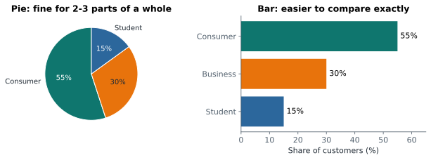
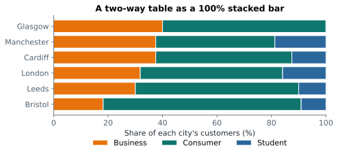

# Lesson 5: Categorical data: counts, shares and charts

**You'll learn:** counts and proportions, the mean of 0/1 data, bar vs pie charts, two-way tables, row percentages.

▶ **Practise this lesson in the [sandbox](https://kishoremadanagopal.github.io/learning/statistics/#categorical-data)**: run every example and check your exercise answers.

## Key terms

- **Frequency:** how many times a value occurs.
- **Proportion:** a count divided by the total, between 0 and 1.
- **Relative frequency:** another name for proportion.
- **Binary variable:** a variable with two values, often coded 1 (yes) and 0 (no).
- **Rate:** a proportion of a group, like the conversion rate.
- **Two-way (contingency) table:** counts for every combination of two categorical variables.
- **Row percentages:** each row of a two-way table divided by its row total.

For categories (city, product, yes/no) there's no mean or standard deviation. You count, and you turn counts into **proportions** (shares).

```python
import pandas as pd

customers = pd.read_csv("customers.csv")
counts = customers["segment"].value_counts()
shares = customers["segment"].value_counts(normalize=True)
print(pd.DataFrame({"count": counts, "share": shares.round(3)}))
```

A proportion is always between 0 and 1. For yes/no data stored as 1/0, the **mean is the proportion of 1s**, a trick you'll use constantly in A/B testing:

```python
import pandas as pd

ab = pd.read_csv("ab_test.csv")
print("conversion rate:", round(ab["converted"].mean(), 4))
print("same as:", ab["converted"].sum(), "/", len(ab))
```

## Bar charts beat pie charts



People compare lengths far more accurately than angles. With two or three slices a pie is fine for "part of a whole", but with more categories, or when the values are close, use a **sorted bar chart**:

```python
import pandas as pd
import matplotlib.pyplot as plt

sales = pd.read_csv("sales.csv")
counts = sales["product"].value_counts().sort_values()
fig, ax = plt.subplots(figsize=(6, 3.5))
ax.barh(counts.index, counts.values, color="teal")
ax.set_xlabel("orders")
ax.set_title("Orders by product")
plt.show()
```

## Two categories together: two-way tables

A **two-way table** (contingency table) counts every combination of two categories. `pd.crosstab` builds it:

```python
import pandas as pd

customers = pd.read_csv("customers.csv")
print(pd.crosstab(customers["city"], customers["segment"], margins=True))
```

Raw counts are hard to compare when groups differ in size, so convert each row to percentages with `normalize="index"`. This answers "within each city, what share is each segment?":

```python
import pandas as pd

customers = pd.read_csv("customers.csv")
pct = pd.crosstab(customers["city"], customers["segment"], normalize="index") * 100
print(pct.round(0))
```



Each bar adds up to 100%, so you compare the mix, not the size. In Part 4 you'll test whether differences like these are real or just chance (the chi-square test).

## Proportions by group

`groupby` with the mean of a 0/1 column gives a rate per group:

```python
import pandas as pd

ab = pd.read_csv("ab_test.csv")
print(ab.groupby(["device", "group"])["converted"].mean().unstack().round(3))
```

Desktop visitors convert more often than mobile ones in both versions of the page. Whenever groups differ like this, compare like with like.

## Common mistakes

- Comparing raw counts between groups of different sizes. Compare percentages.
- Using a pie chart with many slices or close values. Use a sorted bar chart.
- Normalising the wrong direction. Ask "percent of what?" before choosing `normalize="index"` or `"columns"`.

## Exercises

### 1. Segment shares

Load `customers.csv` and store the **percentage** of customers in each `segment` in `seg_pct` (a Series that adds up to 100).

Starter code:

```python
import pandas as pd

customers = pd.read_csv("customers.csv")

```

### 2. Conversion by device

Load `ab_test.csv` and store each `device`'s conversion rate (the mean of `converted`) in `rate_by_device`. Store the name of the device with the higher rate in `better_device`.

Starter code:

```python
import pandas as pd

ab = pd.read_csv("ab_test.csv")

```

**In the sandbox:** exercises 9–10. Press **Check** to test your answer.

<details>
<summary>Hints</summary>

1. `value_counts(normalize=True)` gives shares; multiply by 100.
2. `ab.groupby("device")["converted"].mean()`, then `idxmax()`.

</details>

<details>
<summary>Answers</summary>

**1. Segment shares**

```python
import pandas as pd

customers = pd.read_csv("customers.csv")
seg_pct = customers["segment"].value_counts(normalize=True) * 100
print(seg_pct.round(1))
```

**2. Conversion by device**

```python
import pandas as pd

ab = pd.read_csv("ab_test.csv")
rate_by_device = ab.groupby("device")["converted"].mean()
better_device = rate_by_device.idxmax()
print(rate_by_device.round(3))
print(better_device)
```

</details>

## Quick quiz

1. What is the mean of a column of 1s and 0s?
   - A) Always 0.5
   - B) The proportion of 1s
   - C) The number of 1s

2. Why prefer a sorted bar chart to a pie chart with seven slices?
   - A) People compare lengths more accurately than angles
   - B) Pie charts can't show percentages
   - C) Bar charts use less ink

3. What does `normalize="index"` do in `pd.crosstab`?
   - A) Sorts the rows
   - B) Turns each row into percentages of that row's total
   - C) Removes missing values

<details>
<summary>Quiz answers</summary>

1. **B) The proportion of 1s**: Adding 1s counts them; dividing by the total turns the count into a share.
2. **A) People compare lengths more accurately than angles**: With many similar slices, a pie becomes guesswork; bars make the ranking obvious.
3. **B) Turns each row into percentages of that row's total**: Each row then adds up to 1 (or 100%), so groups of different sizes can be compared.

</details>

---
Previous: [Lesson 4](04-shape-and-outliers.md) · Next: [Lesson 6: Probability basics](06-probability-basics.md)
