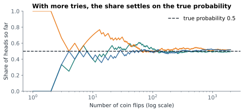

# Lesson 6: Probability basics

**You'll learn:** probability as a fraction and a long-run share, law of large numbers, complement, addition and multiplication rules, independence, counting.

▶ **Practise this lesson in the [sandbox](https://kishoremadanagopal.github.io/learning/statistics/#probability-basics)**: run every example and check your exercise answers.

## Key terms

- **Probability:** a number from 0 (impossible) to 1 (certain) for how likely something is.
- **Outcome:** one possible result of a random process, like rolling a 4.
- **Event:** a set of outcomes, like "an even number".
- **Law of large numbers:** with more repetitions, the observed share gets closer to the true probability.
- **Complement:** "not A"; P(not A) = 1 − P(A).
- **Independent events:** events where one happening doesn't change the chance of the other.
- **Simulation:** estimating a probability by imitating the random process many times.
- **Combination / permutation:** the number of ways to choose items without order / to arrange them in order.

A **probability** is a number from 0 to 1 that says how likely something is: 0 means impossible, 1 means certain, 0.5 means "as likely as not". Percentages are the same idea times 100.

When every outcome is equally likely, a probability is a fraction:

P(event) = (number of ways it can happen) / (number of possible outcomes)

A fair dice has 6 outcomes, so P(rolling a 5) = 1/6, and P(an even number) = 3/6 = 0.5.

## Probability as a long-run share

The other way to see a probability is "the share of times it happens if you repeat it many, many times". That's how you estimate probabilities from data, and how simulations check them:

```python
import numpy as np

rng = np.random.default_rng(1)
rolls = rng.integers(1, 7, size=100_000)
print("P(5) is about   ", round((rolls == 5).mean(), 4), " exact:", round(1 / 6, 4))
print("P(even) is about", round((rolls % 2 == 0).mean(), 4), " exact: 0.5")
```



With a few flips, the share of heads jumps around. With thousands, it settles on the true probability. This is the **law of large numbers**, and it's why big samples give reliable estimates.

## The basic rules

| Rule | Formula | Example (one dice) |
|---|---|---|
| **Complement**: "not A" | P(not A) = 1 − P(A) | P(not a 6) = 1 − 1/6 = 5/6 |
| **Addition**: "A or B" | P(A or B) = P(A) + P(B) − P(A and B) | P(even or > 4) = 3/6 + 2/6 − 1/6 = 4/6 |
| **Multiplication** (independent): "A and B" | P(A and B) = P(A) × P(B) | P(two 6s in two rolls) = 1/6 × 1/6 = 1/36 |

The addition rule subtracts P(A and B) because outcomes in both groups would otherwise be counted twice (6 is both even and > 4).

## Independence

Two events are **independent** when one happening doesn't change the chance of the other: two dice rolls, two coin flips. Then you multiply their probabilities. Many real events are **not** independent (rain today and rain tomorrow), and multiplying their probabilities gives badly wrong answers.

The complement rule plus independence answers "at least one" questions neatly. What's the chance of at least one 6 in four rolls?

```python
import numpy as np

exact = 1 - (5 / 6) ** 4        # 1 - P(no 6 in four rolls)
rng = np.random.default_rng(2)
rolls = rng.integers(1, 7, size=(100_000, 4))
simulated = (rolls == 6).any(axis=1).mean()
print(round(exact, 4), round(simulated, 4))
```

"At least one" is almost always easiest as **1 − P(none)**.

## Probabilities from data

With real data, a probability is the share of rows where something happens:

```python
import pandas as pd

customers = pd.read_csv("customers.csv")
p_london = (customers["city"] == "London").mean()
p_business = (customers["segment"] == "Business").mean()
p_both = ((customers["city"] == "London") & (customers["segment"] == "Business")).mean()
print(f"P(London) = {p_london:.3f}")
print(f"P(Business) = {p_business:.3f}")
print(f"P(London and Business) = {p_both:.3f}")
print(f"if independent we'd expect {p_london * p_business:.3f}")
```

If the observed P(both) is close to P(A) × P(B), the two look independent. Part 4 shows how to test that properly.

## Counting outcomes

When outcomes are equally likely you often need to count them. Python's `math` module has the two classic counts:

```python
import math

print(math.perm(5, 3))   # ways to arrange 3 of 5 people in order (1st, 2nd, 3rd)
print(math.comb(5, 3))   # ways to choose a team of 3 from 5 (order doesn't matter)
print(1 / math.comb(49, 6))   # chance of winning a 6-from-49 lottery
```

## Common mistakes

- Multiplying probabilities of events that aren't independent.
- Adding probabilities for "A or B" without subtracting the overlap.
- The gambler's fallacy: thinking heads is "due" after many tails. Independent flips have no memory.

## Exercises

### 1. At least one double six

Two dice are rolled 24 times. Store the exact probability of getting **at least one** double six in `exact` (hint: P(double six) = 1/36 for one roll of two dice). Then estimate it by simulation: make `rng = np.random.default_rng(7)`, roll `rng.integers(1, 7, size=(100_000, 24, 2))`, and store the share of games with at least one double six in `simulated`.

Starter code:

```python
import numpy as np

```

### 2. Probabilities from the A/B data

Load `ab_test.csv`. Store P(a visitor is on mobile) in `p_mobile`, P(a visitor converted) in `p_conv`, and P(mobile **and** converted) in `p_both`.

Starter code:

```python
import pandas as pd

ab = pd.read_csv("ab_test.csv")

```

**In the sandbox:** exercises 11–12. Press **Check** to test your answer.

<details>
<summary>Hints</summary>

1. Exact: `1 - (35/36) ** 24`. Simulated: `(rolls == 6).all(axis=2)` marks double sixes; `.any(axis=1)` asks "at least one per game"; `.mean()` gives the share.
2. The mean of a True/False condition is its probability. Combine conditions with `&`.

</details>

<details>
<summary>Answers</summary>

**1. At least one double six**

```python
import numpy as np

exact = 1 - (35 / 36) ** 24

rng = np.random.default_rng(7)
rolls = rng.integers(1, 7, size=(100_000, 24, 2))
double_six = (rolls == 6).all(axis=2)        # True where both dice show 6
simulated = double_six.any(axis=1).mean()    # at least one in each game of 24
print(round(exact, 4), round(simulated, 4))
```

**2. Probabilities from the A/B data**

```python
import pandas as pd

ab = pd.read_csv("ab_test.csv")
p_mobile = (ab["device"] == "mobile").mean()
p_conv = ab["converted"].mean()
p_both = ((ab["device"] == "mobile") & (ab["converted"] == 1)).mean()
print(p_mobile, p_conv, p_both)
```

</details>

## Quick quiz

1. P(rain) = 0.3. What is P(no rain)?
   - A) 0.3
   - B) 0.7
   - C) 1.3

2. Two fair coins are flipped. What is P(both heads)?
   - A) 0.25
   - B) 0.5
   - C) 1

3. What does the law of large numbers say?
   - A) Big numbers are more likely
   - B) With more repetitions, the observed share gets closer to the true probability
   - C) After many tails, heads becomes more likely

<details>
<summary>Quiz answers</summary>

1. **B) 0.7**: The complement rule: 1 − 0.3.
2. **A) 0.25**: Independent events multiply: 0.5 × 0.5.
3. **B) With more repetitions, the observed share gets closer to the true probability**: The long-run share converges. It does not mean a coin "makes up" for past results.

</details>

---
Previous: [Lesson 5](05-categorical-data.md) · Next: [Lesson 7: Conditional probability and Bayes](07-conditional-probability.md)
