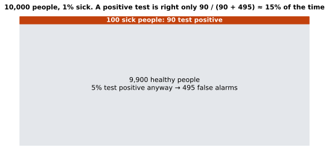

# Lesson 7: Conditional probability and Bayes

**You'll learn:** P(A | B), conditioning by filtering, independence, P(A | B) vs P(B | A), Bayes' rule, base rates, false positives.

▶ **Practise this lesson in the [sandbox](https://kishoremadanagopal.github.io/learning/statistics/#conditional-probability)**: run every example and check your exercise answers.

## Key terms

- **Conditional probability:** the probability of A given that B happened, written P(A | B).
- **Joint probability:** the probability that A and B both happen.
- **Bayes' rule:** P(A | B) = P(B | A) × P(A) / P(B), used to reverse a conditional probability.
- **Prior (base rate):** the probability before seeing new evidence, like how common a disease is.
- **Posterior:** the updated probability after seeing the evidence.
- **False positive:** a test or model saying "yes" when the truth is "no".
- **False negative:** saying "no" when the truth is "yes".
- **Precision:** of everything flagged as positive, the share that really is.

A **conditional probability** is a probability **given** that you know something else. It's written P(A | B), read "the probability of A given B":

P(A | B) = P(A and B) / P(B)

In words: among the cases where B happened, what share also had A? With data, that's just filtering first and then taking a share:

```python
import pandas as pd

ab = pd.read_csv("ab_test.csv")
p_conv = ab["converted"].mean()
p_conv_given_desktop = ab.loc[ab["device"] == "desktop", "converted"].mean()
p_conv_given_mobile = ab.loc[ab["device"] == "mobile", "converted"].mean()
print(f"P(convert)           = {p_conv:.3f}")
print(f"P(convert | desktop) = {p_conv_given_desktop:.3f}")
print(f"P(convert | mobile)  = {p_conv_given_mobile:.3f}")
```

Knowing the device changes the probability, so device and converting are **not independent**. Independence means exactly this: P(A | B) = P(A).

## Order matters: P(A | B) is not P(B | A)

P(a visitor is on mobile | they converted) and P(they converted | they're on mobile) answer different questions and have different values:

```python
import pandas as pd

ab = pd.read_csv("ab_test.csv")
mobile = ab["device"] == "mobile"
conv = ab["converted"] == 1
print("P(mobile | converted) =", round((mobile & conv).sum() / conv.sum(), 3))
print("P(converted | mobile) =", round((mobile & conv).sum() / mobile.sum(), 3))
```

Mixing the two up is one of the most common reasoning errors in news, courts and medicine.

## Bayes' rule: flipping the condition

**Bayes' rule** turns one conditional probability into the other:

P(A | B) = P(B | A) × P(A) / P(B)

The classic example is a medical test. A disease affects 1% of people. The test catches 90% of sick people (P(positive | sick) = 0.9) but also flags 5% of healthy people (a **false positive**). You test positive. What's the chance you're sick?



Most people guess 90%. The answer is about 15%. Counting with 10,000 imaginary people makes it obvious:

```python
people = 10_000
sick = people * 0.01                 # 100
healthy = people - sick              # 9,900
true_pos = sick * 0.90               # 90 sick people test positive
false_pos = healthy * 0.05           # 495 healthy people test positive anyway
print("P(sick | positive) =", round(true_pos / (true_pos + false_pos), 3))
```

There are so many more healthy people that their 5% of false alarms outnumber the real cases. The starting probability (here 1%) is called the **prior** or **base rate**, and ignoring it is the **base rate fallacy**.

The same calculation with the formula:

```python
p_sick = 0.01
p_pos_given_sick = 0.90
p_pos_given_healthy = 0.05

p_pos = p_pos_given_sick * p_sick + p_pos_given_healthy * (1 - p_sick)   # all ways to test positive
p_sick_given_pos = p_pos_given_sick * p_sick / p_pos
print(round(p_sick_given_pos, 3))
```

## Why this matters for AI

A spam filter, a fraud detector or a medical AI has exactly this problem: when the thing you're looking for is rare, even an accurate model raises many false alarms. That's why machine-learning teams look at **precision** (of the cases flagged, how many are real) and not just accuracy. And Bayes' rule is the basis of a whole family of models (naive Bayes) and of Bayesian statistics.

## Common mistakes

- Confusing P(A | B) with P(B | A), the "prosecutor's fallacy".
- Ignoring the base rate. A 95%-accurate test for a rare condition still gives mostly false alarms.
- Dividing by the wrong total: "given B" means divide by the count of B.

## Exercises

### 1. Conversion given group

Load `ab_test.csv`. Store P(converted | group A) in `p_a` and P(converted | group B) in `p_b`. Then store P(group B | converted), the share of buyers who saw page B, in `p_b_given_conv`.

Starter code:

```python
import pandas as pd

ab = pd.read_csv("ab_test.csv")

```

### 2. Fraud alarms

1 in 500 transactions is fraud. A fraud model flags 95% of frauds, and wrongly flags 2% of honest transactions. Store P(fraud | flagged) in `p_fraud_given_flag`.

Starter code:

```python
p_fraud = 1 / 500

```

**In the sandbox:** exercises 13–14. Press **Check** to test your answer.

<details>
<summary>Hints</summary>

1. "Given X" means filter to X first. For the last one, filter to buyers, then take the share in group B.
2. First P(flagged) = 0.95 × P(fraud) + 0.02 × P(honest). Then Bayes: 0.95 × P(fraud) / P(flagged).

</details>

<details>
<summary>Answers</summary>

**1. Conversion given group**

```python
import pandas as pd

ab = pd.read_csv("ab_test.csv")
p_a = ab.loc[ab["group"] == "A", "converted"].mean()
p_b = ab.loc[ab["group"] == "B", "converted"].mean()
buyers = ab[ab["converted"] == 1]
p_b_given_conv = (buyers["group"] == "B").mean()
print(p_a, p_b, p_b_given_conv)
```

**2. Fraud alarms**

```python
p_fraud = 1 / 500
p_flag_given_fraud = 0.95
p_flag_given_honest = 0.02

p_flag = p_flag_given_fraud * p_fraud + p_flag_given_honest * (1 - p_fraud)
p_fraud_given_flag = p_flag_given_fraud * p_fraud / p_flag
print(round(p_fraud_given_flag, 3))
```

</details>

## Quick quiz

1. How do you compute P(converted | mobile) from data?
   - A) Keep only mobile visitors, then take the share who converted
   - B) Take the share of converters who are on mobile
   - C) Multiply P(converted) by P(mobile)

2. A rare disease, an accurate test, a positive result. Why might the chance of being sick still be low?
   - A) The test is broken
   - B) Healthy people vastly outnumber sick ones, so their false positives outnumber the true positives
   - C) Probabilities don't apply to medicine

3. Events A and B are independent when:
   - A) P(A and B) = 0
   - B) P(A | B) = P(A)
   - C) P(A) = P(B)

<details>
<summary>Quiz answers</summary>

1. **A) Keep only mobile visitors, then take the share who converted**: "Given mobile" means you restrict to mobile visitors first.
2. **B) Healthy people vastly outnumber sick ones, so their false positives outnumber the true positives**: The base rate matters: a small error rate on a huge group swamps a rare condition.
3. **B) P(A | B) = P(A)**: Knowing B happened doesn't change the probability of A.

</details>

---
Previous: [Lesson 6](06-probability-basics.md) · Next: [Lesson 8: Counting distributions: binomial and Poisson](08-discrete-distributions.md)
