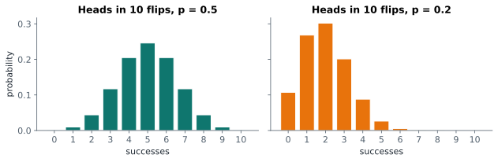
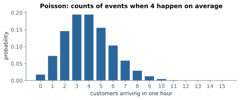

# Lesson 8: Counting distributions: binomial and Poisson

**You'll learn:** random variables, expected value, the binomial distribution, pmf, cdf and sf, the Poisson distribution, simulating with rvs.

▶ **Practise this lesson in the [sandbox](https://kishoremadanagopal.github.io/learning/statistics/#discrete-distributions)**: run every example and check your exercise answers.

## Key terms

- **Random variable:** a number produced by a random process.
- **Discrete:** taking separate, countable values like 0, 1, 2.
- **Expected value:** the long-run average of a random variable: each value times its probability, summed.
- **Binomial distribution:** the number of successes in n independent tries with success probability p.
- **Poisson distribution:** the number of events in a fixed interval when they happen at a steady average rate λ.
- **pmf (probability mass function):** P(X = k) for a discrete variable.
- **cdf (cumulative distribution function):** P(X ≤ k).
- **sf (survival function):** P(X > k) = 1 − cdf.

A **random variable** is a number that comes out of a random process: the number of heads in 10 flips, the number of customers in the next hour, tomorrow's temperature. Its **distribution** lists every possible value and how likely each one is.

**Discrete** random variables take countable values (0, 1, 2…); **continuous** ones can take any value in a range (next lesson).

## Expected value

The **expected value** (or mean) of a random variable is the long-run average: each value times its probability, added up. A fair dice:

```python
import numpy as np

values = np.array([1, 2, 3, 4, 5, 6])
probs = np.full(6, 1 / 6)
print("expected value:", (values * probs).sum())

rng = np.random.default_rng(0)
print("average of 100,000 rolls:", rng.integers(1, 7, 100_000).mean().round(3))
```

You never roll 3.5, but over many rolls that's the average. Expected values decide whether a bet, insurance policy or marketing campaign pays off on average.

## The binomial distribution

The **binomial** distribution counts **successes in a fixed number of independent tries**, each with the same chance of success:

- n = the number of tries;
- p = the chance of success on each try.

Examples: heads in 10 flips (n = 10, p = 0.5); how many of 200 visitors buy (n = 200, p = 0.1); how many of 20 parts are faulty.



SciPy's `stats.binom` gives the probabilities:

```python
from scipy import stats

print("P(exactly 5 heads in 10)   =", round(stats.binom.pmf(5, 10, 0.5), 4))
print("P(at most 2 heads in 10)   =", round(stats.binom.cdf(2, 10, 0.5), 4))
print("P(more than 7 heads in 10) =", round(stats.binom.sf(7, 10, 0.5), 4))
print("expected heads:", stats.binom.mean(10, 0.5), " std:", round(stats.binom.std(10, 0.5), 3))
```

| Method | Gives | Read it as |
|---|---|---|
| `pmf(k, n, p)` | P(X = k) | exactly k |
| `cdf(k, n, p)` | P(X ≤ k) | at most k |
| `sf(k, n, p)` | P(X > k) = 1 − cdf | more than k |

The expected number of successes is n × p, and the standard deviation is √(n × p × (1 − p)).

## A practical binomial question

A page converts 10% of visitors. Tomorrow 200 people visit. How surprising would 30 or more sales be?

```python
from scipy import stats

n, p = 200, 0.10
print("expected sales:", n * p)
print("P(30 or more) =", round(stats.binom.sf(29, n, p), 4))   # sf(29) = P(X > 29) = P(X >= 30)
```

Under 2%. If it happened, you'd suspect something had changed. That's the idea behind hypothesis testing in Part 4.

## The Poisson distribution

The **Poisson** distribution counts **events in a fixed amount of time or space** when they happen independently at a steady average rate: customers per hour, website errors per day, typos per page. It has one number, the average rate λ (lambda):



```python
from scipy import stats

rate = 4          # on average 4 customers arrive per hour
print("P(exactly 4) =", round(stats.poisson.pmf(4, rate), 4))
print("P(0)         =", round(stats.poisson.pmf(0, rate), 4))
print("P(8 or more) =", round(stats.poisson.sf(7, rate), 4))
```

For a Poisson distribution the mean and the variance both equal λ.

## Drawing random values

Every SciPy distribution can also **generate** values with `.rvs()`, which is how you simulate:

```python
from scipy import stats

sim = stats.binom.rvs(10, 0.5, size=10_000, random_state=1)
print("simulated share of exactly 5 heads:", (sim == 5).mean())
```

## Common mistakes

- Off-by-one errors: "at least 30" is `sf(29)`, not `sf(30)`, because `sf(k)` means "more than k".
- Using the binomial when tries aren't independent or the probability changes between them.
- Expecting the expected value to be a possible outcome (a dice's is 3.5).

## Exercises

### 1. Defective parts

A machine makes parts with a 3% defect rate. A box holds 50 parts. Using `scipy.stats.binom`, store P(no defects in a box) in `p_none`, P(at most 2 defects) in `p_at_most_2`, and the expected number of defects in `expected`.

Starter code:

```python
from scipy import stats

```

### 2. Support tickets

A help desk gets 6 tickets an hour on average. Using `scipy.stats.poisson`, store P(more than 10 tickets in an hour) in `p_busy`, and P(fewer than 3) in `p_quiet`.

Starter code:

```python
from scipy import stats

```

**In the sandbox:** exercises 15–16. Press **Check** to test your answer.

<details>
<summary>Hints</summary>

1. Exactly 0 is `pmf(0, 50, 0.03)`; at most 2 is `cdf(2, 50, 0.03)`; expected is n × p.
2. "More than 10" is `sf(10, 6)`. "Fewer than 3" means at most 2: `cdf(2, 6)`.

</details>

<details>
<summary>Answers</summary>

**1. Defective parts**

```python
from scipy import stats

n, p = 50, 0.03
p_none = stats.binom.pmf(0, n, p)
p_at_most_2 = stats.binom.cdf(2, n, p)
expected = n * p
print(p_none, p_at_most_2, expected)
```

**2. Support tickets**

```python
from scipy import stats

p_busy = stats.poisson.sf(10, 6)      # P(X > 10)
p_quiet = stats.poisson.cdf(2, 6)     # P(X <= 2), i.e. fewer than 3
print(round(p_busy, 4), round(p_quiet, 4))
```

</details>

## Quick quiz

1. Which situation fits a binomial distribution?
   - A) The number of buyers among 500 visitors, each buying with probability 0.08
   - B) The time until the next bus
   - C) People's heights

2. What does `stats.binom.cdf(3, 10, 0.5)` give?
   - A) P(exactly 3)
   - B) P(3 or fewer)
   - C) P(more than 3)

3. A Poisson distribution has λ = 5. What's its mean?
   - A) 5
   - B) 2.5
   - C) √5

<details>
<summary>Quiz answers</summary>

1. **A) The number of buyers among 500 visitors, each buying with probability 0.08**: A fixed number of independent tries, each with the same success probability.
2. **B) P(3 or fewer)**: cdf is cumulative: the probability of k or less.
3. **A) 5**: For Poisson, the mean (and the variance) equal λ.

</details>

---
Previous: [Lesson 7](07-conditional-probability.md) · Next: [Lesson 9: The normal distribution](09-normal-distribution.md)
