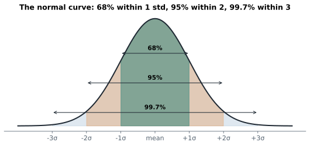
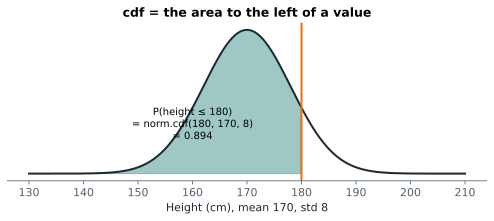

# Lesson 9: The normal distribution

**You'll learn:** the bell curve, μ and σ, the 68-95-99.7 rule, areas with `norm.cdf` and `norm.sf`, percentiles with `norm.ppf`, the standard normal, checking normality.

▶ **Practise this lesson in the [sandbox](https://kishoremadanagopal.github.io/learning/statistics/#normal-distribution)**: run every example and check your exercise answers.

## Key terms

- **Normal distribution:** the symmetric bell-shaped distribution set by its mean μ and standard deviation σ.
- **Continuous:** able to take any value in a range.
- **pdf (probability density function):** the height of the curve; probabilities are areas under it.
- **68-95-99.7 rule:** the share of normal values within 1, 2 and 3 standard deviations of the mean.
- **Standard normal:** the normal distribution with mean 0 and std 1.
- **ppf (percent point function):** the value with a given area to its left; the inverse of the cdf.
- **1.96:** the z-value with 2.5% of the standard normal beyond it; ±1.96 holds the middle 95%.
- **Normality test:** a test (like Shapiro-Wilk) of whether data could come from a normal distribution.

The **normal distribution** is the bell curve. Measurements that are the sum of many small, independent influences tend to follow it: heights, measurement errors, test scores, and (as you'll see in Part 3) **averages of samples**. It's described by two numbers: the mean μ (mu), which sets the centre, and the standard deviation σ (sigma), which sets the width.



## The 68-95-99.7 rule

For any normal distribution:

- about **68%** of values are within 1 standard deviation of the mean;
- about **95%** are within 2;
- about **99.7%** are within 3.

So if adult heights are normal with mean 170 cm and std 8 cm, 95% of adults are between 154 and 186 cm, and someone over 194 cm (3 std above) is rare: about 1 in 740.

Let's check the rule by simulation:

```python
import numpy as np

rng = np.random.default_rng(3)
heights = rng.normal(170, 8, 100_000)
for k in (1, 2, 3):
    inside = ((heights > 170 - k * 8) & (heights < 170 + k * 8)).mean()
    print(f"within {k} std: {inside:.3f}")
```

## Continuous probabilities are areas

For continuous variables, the probability of any exact value (exactly 170.000… cm) is zero. Probabilities are **areas under the curve** between two values. SciPy's `stats.norm` calculates them:



```python
from scipy import stats

mu, sigma = 170, 8
print("P(height <= 180)        =", round(stats.norm.cdf(180, mu, sigma), 4))
print("P(height > 190)         =", round(stats.norm.sf(190, mu, sigma), 4))
print("P(160 < height < 180)   =", round(stats.norm.cdf(180, mu, sigma) - stats.norm.cdf(160, mu, sigma), 4))
```

| You want | Use |
|---|---|
| P(X ≤ x), the area to the left | `stats.norm.cdf(x, mu, sigma)` |
| P(X > x), the area to the right | `stats.norm.sf(x, mu, sigma)` |
| P(a < X < b) | `cdf(b) - cdf(a)` |
| the value with a given area to its left | `stats.norm.ppf(area, mu, sigma)` |

## Going backwards: percentiles with ppf

`ppf` (the percent point function) answers "what value is at the 90th percentile?". A door designer wants 99% of adults to fit under the frame:

```python
from scipy import stats

print("99th percentile height:", round(stats.norm.ppf(0.99, 170, 8), 1), "cm")
print("middle 95% runs from", round(stats.norm.ppf(0.025, 170, 8), 1), "to", round(stats.norm.ppf(0.975, 170, 8), 1))
print("z for the top 2.5%:", round(stats.norm.ppf(0.975), 2))
```

That last number, **1.96**, will appear again and again: 95% of a normal distribution lies within 1.96 standard deviations of the mean.

## The standard normal and z-scores

The **standard normal** distribution has mean 0 and std 1. Any normal value turns into a standard normal value by computing its z-score, (x − μ) / σ, so one table (or one SciPy call without `mu` and `sigma`) covers every normal distribution:

```python
from scipy import stats

z = (180 - 170) / 8
print("z =", z, "→ P =", round(stats.norm.cdf(z), 4))     # same as cdf(180, 170, 8)
```

## Is my data normal?

Many methods assume roughly normal data, so it's worth checking. Two quick ways: compare the histogram with a fitted bell curve, and run a **normality test**. The Shapiro-Wilk test gives a p-value (Part 4 explains them properly); a small value, below 0.05, suggests the data is not normal:

```python
import numpy as np
import pandas as pd
import matplotlib.pyplot as plt
from scipy import stats

students = pd.read_csv("students.csv")
math = students["math"]
x = np.linspace(math.min() - 10, math.max() + 10, 200)

fig, ax = plt.subplots(figsize=(6, 3.2))
ax.hist(math, bins=12, density=True, color="lightseagreen", edgecolor="white", label="math scores")
ax.plot(x, stats.norm.pdf(x, math.mean(), math.std()), color="darkorange", linewidth=2, label="normal curve")
ax.legend()
ax.set_title("Math scores vs a normal curve")
plt.show()

print("Shapiro-Wilk p-value (math):", round(stats.shapiro(math).pvalue, 3))
sales = pd.read_csv("sales.csv")
print("Shapiro-Wilk p-value (order units):", stats.shapiro(sales["units"]).pvalue)
```

`density=True` scales the histogram so its total area is 1, which lets the curve sit on top of it. Math scores look normal; order units clearly don't. With very large samples, normality tests flag even tiny, harmless departures, so always look at the picture too.

## Common mistakes

- Assuming everything is normal. Incomes, waiting times and counts usually aren't; look at a histogram.
- Using `cdf` for "greater than". The right tail is `sf` (or 1 − cdf).
- Passing the variance instead of the standard deviation to `stats.norm`.

## Exercises

### 1. IQ scores

IQ scores are normal with mean 100 and standard deviation 15. Store P(IQ > 130) in `p_gifted`, P(85 < IQ < 115) in `p_middle`, and the IQ at the 90th percentile in `iq_90`.

Starter code:

```python
from scipy import stats

```

### 2. Delivery promise

Delivery times are normal with mean 42 minutes and std 7. The shop wants to promise a time that 95% of deliveries beat. Store that time in `promise`, and the share of deliveries that take **longer than 55 minutes** in `late_share`.

Starter code:

```python
from scipy import stats

```

**In the sandbox:** exercises 17–18. Press **Check** to test your answer.

<details>
<summary>Hints</summary>

1. Right tail: `sf`. Between: `cdf(b) - cdf(a)`. Percentile: `ppf(0.90, 100, 15)`.
2. "95% beat it" means 95% of the area is to its left: `ppf(0.95, 42, 7)`.

</details>

<details>
<summary>Answers</summary>

**1. IQ scores**

```python
from scipy import stats

p_gifted = stats.norm.sf(130, 100, 15)
p_middle = stats.norm.cdf(115, 100, 15) - stats.norm.cdf(85, 100, 15)
iq_90 = stats.norm.ppf(0.90, 100, 15)
print(round(p_gifted, 4), round(p_middle, 4), round(iq_90, 1))
```

**2. Delivery promise**

```python
from scipy import stats

promise = stats.norm.ppf(0.95, 42, 7)
late_share = stats.norm.sf(55, 42, 7)
print(round(promise, 1), round(late_share, 4))
```

</details>

## Quick quiz

1. Heights are normal, mean 170, std 8. About what share are between 162 and 178?
   - A) 68%
   - B) 95%
   - C) 50%

2. What does `stats.norm.ppf(0.975)` return?
   - A) 0.975
   - B) About 1.96: the z with 97.5% of the area to its left
   - C) The area to the right of 0.975

3. Why is P(height = exactly 170 cm) zero for a continuous variable?
   - A) Nobody is 170 cm
   - B) Probabilities are areas, and a single point has no width
   - C) The normal distribution is wrong

<details>
<summary>Quiz answers</summary>

1. **A) 68%**: 162 to 178 is the mean ± 1 std, which holds about 68%.
2. **B) About 1.96: the z with 97.5% of the area to its left**: ppf goes from an area back to a value. 1.96 marks the top 2.5%.
3. **B) Probabilities are areas, and a single point has no width**: You can only ask about ranges, like 169.5 to 170.5.

</details>

---
Previous: [Lesson 8](08-discrete-distributions.md) · Next: [Lesson 10: Sampling and bias](10-sampling-and-bias.md)
