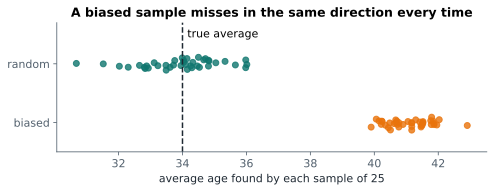

# Lesson 10: Sampling and bias

**You'll learn:** simple random, stratified, cluster and convenience samples, selection, non-response, survivorship and measurement bias, sampling variability, standard error.

▶ **Practise this lesson in the [sandbox](https://kishoremadanagopal.github.io/learning/statistics/#sampling-and-bias)**: run every example and check your exercise answers.

## Key terms

- **Simple random sample:** a sample where every member of the population has the same chance of being chosen.
- **Stratified sample:** random samples taken separately from each group (stratum), so every group is represented.
- **Cluster sample:** randomly chosen whole groups, with everyone in them measured.
- **Convenience sample:** whoever is easiest to reach; usually biased.
- **Bias:** a systematic error that pushes results in one direction.
- **Selection bias:** bias from who ends up in the sample.
- **Non-response bias:** bias because people who respond differ from those who don't.
- **Survivorship bias:** bias from looking only at the cases that "survived" some filter.
- **Sampling variability:** the natural difference between one random sample and another.
- **Standard error (SE):** the standard deviation of a statistic across samples; for a mean, s / √n.

Everything in inferential statistics depends on one assumption: **the sample represents the population**. A huge sample that's collected badly is worse than a small one collected well.

## Ways to sample

| Method | How | Good because |
|---|---|---|
| **Simple random sample** | every member has the same chance of being picked | no systematic favouritism |
| **Stratified sample** | split into groups (strata), sample randomly within each | every group is represented in proportion |
| **Cluster sample** | randomly pick whole groups (schools, stores), use everyone in them | cheaper to collect |
| **Convenience sample** | whoever is easy to reach | ❌ usually biased |

pandas does random and stratified sampling in one line each:

```python
import pandas as pd

customers = pd.read_csv("customers.csv")
simple = customers.sample(n=30, random_state=1)
stratified = customers.groupby("segment").sample(frac=0.25, random_state=1)

print("population mix:\n", customers["segment"].value_counts(normalize=True).round(2))
print("simple random sample mix:\n", simple["segment"].value_counts(normalize=True).round(2))
print("stratified sample mix:\n", stratified["segment"].value_counts(normalize=True).round(2))
```

The stratified sample keeps the segment mix almost exactly; the simple random sample is close but wobbles.

## Bias: when the sample systematically misses

**Bias** means the method tends to miss in the same direction every time. More data doesn't fix it:



Common sources:

- **Selection bias:** who gets into the sample isn't random (an online survey misses people who aren't online).
- **Non-response bias:** the people who answer differ from those who don't (only angry customers fill in the feedback form).
- **Survivorship bias:** you only see the survivors (studying only successful startups to find the "secrets of success").
- **Measurement bias:** the question or instrument pushes answers one way ("Don't you agree that…?").

Let's see selection bias in action. Suppose we only survey customers who signed up in the last year, and ask their age:

```python
import pandas as pd

customers = pd.read_csv("customers.csv", parse_dates=["signup_date"])
recent = customers[customers["signup_date"] >= "2025-01-01"]
print("true average age:   ", customers["age"].mean().round(1))
print("recent sign-ups only:", recent["age"].mean().round(1), f"({len(recent)} people)")
```

Whether the difference is big or small here, the point stands: unless the restricted group is like everyone else, its average answers a different question.

## Sampling variability and the standard error

Even with perfect random sampling, every sample gives a slightly different answer. That's **sampling variability**, and it's not a mistake: it's what statistics measures. Let's draw 1,000 random samples of 10 students and look at how their averages spread:

```python
import numpy as np
import pandas as pd

students = pd.read_csv("students.csv")
math = students["math"].to_numpy()
rng = np.random.default_rng(0)

for n in (5, 10, 30):
    means = [rng.choice(math, n, replace=False).mean() for _ in range(1000)]
    print(f"samples of {n:2}: averages vary with std {np.std(means):.2f}")
```

Bigger samples give averages that vary less. The standard deviation of a sample average has its own name, the **standard error** (SE), and a formula:

SE = s / √n

where s is the standard deviation of the data and n the sample size. To halve the standard error you need **four times** the data, because of the square root.

```python
import numpy as np
import pandas as pd

students = pd.read_csv("students.csv")
sample = students.sample(30, random_state=4)["math"]
se = sample.std() / np.sqrt(len(sample))
print("sample mean:", round(sample.mean(), 1), " standard error:", round(se, 2))
```

`scipy.stats.sem(x)` computes the same thing.

## Common mistakes

- Believing a large sample can't be biased. Size reduces random error, not bias.
- Confusing the standard deviation (spread of the data) with the standard error (uncertainty of an average).
- Forgetting `random_state=` and getting a different sample each time, so results can't be reproduced.

## Exercises

### 1. A stratified sample

Load `customers.csv` and take a stratified sample of **20%** of each `city` with `groupby("city").sample(frac=0.2, random_state=3)`. Store it in `strat`, and store the **largest absolute difference** between the city shares in the sample and in the full data in `max_gap`.

Starter code:

```python
import pandas as pd

customers = pd.read_csv("customers.csv")

```

### 2. Standard error

Load `housing.csv`. Store the standard error of the mean of `price_k` in `se_price` (std / √n, using pandas `.std()`), and the standard error you'd get with **four times** as many homes (same std) in `se_4x`.

Starter code:

```python
import numpy as np
import pandas as pd

housing = pd.read_csv("housing.csv")

```

**In the sandbox:** exercises 19–20. Press **Check** to test your answer.

<details>
<summary>Hints</summary>

1. Subtract the two `value_counts(normalize=True)` Series (they line up by city), take `.abs().max()`.
2. `std / np.sqrt(n)`. With four times the data, n becomes `4 * n`.

</details>

<details>
<summary>Answers</summary>

**1. A stratified sample**

```python
import pandas as pd

customers = pd.read_csv("customers.csv")
strat = customers.groupby("city").sample(frac=0.2, random_state=3)
diff = strat["city"].value_counts(normalize=True) - customers["city"].value_counts(normalize=True)
max_gap = diff.abs().max()
print(max_gap)
```

**2. Standard error**

```python
import numpy as np
import pandas as pd

housing = pd.read_csv("housing.csv")
price = housing["price_k"]
se_price = price.std() / np.sqrt(len(price))
se_4x = price.std() / np.sqrt(4 * len(price))
print(se_price, se_4x)      # four times the data halves the standard error
```

</details>

## Quick quiz

1. A company surveys customers by email. Who is missed?
   - A) Customers who don't read or answer email, so the sample may be biased
   - B) Nobody, email reaches everyone
   - C) Only very young customers

2. Does collecting a much bigger biased sample fix bias?
   - A) Yes
   - B) No, it just gives a more precise wrong answer
   - C) Only if the sample is over 1,000

3. To halve the standard error of a mean, you need:
   - A) Twice the data
   - B) Four times the data
   - C) Half the data

<details>
<summary>Quiz answers</summary>

1. **A) Customers who don't read or answer email, so the sample may be biased**: That's selection and non-response bias: the people who answer may differ from those who don't.
2. **B) No, it just gives a more precise wrong answer**: Bias is a systematic error. More data shrinks the random wobble, not the bias.
3. **B) Four times the data**: SE = s / √n, and √4 = 2.

</details>

---
Previous: [Lesson 9](09-normal-distribution.md) · Next: [Lesson 11: The central limit theorem](11-central-limit-theorem.md)
