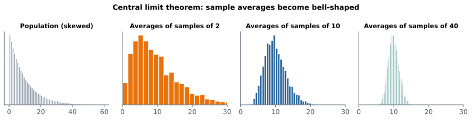

# Lesson 11: The central limit theorem

**You'll learn:** the distribution of sample averages, the central limit theorem, σ / √n, how large n must be, proportions.

▶ **Practise this lesson in the [sandbox](https://kishoremadanagopal.github.io/learning/statistics/#central-limit-theorem)**: run every example and check your exercise answers.

## Key terms

- **Sampling distribution:** the distribution of a statistic (like the mean) over many samples.
- **Central limit theorem (CLT):** for large enough samples, sample averages are approximately normal, centred on the population mean, with standard deviation σ / √n.
- **σ (sigma):** the population standard deviation.
- **√n:** the square root of the sample size; why precision grows slowly with more data.
- **Standard error of a proportion:** √(p(1 − p) / n).

Here's the most important result in statistics. Take **any** population, however strange its shape. Draw many random samples of size n and work out each sample's average. If n is large enough, those averages:

1. form a **normal** (bell-shaped) distribution;
2. are centred on the **population mean**;
3. have a standard deviation of σ / √n: the **standard error**.

That's the **central limit theorem** (CLT).



The population on the left is very skewed: lots of small values, a long tail. Averages of 2 values are still skewed. Averages of 10 are nearly a bell. Averages of 40 are a narrow, almost perfect bell around the true mean.

## Watch it happen

Order revenue in `sales.csv` is very right-skewed. Let's treat the 600 orders as a population and look at averages of random samples:

```python
import numpy as np
import pandas as pd
import matplotlib.pyplot as plt

sales = pd.read_csv("sales.csv")
revenue = (sales["units"] * sales["unit_price"]).to_numpy()
rng = np.random.default_rng(1)

fig, axes = plt.subplots(1, 3, figsize=(10, 3))
axes[0].hist(revenue, bins=40, color="grey")
axes[0].set_title("orders (skewed)")
for ax, n in zip(axes[1:], (5, 50)):
    means = rng.choice(revenue, size=(4000, n)).mean(axis=1)
    ax.hist(means, bins=40, color="teal")
    ax.set_title(f"averages of {n} orders")
plt.show()

print("population mean:", revenue.mean().round(1))
```

## Check the formula

The CLT says the averages' standard deviation should be σ / √n. Let's compare:

```python
import numpy as np
import pandas as pd

sales = pd.read_csv("sales.csv")
revenue = (sales["units"] * sales["unit_price"]).to_numpy()
rng = np.random.default_rng(2)
n = 50
means = rng.choice(revenue, size=(10_000, n)).mean(axis=1)
print("mean of the averages:", means.mean().round(1), " population mean:", revenue.mean().round(1))
print("std of the averages: ", means.std().round(2), " formula σ/√n:", (revenue.std() / np.sqrt(n)).round(2))
```

They match. That means you can know how much a sample average wobbles **from a single sample**, without drawing thousands of them: use the sample's std in place of σ.

## Why it matters

Because sample averages are approximately normal, everything you learned about the normal curve applies to them:

- 95% of sample averages land within about 1.96 standard errors of the true mean. Turn that around and you get a **confidence interval** (next lesson).
- If an average lands far outside that range, something unusual is going on. That's a **hypothesis test** (Part 4).

## How large is "large enough"?

| Population shape | n needed for a good bell |
|---|---|
| already roughly normal | any n |
| mildly skewed | about 15 to 30 |
| strongly skewed or with outliers | 50 or more |

The CLT is about **averages** (and sums and proportions). It doesn't make the data itself normal, and it doesn't rescue a **biased** sample.

## Proportions are averages too

A proportion is the average of 0/1 values, so the CLT covers it. Its standard error is √(p(1 − p) / n):

```python
import numpy as np
import pandas as pd

ab = pd.read_csv("ab_test.csv")
p = ab["converted"].mean()
n = len(ab)
print("conversion rate:", round(p, 4), " standard error:", round(np.sqrt(p * (1 - p) / n), 4))
```

## Common mistakes

- Thinking the CLT makes the data normal. It's the averages that become normal.
- Applying it to tiny samples from very skewed data. Strong skew needs bigger n.
- Expecting it to fix bias or non-random samples.

## Exercises

### 1. Simulate the CLT

Load `weather.csv` and take Mumbai's `rain_mm` (very skewed: most days are dry). With `rng = np.random.default_rng(5)`, draw **5,000** samples of **30** days with replacement (`rng.choice(rain, size=(5000, 30))`) and store the 5,000 sample averages in `means`. Store `means.std()` in `sim_se` and the formula value, `rain.std(ddof=0) / np.sqrt(30)`, in `formula_se`.

Starter code:

```python
import numpy as np
import pandas as pd

weather = pd.read_csv("weather.csv")
rain = weather.loc[weather["city"] == "Mumbai", "rain_mm"].to_numpy()

```

### 2. Standard error of a proportion

Load `ab_test.csv` and keep group B. Store its conversion rate in `p_b` and the standard error of that rate, √(p(1 − p) / n), in `se_b`.

Starter code:

```python
import numpy as np
import pandas as pd

ab = pd.read_csv("ab_test.csv")

```

**In the sandbox:** exercises 21–22. Press **Check** to test your answer.

<details>
<summary>Hints</summary>

1. `rng.choice(rain, size=(5000, 30))` makes a 5000 × 30 array; `.mean(axis=1)` averages each row.
2. Filter group B's `converted` column; n is its length.

</details>

<details>
<summary>Answers</summary>

**1. Simulate the CLT**

```python
import numpy as np
import pandas as pd

weather = pd.read_csv("weather.csv")
rain = weather.loc[weather["city"] == "Mumbai", "rain_mm"].to_numpy()

rng = np.random.default_rng(5)
means = rng.choice(rain, size=(5000, 30)).mean(axis=1)
sim_se = means.std()
formula_se = rain.std(ddof=0) / np.sqrt(30)
print(round(sim_se, 3), round(formula_se, 3))
```

**2. Standard error of a proportion**

```python
import numpy as np
import pandas as pd

ab = pd.read_csv("ab_test.csv")
b = ab.loc[ab["group"] == "B", "converted"]
p_b = b.mean()
se_b = np.sqrt(p_b * (1 - p_b) / len(b))
print(round(p_b, 4), round(se_b, 4))
```

</details>

## Quick quiz

1. The central limit theorem says that, for large samples:
   - A) The data becomes normal
   - B) The sample averages are approximately normal
   - C) Every sample has the same average

2. Averages of samples of 100 are more spread out than averages of samples of 25. True or false?
   - A) True
   - B) False: bigger samples give averages that vary less
   - C) It depends on the data's shape

3. Why does the CLT matter so much?
   - A) It lets us use the normal curve to measure uncertainty in averages and proportions
   - B) It removes bias from samples
   - C) It means we never need large samples

<details>
<summary>Quiz answers</summary>

1. **B) The sample averages are approximately normal**: It's about the distribution of averages, not of the raw data.
2. **B) False: bigger samples give averages that vary less**: The spread of averages is σ / √n, which shrinks as n grows.
3. **A) It lets us use the normal curve to measure uncertainty in averages and proportions**: Confidence intervals and many tests rest on it.

</details>

---
Previous: [Lesson 10](10-sampling-and-bias.md) · Next: [Lesson 12: Confidence intervals](12-confidence-intervals.md)
