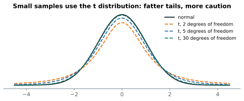
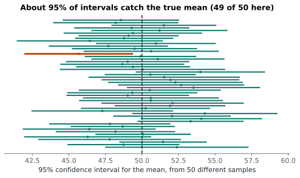

# Lesson 12: Confidence intervals

**You'll learn:** estimate ± critical value × standard error, the t distribution, degrees of freedom, `stats.t.interval`, interpreting 95%, interval width, intervals for proportions, margin of error.

▶ **Practise this lesson in the [sandbox](https://kishoremadanagopal.github.io/learning/statistics/#confidence-intervals)**: run every example and check your exercise answers.

## Key terms

- **Point estimate:** a single best guess, like the sample mean.
- **Confidence interval:** a range of plausible values for a population number, built so that a stated share of such ranges contain it.
- **Confidence level:** the long-run share of intervals that contain the true value, usually 95%.
- **Critical value:** how many standard errors to go out on each side (about 1.96 for 95% with the normal distribution).
- **t distribution:** a bell-shaped distribution with fatter tails than the normal, used when the std is estimated from the sample.
- **Degrees of freedom:** a number that sets the t distribution's shape; n − 1 for one mean.
- **Margin of error:** the "±" part of a confidence interval.

A single estimate ("the average is 56.6") hides how uncertain it is. A **confidence interval** gives a range of plausible values for the population number: "the average is between 52.8 and 60.4, with 95% confidence".

The recipe, straight from the central limit theorem:

**estimate ± (critical value) × (standard error)**

For a 95% interval the critical value is about 2 (1.96 for the normal distribution, a little more for small samples).

## A confidence interval for a mean

For means we use the **t distribution** instead of the normal. It's like the normal but with fatter tails, which accounts for the extra uncertainty of estimating the std from the sample itself:



The t distribution's shape depends on the **degrees of freedom**, n − 1 for a single mean. As n grows it becomes the normal distribution.

```python
import numpy as np
import pandas as pd
from scipy import stats

students = pd.read_csv("students.csv")
math = students["math"]
n = len(math)
mean = math.mean()
se = math.std() / np.sqrt(n)
t_crit = stats.t.ppf(0.975, df=n - 1)        # 2.5% in each tail

print(f"mean {mean:.1f}, SE {se:.2f}, t* {t_crit:.3f}")
print(f"95% CI: {mean - t_crit * se:.1f} to {mean + t_crit * se:.1f}")
```

SciPy does the same in one call:

```python
import pandas as pd
from scipy import stats

students = pd.read_csv("students.csv")
math = students["math"]
low, high = stats.t.interval(0.95, df=len(math) - 1, loc=math.mean(), scale=stats.sem(math))
print(round(low, 1), round(high, 1))
```

## What "95% confidence" really means

It's a statement about the **method**, not about one interval. If you repeated the study many times, about 95% of the intervals you built would contain the true value:



Any single interval either contains the true value or it doesn't; you just don't know which. So say "we're 95% confident the average is between 52.8 and 60.4", and avoid "there's a 95% probability the true average is in this interval" (strictly, that's a different, Bayesian statement).

Let's check the 95% by simulation, using a population where we know the truth:

```python
import numpy as np
from scipy import stats

rng = np.random.default_rng(10)
true_mean, hits = 50, 0
for _ in range(2000):
    sample = rng.normal(true_mean, 12, 25)
    low, high = stats.t.interval(0.95, 24, loc=sample.mean(), scale=stats.sem(sample))
    hits += low <= true_mean <= high
print("share of intervals containing the true mean:", hits / 2000)
```

## What makes an interval narrow?

| Change | Effect on the interval |
|---|---|
| bigger sample (n ↑) | narrower (SE = s / √n shrinks) |
| more spread in the data (s ↑) | wider |
| higher confidence (99% instead of 95%) | wider: to be surer, you need a bigger net |

```python
import pandas as pd
from scipy import stats

students = pd.read_csv("students.csv")
math = students["math"]
for level in (0.90, 0.95, 0.99):
    low, high = stats.t.interval(level, len(math) - 1, loc=math.mean(), scale=stats.sem(math))
    print(f"{level:.0%}: {low:.1f} to {high:.1f}  (width {high - low:.1f})")
```

## A confidence interval for a proportion

For a proportion p from n yes/no values, the standard error is √(p(1 − p) / n), and the normal critical value 1.96 is used:

```python
import numpy as np
import pandas as pd

ab = pd.read_csv("ab_test.csv")
a = ab.loc[ab["group"] == "A", "converted"]
p, n = a.mean(), len(a)
se = np.sqrt(p * (1 - p) / n)
print(f"page A converts {p:.1%}, 95% CI {p - 1.96 * se:.1%} to {p + 1.96 * se:.1%}")
```

This simple "plus or minus 1.96 SE" interval works well when there are at least about 10 successes and 10 failures. For tiny samples or rates near 0% or 100%, use the Wilson interval (`statsmodels.stats.proportion.proportion_confint(..., method="wilson")`).

This is the "margin of error" you see in polls: "52% support, ±3 points" is a 95% interval from about 1,000 people.

## Common mistakes

- Saying "95% of the data is in the interval". The interval is about the mean, not individual values.
- Using 1.96 with very small samples. Use the t distribution for means.
- Comparing two groups by checking whether their intervals overlap. Overlapping intervals can still hide a real difference; test the difference directly.

## Exercises

### 1. Average home price

Load `housing.csv` and build a **95%** confidence interval for the mean `price_k` with `stats.t.interval`. Store the lower and upper ends in `low` and `high`.

Starter code:

```python
import pandas as pd
from scipy import stats

housing = pd.read_csv("housing.csv")

```

### 2. Margin of error

Load `ab_test.csv`, keep **mobile** visitors, and compute a 95% confidence interval for their conversion rate using p ± 1.96 × √(p(1 − p) / n). Store the rate in `p_mobile` and the margin of error (1.96 × SE) in `margin`.

Starter code:

```python
import numpy as np
import pandas as pd

ab = pd.read_csv("ab_test.csv")

```

**In the sandbox:** exercises 23–24. Press **Check** to test your answer.

<details>
<summary>Hints</summary>

1. `stats.t.interval(0.95, df=n - 1, loc=mean, scale=stats.sem(price))`.
2. Filter mobile visitors' `converted` column, then `1.96 * np.sqrt(p * (1 - p) / n)`.

</details>

<details>
<summary>Answers</summary>

**1. Average home price**

```python
import pandas as pd
from scipy import stats

housing = pd.read_csv("housing.csv")
price = housing["price_k"]
low, high = stats.t.interval(0.95, df=len(price) - 1, loc=price.mean(), scale=stats.sem(price))
print(round(low, 1), round(high, 1))
```

**2. Margin of error**

```python
import numpy as np
import pandas as pd

ab = pd.read_csv("ab_test.csv")
mobile = ab.loc[ab["device"] == "mobile", "converted"]
p_mobile = mobile.mean()
margin = 1.96 * np.sqrt(p_mobile * (1 - p_mobile) / len(mobile))
print(f"{p_mobile:.1%} ± {margin:.1%}")
```

</details>

## Quick quiz

1. What does "95% confidence" mean?
   - A) The method captures the true value in about 95% of repeated samples
   - B) 95% of the data is inside the interval
   - C) The true value moves around inside the interval 95% of the time

2. You want a narrower interval without changing the confidence level. What helps?
   - A) Using 99% confidence
   - B) Collecting a bigger sample
   - C) Rounding the mean

3. Why use the t distribution for a mean's interval?
   - A) It's always narrower
   - B) It allows for the extra uncertainty of estimating the standard deviation from the sample
   - C) The normal distribution can't be used for means

<details>
<summary>Quiz answers</summary>

1. **A) The method captures the true value in about 95% of repeated samples**: Confidence is about the long-run success rate of the method.
2. **B) Collecting a bigger sample**: SE = s / √n, so more data narrows the interval.
3. **B) It allows for the extra uncertainty of estimating the standard deviation from the sample**: With small samples the t's fatter tails give an honestly wider interval.

</details>

---
Previous: [Lesson 11](11-central-limit-theorem.md) · Next: [Lesson 13: The bootstrap](13-bootstrap.md)
