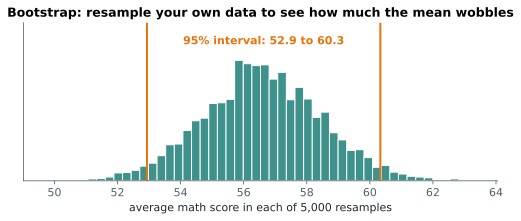

# Lesson 13: The bootstrap

**You'll learn:** resampling with replacement, bootstrap percentile intervals, intervals for medians and correlations, `scipy.stats.bootstrap`, differences between groups, limits.

▶ **Practise this lesson in the [sandbox](https://kishoremadanagopal.github.io/learning/statistics/#bootstrap)**: run every example and check your exercise answers.

## Key terms

- **Bootstrap:** estimating uncertainty by recomputing a statistic on many resamples of your data.
- **Resample:** a sample drawn from your own data, with replacement, the same size as the original.
- **With replacement:** each draw can pick a row that was already picked.
- **Bootstrap distribution:** the statistic's values across all resamples.
- **Percentile interval:** the middle 95% of the bootstrap distribution (2.5th to 97.5th percentiles).
- **BCa interval:** a more accurate bootstrap interval that corrects for bias and skew; SciPy's default.

The formulas in the last lesson work for means and proportions. But what about a confidence interval for a **median**, a 90th percentile, a ratio, or a correlation? The **bootstrap** handles all of them with one idea:

> Treat your sample as a stand-in for the population. Draw many new samples **from your sample, with replacement**, recompute the statistic each time, and see how much it varies.

"With replacement" means the same row can be picked more than once, so each resample is a slightly different version of your data, the same size as the original.

```python
import numpy as np

rng = np.random.default_rng(0)
data = np.array([3, 7, 8, 12, 15])
for _ in range(3):
    print(rng.choice(data, size=len(data), replace=True))
```

## A bootstrap confidence interval for the mean

1. resample the data with replacement, thousands of times;
2. compute the mean of each resample;
3. the middle 95% of those means (the 2.5th to 97.5th percentiles) is a 95% confidence interval.



```python
import numpy as np
import pandas as pd

students = pd.read_csv("students.csv")
math = students["math"].to_numpy()
rng = np.random.default_rng(1)

boot_means = np.array([rng.choice(math, size=len(math)).mean() for _ in range(5000)])
low, high = np.percentile(boot_means, [2.5, 97.5])
print(f"bootstrap 95% CI for the mean: {low:.1f} to {high:.1f}")
```

That's almost the same as the t-interval (52.8 to 60.4), which is reassuring: for a mean, both methods agree.

## The real power: any statistic

The median of order revenue has no simple standard-error formula. The bootstrap doesn't care:

```python
import numpy as np
import pandas as pd

sales = pd.read_csv("sales.csv")
revenue = (sales["units"] * sales["unit_price"]).to_numpy()
rng = np.random.default_rng(2)

boot_medians = np.array([np.median(rng.choice(revenue, size=len(revenue))) for _ in range(3000)])
low, high = np.percentile(boot_medians, [2.5, 97.5])
print(f"median order: {np.median(revenue):.1f}, 95% CI {low:.1f} to {high:.1f}")
```

## SciPy's bootstrap

`scipy.stats.bootstrap` does the resampling for you, with a more accurate interval method (BCa) by default. Data goes in as a tuple:

```python
import numpy as np
import pandas as pd
from scipy import stats

housing = pd.read_csv("housing.csv")
res = stats.bootstrap((housing["price_k"].to_numpy(),), np.median, n_resamples=2000, random_state=3)
ci = res.confidence_interval
print(f"95% CI for the median price: {ci.low:.1f} to {ci.high:.1f}")
```

## Bootstrapping a difference

The bootstrap also gives an interval for a **difference between two groups**: resample each group separately, take the difference each time.

```python
import numpy as np
import pandas as pd

ab = pd.read_csv("ab_test.csv")
a = ab.loc[ab["group"] == "A", "converted"].to_numpy()
b = ab.loc[ab["group"] == "B", "converted"].to_numpy()
rng = np.random.default_rng(4)

diffs = np.array([rng.choice(b, len(b)).mean() - rng.choice(a, len(a)).mean() for _ in range(3000)])
low, high = np.percentile(diffs, [2.5, 97.5])
print(f"B - A: {b.mean() - a.mean():.2%}, 95% CI {low:.2%} to {high:.2%}")
```

The whole interval is above zero, so page B's advantage is very unlikely to be just luck. You'll test that formally in Part 6.

## Limits

- The bootstrap can only reflect the data you have. A small or biased sample gives a misleading bootstrap too.
- It struggles with extreme statistics (the maximum, the 99.9th percentile) and with very small samples (below about 15).

## Common mistakes

- Resampling x and y separately when they're pairs. Pick row positions and use them for both.
- Resampling without replacement, which just returns the same data shuffled.
- Expecting the bootstrap to rescue a tiny or biased sample.

## Exercises

### 1. Bootstrap a median

Load `housing.csv`. With `rng = np.random.default_rng(8)`, make **2,000** bootstrap resamples of `price_k` (each the same size as the data, with replacement), store the 2,000 medians in `boot_medians`, and the 95% percentile interval in `low` and `high`.

Starter code:

```python
import numpy as np
import pandas as pd

housing = pd.read_csv("housing.csv")
price = housing["price_k"].to_numpy()
rng = np.random.default_rng(8)

```

### 2. Bootstrap a correlation

Load `students.csv`. With `rng = np.random.default_rng(9)`, resample **rows** 2,000 times (pick row positions with `rng.integers(0, n, n)`), compute the correlation between `hours_studied` and `math` for each resample with `np.corrcoef(x, y)[0, 1]`, and store the 95% percentile interval in `low` and `high`.

Starter code:

```python
import numpy as np
import pandas as pd

students = pd.read_csv("students.csv")
x = students["hours_studied"].to_numpy()
y = students["math"].to_numpy()
n = len(x)
rng = np.random.default_rng(9)

```

**In the sandbox:** exercises 25–26. Press **Check** to test your answer.

<details>
<summary>Hints</summary>

1. A list comprehension: `[np.median(rng.choice(price, size=len(price))) for _ in range(2000)]`, then `np.percentile(..., [2.5, 97.5])`.
2. Pick `idx = rng.integers(0, n, n)` once per resample and use it for both `x` and `y`, so each student's pair stays together.

</details>

<details>
<summary>Answers</summary>

**1. Bootstrap a median**

```python
import numpy as np
import pandas as pd

housing = pd.read_csv("housing.csv")
price = housing["price_k"].to_numpy()
rng = np.random.default_rng(8)

boot_medians = np.array([np.median(rng.choice(price, size=len(price))) for _ in range(2000)])
low, high = np.percentile(boot_medians, [2.5, 97.5])
print(round(low, 1), round(high, 1))
```

**2. Bootstrap a correlation**

```python
import numpy as np
import pandas as pd

students = pd.read_csv("students.csv")
x = students["hours_studied"].to_numpy()
y = students["math"].to_numpy()
n = len(x)
rng = np.random.default_rng(9)

rs = []
for _ in range(2000):
    idx = rng.integers(0, n, n)          # the same rows for x and y keeps each pair together
    rs.append(np.corrcoef(x[idx], y[idx])[0, 1])
low, high = np.percentile(rs, [2.5, 97.5])
print(round(low, 2), round(high, 2))
```

</details>

## Quick quiz

1. What does "resampling with replacement" mean?
   - A) Drawing rows from your data where the same row can be picked more than once
   - B) Replacing missing values
   - C) Drawing a new sample from the population

2. What's the bootstrap's main advantage over formulas?
   - A) It's always more accurate
   - B) It works for almost any statistic, like a median or a correlation
   - C) It fixes biased samples

3. A bootstrap 95% interval for B − A runs from 1% to 4%. What does that suggest?
   - A) B is very likely truly better than A
   - B) A is better than B
   - C) Nothing, since bootstrap intervals can't be interpreted

<details>
<summary>Quiz answers</summary>

1. **A) Drawing rows from your data where the same row can be picked more than once**: Each resample is a shuffled, slightly different copy of your sample.
2. **B) It works for almost any statistic, like a median or a correlation**: No special formula is needed; you just recompute the statistic.
3. **A) B is very likely truly better than A**: The whole interval is above zero, so a zero difference looks implausible.

</details>

---
Previous: [Lesson 12](12-confidence-intervals.md) · Next: [Lesson 14: Hypothesis testing and p-values](14-hypothesis-testing.md)
