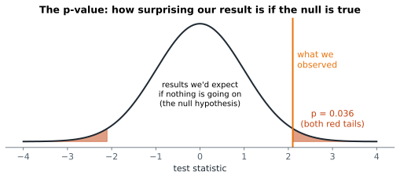

# Lesson 14: Hypothesis testing and p-values

**You'll learn:** null and alternative hypotheses, test statistics, null distributions, permutation tests, p-values, α, one- vs two-sided tests, reading p-values correctly.

▶ **Practise this lesson in the [sandbox](https://kishoremadanagopal.github.io/learning/statistics/#hypothesis-testing)**: run every example and check your exercise answers.

## Key terms

- **Hypothesis test:** a method for judging whether data gives evidence against a "no effect" explanation.
- **Null hypothesis (H₀):** the default claim of no effect or no difference.
- **Alternative hypothesis (H₁):** the claim that there is an effect or difference.
- **Test statistic:** a number that measures how far the data is from what H₀ predicts.
- **Null distribution:** the values the test statistic would take if H₀ were true.
- **p-value:** the probability of a result at least as extreme as the one observed, if H₀ were true.
- **Significance level (α):** the cut-off for calling a result significant, usually 0.05.
- **Statistically significant:** p below α; evidence against H₀, not necessarily an important effect.
- **Permutation test:** a test that builds the null distribution by shuffling group labels.
- **Two-sided test:** a test that counts extreme results in both directions.
- **Effect size:** how big a difference or relationship is, separate from whether it's significant.

Page B converted 12.8% of visitors and page A 10.2%. Is B really better, or did B just get luckier visitors this time? A **hypothesis test** answers: *if there were really no difference, how surprising would a gap this big be?*

## The logic, step by step

1. **Null hypothesis (H₀):** the boring explanation: "there's no difference; any gap is luck."
2. **Alternative hypothesis (H₁):** what you suspect: "there is a difference."
3. Pick a **test statistic** that measures the gap (here, rate B − rate A).
4. Work out what values the statistic would take **if H₀ were true**: the **null distribution**.
5. The **p-value** is the probability of a result at least as extreme as yours, if H₀ were true.
6. If the p-value is small (usually below **0.05**, the **significance level** α), reject H₀: the result is **statistically significant**.



It's like a court: the defendant (H₀) is presumed innocent, and you only convict if the evidence would be very unlikely under innocence. "Not significant" means "not enough evidence", **not** "proved innocent".

## A permutation test: build the null distribution yourself

If the page made no difference, the "A" and "B" labels are meaningless: you could shuffle them and the gap would be just as big. So shuffle the labels thousands of times and see how often a shuffled gap is as big as the real one:

```python
import numpy as np
import pandas as pd

ab = pd.read_csv("ab_test.csv")
converted = ab["converted"].to_numpy()
is_b = (ab["group"] == "B").to_numpy()
observed = converted[is_b].mean() - converted[~is_b].mean()

rng = np.random.default_rng(0)
null_gaps = []
for _ in range(5000):
    shuffled = rng.permutation(is_b)            # random labels: H0 is true by design
    null_gaps.append(converted[shuffled].mean() - converted[~shuffled].mean())
null_gaps = np.array(null_gaps)

p_value = (np.abs(null_gaps) >= abs(observed)).mean()
print(f"observed gap: {observed:.4f}")
print(f"p-value: {p_value:.4f}")
```

Only a tiny share of the shuffled gaps are as big as the real one, so the p-value is small and we reject H₀: page B's advantage is unlikely to be luck.

Let's draw the null distribution and where the real gap falls:

```python
import numpy as np
import pandas as pd
import matplotlib.pyplot as plt

ab = pd.read_csv("ab_test.csv")
converted = ab["converted"].to_numpy()
is_b = (ab["group"] == "B").to_numpy()
observed = converted[is_b].mean() - converted[~is_b].mean()
rng = np.random.default_rng(0)
null_gaps = [converted[s].mean() - converted[~s].mean() for s in (rng.permutation(is_b) for _ in range(3000))]

fig, ax = plt.subplots(figsize=(7, 3))
ax.hist(null_gaps, bins=40, color="lightgrey", edgecolor="white")
ax.axvline(observed, color="darkorange", linewidth=2, label="observed gap")
ax.set_xlabel("gap in conversion rate (B - A) when labels are shuffled")
ax.legend()
plt.show()
```

## One-sided or two-sided?

A **two-sided** test asks "is there a difference in either direction?" and counts both tails (that's why we used `np.abs`). A **one-sided** test asks only "is B better?" and counts one tail. Decide **before** looking at the data; two-sided is the safe default.

## Reading p-values correctly

| The p-value IS | The p-value is NOT |
|---|---|
| how surprising the data would be if H₀ were true | the probability that H₀ is true |
| a measure of evidence against H₀ | the size or importance of the effect |
| affected by the sample size | proof of anything |

- **p = 0.03:** if there were no real difference, a gap this big would turn up only 3% of the time. Evidence against H₀.
- **p = 0.40:** gaps this big are common by chance alone. Not evidence of a difference (but not proof of no difference either).
- With huge samples, tiny, unimportant differences become "significant". Always report the **effect size** (how big the difference is) alongside the p-value.

## The 0.05 threshold

0.05 is a convention, not a law of nature. Some fields use 0.01 or stricter (particle physics uses about 0.0000003). Report the actual p-value rather than just "significant" or not, and never change α after seeing the results.

## Common mistakes

- Reading p as "the probability H₀ is true" or "the probability the result is due to chance".
- Treating "not significant" as proof of no effect. It means not enough evidence.
- Choosing one-sided tests or changing α after seeing the data.

## Exercises

### 1. Permutation test for study hours

Do students in class A study more hours than students in class B? Load `students.csv`, keep classes A and B, and compute `observed`: the mean `hours_studied` of A minus that of B. Then, with `rng = np.random.default_rng(1)`, shuffle the class labels **4,000** times (use `rng.permutation(is_a)` each time) and store the **two-sided** p-value in `p_value`.

Starter code:

```python
import numpy as np
import pandas as pd

students = pd.read_csv("students.csv")
ab = students[students["class"].isin(["A", "B"])]
hours = ab["hours_studied"].to_numpy()
is_a = (ab["class"] == "A").to_numpy()
rng = np.random.default_rng(1)

```

### 2. Read the result

A test of a new checkout button gives p = 0.21. Set `reject` to `True` or `False` for α = 0.05, and set `meaning` to the letter of the correct statement:

- `"a"`: the new button has no effect;
- `"b"`: a difference this big would happen fairly often by chance, so there isn't enough evidence of an effect;
- `"c"`: there is a 21% chance the new button works.

Starter code:

```python
reject = None
meaning = ""
```

**In the sandbox:** exercises 27–28. Press **Check** to test your answer.

<details>
<summary>Hints</summary>

1. Inside the loop, `shuffled = rng.permutation(is_a)`, then the gap is `hours[shuffled].mean() - hours[~shuffled].mean()`. The p-value is the share of `abs(gap) >= abs(observed)`.
2. 0.21 is above 0.05. And a p-value is never "the chance the hypothesis is true".

</details>

<details>
<summary>Answers</summary>

**1. Permutation test for study hours**

```python
import numpy as np
import pandas as pd

students = pd.read_csv("students.csv")
ab = students[students["class"].isin(["A", "B"])]
hours = ab["hours_studied"].to_numpy()
is_a = (ab["class"] == "A").to_numpy()
rng = np.random.default_rng(1)

observed = hours[is_a].mean() - hours[~is_a].mean()
gaps = []
for _ in range(4000):
    shuffled = rng.permutation(is_a)
    gaps.append(hours[shuffled].mean() - hours[~shuffled].mean())
p_value = (np.abs(gaps) >= abs(observed)).mean()
print(round(observed, 2), p_value)
```

**2. Read the result**

```python
reject = False
meaning = "b"
```

</details>

## Quick quiz

1. What is the null hypothesis in an A/B test?
   - A) There's no real difference between A and B
   - B) B is better than A
   - C) The test was run correctly

2. p = 0.002 means:
   - A) There's a 0.2% chance H₀ is true
   - B) If H₀ were true, a result this extreme would happen only 0.2% of the time
   - C) The effect is large

3. A huge test finds p = 0.001 for a 0.01% lift in sales. What should you conclude?
   - A) It's an important improvement
   - B) It's statistically significant but probably too small to matter
   - C) The test is wrong

<details>
<summary>Quiz answers</summary>

1. **A) There's no real difference between A and B**: H₀ is the "nothing is going on" explanation that the test tries to find evidence against.
2. **B) If H₀ were true, a result this extreme would happen only 0.2% of the time**: A p-value is a probability about the data assuming H₀, not about H₀ itself.
3. **B) It's statistically significant but probably too small to matter**: Large samples make tiny effects significant. Judge the effect size too.

</details>

---
Previous: [Lesson 13](13-bootstrap.md) · Next: [Lesson 15: t-tests: comparing means](15-t-tests.md)
