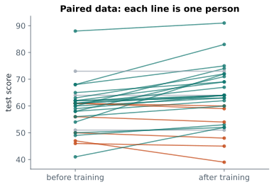

# Lesson 15: t-tests: comparing means

**You'll learn:** the t statistic, one-sample, Welch's two-sample and paired t-tests, confidence intervals for differences, Cohen's d, assumptions, Mann-Whitney and Wilcoxon.

▶ **Practise this lesson in the [sandbox](https://kishoremadanagopal.github.io/learning/statistics/#t-tests)**: run every example and check your exercise answers.

## Key terms

- **t-test:** a test comparing means using the t distribution.
- **t statistic:** a difference divided by its standard error.
- **One-sample t-test:** compares one group's mean with a fixed value.
- **Welch's t-test:** compares two independent groups without assuming equal spreads.
- **Paired t-test:** compares two measurements on the same subjects, using each subject's difference.
- **Cohen's d:** a difference between means measured in standard deviations.
- **Mann-Whitney U test:** a rank-based alternative to the two-sample t-test.
- **Wilcoxon signed-rank test:** a rank-based alternative to the paired t-test.

The **t-test** is the classic way to compare averages. It turns a difference into a **t statistic** (the difference divided by its standard error, "how many standard errors apart?") and compares it with the t distribution to get a p-value. SciPy has one function for each situation:

| Question | Test | SciPy |
|---|---|---|
| Is one group's mean different from a fixed value? | one-sample t-test | `stats.ttest_1samp(x, value)` |
| Do two separate groups have different means? | two-sample (Welch's) t-test | `stats.ttest_ind(a, b, equal_var=False)` |
| Did the same people change between two measurements? | paired t-test | `stats.ttest_rel(before, after)` |

## One-sample t-test

The school's target is an average math score of 60. Are these students below target?

```python
import pandas as pd
from scipy import stats

students = pd.read_csv("students.csv")
res = stats.ttest_1samp(students["math"], 60)
print(f"mean {students['math'].mean():.1f}, t = {res.statistic:.2f}, p = {res.pvalue:.3f}")
```

The mean is 56.6, below 60, but p = 0.078 is above 0.05: a gap this size could plausibly be chance, so there isn't enough evidence that the true average is below target. If you had decided **in advance** to ask only "is it below 60?", a one-sided test (`alternative="less"`) would halve the p-value to about 0.04. That's exactly why the direction must be chosen before looking.

## Two-sample t-test

Do class A and class B differ in math? Use **Welch's** t-test (`equal_var=False`), which doesn't assume the two groups have the same spread. It's the safer default:

```python
import pandas as pd
from scipy import stats

students = pd.read_csv("students.csv")
a = students.loc[students["class"] == "A", "math"]
b = students.loc[students["class"] == "B", "math"]
res = stats.ttest_ind(a, b, equal_var=False)
print(f"A {a.mean():.1f} vs B {b.mean():.1f}: t = {res.statistic:.2f}, p = {res.pvalue:.3f}")
```

A difference of about 6 points, but p is well above 0.05: with only 22 students per class and lots of spread, a gap this size could easily be chance.

## Paired t-test

When the **same people** are measured twice (before and after training), compare each person with themselves. That removes the big differences **between** people and makes the test far more sensitive:



```python
import pandas as pd
from scipy import stats

training = pd.read_csv("training.csv")
diff = training["after"] - training["before"]
paired = stats.ttest_rel(training["after"], training["before"])
wrong = stats.ttest_ind(training["after"], training["before"], equal_var=False)
print(f"average improvement: {diff.mean():.1f} points")
print(f"paired t-test:       p = {paired.pvalue:.4f}")
print(f"(wrong) unpaired:    p = {wrong.pvalue:.4f}")
```

The paired test finds a clear improvement; the unpaired test, which ignores who is who, misses it. **Use the paired test whenever measurements come in pairs.**

## A confidence interval for the difference

A p-value says whether there's evidence of a difference; a confidence interval says **how big** it might be. Results from `ttest_rel` and `ttest_ind` have a `confidence_interval()` method:

```python
import pandas as pd
from scipy import stats

training = pd.read_csv("training.csv")
res = stats.ttest_rel(training["after"], training["before"])
ci = res.confidence_interval(0.95)
print(f"improvement: 95% CI {ci.low:.1f} to {ci.high:.1f} points")
```

## Effect size: Cohen's d

**Cohen's d** expresses a difference in standard deviations, so it can be compared across studies: about 0.2 is small, 0.5 medium, 0.8 large.

```python
import numpy as np
import pandas as pd

students = pd.read_csv("students.csv")
a = students.loc[students["class"] == "A", "math"]
b = students.loc[students["class"] == "B", "math"]
pooled_sd = np.sqrt((a.var() + b.var()) / 2)
print("Cohen's d:", round((a.mean() - b.mean()) / pooled_sd, 2))
```

## Assumptions

t-tests assume independent observations, and roughly normal data **or** large enough samples (about 30 per group, thanks to the central limit theorem). For small, very skewed samples, use a **rank-based** test that doesn't assume normality: **Mann-Whitney U** instead of the two-sample t-test, or **Wilcoxon signed-rank** instead of the paired test:

```python
import pandas as pd
from scipy import stats

training = pd.read_csv("training.csv")
print("Wilcoxon signed-rank p:", round(stats.wilcoxon(training["after"], training["before"]).pvalue, 4))

students = pd.read_csv("students.csv")
a = students.loc[students["class"] == "A", "math"]
b = students.loc[students["class"] == "B", "math"]
print("Mann-Whitney U p:      ", round(stats.mannwhitneyu(a, b).pvalue, 3))
```

## Reporting

A good report includes the means, the difference with its confidence interval, the test and the p-value: *"After training, scores rose by 4.1 points on average (95% CI 1.9 to 6.2; paired t-test, p < 0.001)."*

## Common mistakes

- Using an unpaired test on paired data, which wastes the pairing and loses power.
- Reporting only the p-value. Give the difference and its confidence interval too.
- Using t-tests on tiny, very skewed samples. Switch to a rank-based test.

## Exercises

### 1. Did training help?

Load `training.csv`. Run a **paired** t-test of `after` against `before` and store the p-value in `p_paired`. Store the average improvement (after − before) in `mean_gain`.

Starter code:

```python
import pandas as pd
from scipy import stats

training = pd.read_csv("training.csv")

```

### 2. Revenue per buyer

Load `ab_test.csv` and keep only visitors who **converted**. Compare their `revenue` between group A and group B with **Welch's** t-test and store the p-value in `p_rev`. Set `significant` to `True` if p < 0.05, otherwise `False`.

Starter code:

```python
import pandas as pd
from scipy import stats

ab = pd.read_csv("ab_test.csv")

```

**In the sandbox:** exercises 29–30. Press **Check** to test your answer.

<details>
<summary>Hints</summary>

1. `stats.ttest_rel(training["after"], training["before"]).pvalue`.
2. Filter `converted == 1` first, then split by group and use `stats.ttest_ind(a, b, equal_var=False)`.

</details>

<details>
<summary>Answers</summary>

**1. Did training help?**

```python
import pandas as pd
from scipy import stats

training = pd.read_csv("training.csv")
p_paired = stats.ttest_rel(training["after"], training["before"]).pvalue
mean_gain = (training["after"] - training["before"]).mean()
print(round(mean_gain, 2), p_paired)
```

**2. Revenue per buyer**

```python
import pandas as pd
from scipy import stats

ab = pd.read_csv("ab_test.csv")
buyers = ab[ab["converted"] == 1]
rev_a = buyers.loc[buyers["group"] == "A", "revenue"]
rev_b = buyers.loc[buyers["group"] == "B", "revenue"]
p_rev = stats.ttest_ind(rev_a, rev_b, equal_var=False).pvalue
significant = bool(p_rev < 0.05)
print(round(p_rev, 3), significant)
```

</details>

## Quick quiz

1. The same 30 employees are tested before and after a course. Which test fits?
   - A) Welch's two-sample t-test
   - B) Paired t-test
   - C) One-sample t-test against 0 on the before scores

2. Why is Welch's t-test (`equal_var=False`) a good default?
   - A) It doesn't assume the two groups have equal spread
   - B) It always gives smaller p-values
   - C) It works without any data

3. Cohen's d of 0.8 means:
   - A) p = 0.8
   - B) The means differ by about 0.8 standard deviations, a large effect
   - C) 80% of people improved

<details>
<summary>Quiz answers</summary>

1. **B) Paired t-test**: Each person is measured twice, so compare each person with themselves.
2. **A) It doesn't assume the two groups have equal spread**: When spreads differ, the classic equal-variance test can mislead; Welch's handles both cases.
3. **B) The means differ by about 0.8 standard deviations, a large effect**: Cohen's d measures the size of a difference in standard-deviation units.

</details>

---
Previous: [Lesson 14](14-hypothesis-testing.md) · Next: [Lesson 16: Errors, power and sample size](16-errors-and-power.md)
