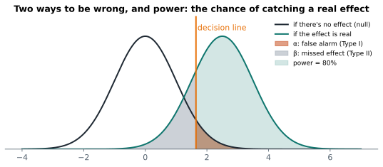

# Lesson 16: Errors, power and sample size

**You'll learn:** Type I and II errors, α and β, power, simulating false alarms and power, sample size calculations, multiple testing, Bonferroni.

▶ **Practise this lesson in the [sandbox](https://kishoremadanagopal.github.io/learning/statistics/#errors-and-power)**: run every example and check your exercise answers.

## Key terms

- **Type I error:** a false alarm: rejecting H₀ when it's true.
- **Type II error:** a miss: failing to reject H₀ when there is a real effect.
- **β (beta):** the probability of a Type II error.
- **Power:** the probability of detecting a real effect, 1 − β; 80% is a common target.
- **Minimum detectable effect:** the smallest effect a study is designed to detect.
- **Multiple testing:** running many tests, which makes some false alarms likely.
- **p-hacking:** trying analyses until something comes out significant.
- **Bonferroni correction:** dividing α by the number of tests.

A test can be wrong in two ways:

| | H₀ really true (no effect) | H₀ really false (real effect) |
|---|---|---|
| **You reject H₀** | ❌ **Type I error**: a false alarm. Probability α | ✅ correct: you found it. Probability = **power** |
| **You don't reject H₀** | ✅ correct | ❌ **Type II error**: a missed effect. Probability β |



- **α (alpha)**, the significance level, is the false-alarm rate you accept, usually 5%.
- **β (beta)** is the chance of missing a real effect.
- **Power = 1 − β**: the chance of detecting an effect that's really there. 80% is the usual target.

Moving the decision line trades one error for the other: a stricter α means fewer false alarms but more missed effects. The only way to reduce **both** is more data.

## See α by simulation

If H₀ is true, a test at α = 0.05 should give a false alarm about 5% of the time. Run 2,000 A/A tests (both groups from the same population):

```python
import numpy as np
from scipy import stats

rng = np.random.default_rng(0)
false_alarms = 0
for _ in range(2000):
    a = rng.normal(50, 10, 40)
    b = rng.normal(50, 10, 40)          # same population: no real effect
    false_alarms += stats.ttest_ind(a, b, equal_var=False).pvalue < 0.05
print("false-alarm rate:", false_alarms / 2000)
```

## See power by simulation

Now give group B a real, modest effect (+5 points, half a standard deviation) and count how often the test finds it, for different sample sizes:

```python
import numpy as np
from scipy import stats

rng = np.random.default_rng(1)
for n in (10, 30, 64, 100):
    found = sum(stats.ttest_ind(rng.normal(50, 10, n), rng.normal(55, 10, n), equal_var=False).pvalue < 0.05
                for _ in range(1000))
    print(f"n = {n:3} per group: power ≈ {found / 1000:.0%}")
```

With 10 per group, a real effect is usually missed. You need about 64 per group to reach 80% power for an effect of this size.

## Power depends on four things

| Increase this… | …and power |
|---|---|
| sample size n | goes up |
| true effect size | goes up (big effects are easier to spot) |
| α (being less strict) | goes up, but with more false alarms |
| spread (noise) in the data | goes down |

## Sample size before you start

Decide the sample size **before** collecting data: pick the smallest effect worth detecting, α and the power you want. statsmodels solves for n:

```python
from statsmodels.stats.power import TTestIndPower

n = TTestIndPower().solve_power(effect_size=0.5, alpha=0.05, power=0.8)
print(f"about {n:.0f} people per group for a medium effect (d = 0.5)")
n_small = TTestIndPower().solve_power(effect_size=0.2, alpha=0.05, power=0.8)
print(f"about {n_small:.0f} per group for a small effect (d = 0.2)")
```

Small effects need **lots** of data: since n grows with 1 / effect², halving the effect size needs four times the people.

## The multiple-testing trap

Run 20 tests at α = 0.05 on data with no real effects, and you'd expect **one** false alarm. Test enough things ("does the new design work for mobile? For desktop? On Tuesdays? For users in Leeds?") and something will look significant by luck. This is how many false discoveries are made (also called **p-hacking** when it's done by digging until something works).

```python
import numpy as np
from scipy import stats

rng = np.random.default_rng(5)
pvals = [stats.ttest_ind(rng.normal(0, 1, 50), rng.normal(0, 1, 50)).pvalue for _ in range(20)]
print("tests 'significant' by luck:", sum(p < 0.05 for p in pvals), "of 20")
print("with Bonferroni (α / 20):  ", sum(p < 0.05 / 20 for p in pvals), "of 20")
```

Fixes: decide the tests in advance, and correct for the number of tests. The **Bonferroni** correction divides α by the number of tests (simple but strict); `statsmodels.stats.multitest.multipletests` offers gentler methods like Holm and Benjamini-Hochberg.

## Common mistakes

- Running a study without working out the sample size, then calling a missed effect "no effect".
- Testing many slices of the data and reporting only the significant one.
- Stopping an experiment the moment p dips below 0.05, which inflates false alarms.

## Exercises

### 1. Simulate power

With `rng = np.random.default_rng(3)`, run **500** simulated experiments where group A is `rng.normal(100, 15, 25)` and group B is `rng.normal(110, 15, 25)` (draw A first, then B, each time). Use Welch's t-test and store the share of experiments with p < 0.05 in `power`.

Starter code:

```python
import numpy as np
from scipy import stats

rng = np.random.default_rng(3)

```

### 2. How many people?

Using `TTestIndPower().solve_power`, store the number of people needed **per group** to detect an effect size of **0.3** with α = 0.05 and **90%** power in `n_needed`, rounded **up** to a whole number with `math.ceil`.

Starter code:

```python
import math
from statsmodels.stats.power import TTestIndPower

```

**In the sandbox:** exercises 31–32. Press **Check** to test your answer.

<details>
<summary>Hints</summary>

1. Loop 500 times; draw `a` then `b`; count p-values below 0.05; divide by 500.
2. `TTestIndPower().solve_power(effect_size=0.3, alpha=0.05, power=0.9)`, then `math.ceil(...)`. You can't recruit part of a person, so round up.

</details>

<details>
<summary>Answers</summary>

**1. Simulate power**

```python
import numpy as np
from scipy import stats

rng = np.random.default_rng(3)
hits = 0
for _ in range(500):
    a = rng.normal(100, 15, 25)
    b = rng.normal(110, 15, 25)
    if stats.ttest_ind(a, b, equal_var=False).pvalue < 0.05:
        hits += 1
power = hits / 500
print(power)
```

**2. How many people?**

```python
import math
from statsmodels.stats.power import TTestIndPower

n = TTestIndPower().solve_power(effect_size=0.3, alpha=0.05, power=0.9)
n_needed = math.ceil(n)
print(n_needed)
```

</details>

## Quick quiz

1. A Type I error is:
   - A) Concluding there's an effect when there isn't one (a false alarm)
   - B) Missing a real effect
   - C) A mistake in the code

2. What's the most direct way to increase power without more false alarms?
   - A) Lower α to 0.01
   - B) Collect a larger sample
   - C) Run more tests

3. You test 40 different customer segments and find 2 "significant" at α = 0.05. What's the concern?
   - A) None: 2 effects were found
   - B) About 2 false alarms are expected by chance alone with 40 tests
   - C) The sample was too large

<details>
<summary>Quiz answers</summary>

1. **A) Concluding there's an effect when there isn't one (a false alarm)**: Rejecting a true null hypothesis; its probability is α.
2. **B) Collect a larger sample**: More data shrinks the standard error, making real effects easier to detect.
3. **B) About 2 false alarms are expected by chance alone with 40 tests**: Multiple testing: correct for the number of tests or treat the findings as hypotheses to check.

</details>

---
Previous: [Lesson 15](15-t-tests.md) · Next: [Lesson 17: Chi-square tests for counts](17-chi-square.md)
