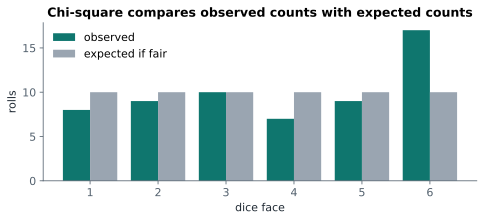

# Lesson 17: Chi-square tests for counts

**You'll learn:** observed vs expected counts, the χ² statistic, goodness-of-fit tests, tests of independence, expected frequencies, Cramér's V, Fisher's exact test.

▶ **Practise this lesson in the [sandbox](https://kishoremadanagopal.github.io/learning/statistics/#chi-square)**: run every example and check your exercise answers.

## Key terms

- **Chi-square (χ²) test:** a test comparing observed counts with the counts expected under H₀.
- **Observed count:** how many cases actually fell in a category.
- **Expected count:** how many would fall there if H₀ were true.
- **Goodness-of-fit test:** tests whether counts match a claimed distribution.
- **Test of independence:** tests whether two categorical variables are related.
- **Degrees of freedom (chi-square):** (rows − 1) × (columns − 1) for a two-way table.
- **Cramér's V:** the strength of association between two categorical variables, from 0 to 1.
- **Fisher's exact test:** an exact test for 2 × 2 tables with small counts.

t-tests compare averages. For **counts in categories** (how many customers in each city, how many buyers per page version), the tool is the **chi-square test** (χ², "kai-square"). It compares the counts you **observed** with the counts you'd **expect** if H₀ were true:

χ² = Σ (observed − expected)² / expected

Big gaps between observed and expected give a big χ² and a small p-value.



## Goodness of fit: does the data match a claim?

A dice is rolled 60 times. A fair dice should give about 10 of each face. Face 6 came up 17 times. Loaded, or luck?

```python
from scipy import stats

observed = [8, 9, 10, 7, 9, 17]
expected = [10] * 6
res = stats.chisquare(observed, expected)
print(f"chi-square = {res.statistic:.2f}, p = {res.pvalue:.3f}")
```

p is above 0.05: 17 sixes in 60 rolls isn't unusual enough to call the dice loaded. You'd need more rolls.

The expected counts don't have to be equal. A company claims its customers are 55% consumers, 30% business and 15% students. Does our data fit?

```python
import pandas as pd
from scipy import stats

customers = pd.read_csv("customers.csv")
observed = customers["segment"].value_counts().reindex(["Consumer", "Business", "Student"])
expected = [0.55 * len(customers), 0.30 * len(customers), 0.15 * len(customers)]
print(observed.tolist(), [round(e, 1) for e in expected])
print("p =", round(stats.chisquare(observed, expected).pvalue, 3))
```

The expected counts must add up to the same total as the observed ones.

## Test of independence: are two categories related?

Is a visitor's device related to whether they convert? Make a two-way table of counts and run `chi2_contingency`:

```python
import pandas as pd
from scipy import stats

ab = pd.read_csv("ab_test.csv")
table = pd.crosstab(ab["device"], ab["converted"])
print(table)
res = stats.chi2_contingency(table)
print(f"chi-square = {res.statistic:.1f}, p = {res.pvalue:.1e}, degrees of freedom = {res.dof}")
print("expected counts if unrelated:")
print(pd.DataFrame(res.expected_freq, index=table.index, columns=table.columns).round(1))
```

H₀ is "device and converting are independent". The expected table shows the counts you'd get if each device converted at the overall rate. The observed counts are far from it (p is tiny): device and converting are related, which matches the conversion rates you saw earlier.

The same test answers "does page version affect conversion?", the core of an A/B test with yes/no outcomes:

```python
import pandas as pd
from scipy import stats

ab = pd.read_csv("ab_test.csv")
table = pd.crosstab(ab["group"], ab["converted"])
print("p =", round(stats.chi2_contingency(table).pvalue, 4))
```

## How strong is the relationship?

As with t-tests, a p-value doesn't say how **strong** a relationship is. **Cramér's V** does, on a 0 (none) to 1 (perfect) scale:

```python
import numpy as np
import pandas as pd
from scipy import stats

customers = pd.read_csv("customers.csv")
table = pd.crosstab(customers["city"], customers["segment"])
chi2 = stats.chi2_contingency(table).statistic
n = table.to_numpy().sum()
v = np.sqrt(chi2 / (n * (min(table.shape) - 1)))
print("p =", round(stats.chi2_contingency(table).pvalue, 3), " Cramér's V =", round(v, 2))
```

## Rules of thumb

- Use **counts**, never percentages, in the table.
- Each **expected** count should be at least about 5. With smaller counts, combine categories, or use **Fisher's exact test** for 2 × 2 tables (`stats.fisher_exact`).
- Each row of data should be counted in exactly one cell (independent observations).

## Common mistakes

- Feeding percentages instead of counts into the test.
- Ignoring small expected counts (below about 5).
- Reading a significant result as a strong relationship. Check Cramér's V.

## Exercises

### 1. Fair coin?

A coin is flipped 200 times and lands heads 116 times. Run a chi-square goodness-of-fit test against a fair coin (expected 100 heads and 100 tails) and store the p-value in `p_coin`. Set `fair_looking` to `True` if p ≥ 0.05, otherwise `False`.

Starter code:

```python
from scipy import stats

```

### 2. Segment by city

Load `customers.csv`, build the two-way table of `city` by `segment` with `pd.crosstab`, and run `stats.chi2_contingency`. Store the p-value in `p_city_seg` and the degrees of freedom in `dof`.

Starter code:

```python
import pandas as pd
from scipy import stats

customers = pd.read_csv("customers.csv")

```

**In the sandbox:** exercises 33–34. Press **Check** to test your answer.

<details>
<summary>Hints</summary>

1. Observed `[116, 84]`, expected `[100, 100]`.
2. `res = stats.chi2_contingency(table)`, then `res.pvalue` and `res.dof`.

</details>

<details>
<summary>Answers</summary>

**1. Fair coin?**

```python
from scipy import stats

p_coin = stats.chisquare([116, 84], [100, 100]).pvalue
fair_looking = bool(p_coin >= 0.05)
print(round(p_coin, 4), fair_looking)
```

**2. Segment by city**

```python
import pandas as pd
from scipy import stats

customers = pd.read_csv("customers.csv")
table = pd.crosstab(customers["city"], customers["segment"])
res = stats.chi2_contingency(table)
p_city_seg = res.pvalue
dof = res.dof
print(round(p_city_seg, 3), dof)
```

</details>

## Quick quiz

1. Which question needs a chi-square test rather than a t-test?
   - A) Is product preference related to the customer's region?
   - B) Is the average order value different between two regions?
   - C) Did scores improve after training?

2. What goes into `chi2_contingency`?
   - A) Percentages
   - B) A table of counts
   - C) Raw text values

3. An expected count in your table is 2. What should you do?
   - A) Nothing
   - B) Combine categories, or use Fisher's exact test for a 2 × 2 table
   - C) Multiply the counts by 10

<details>
<summary>Quiz answers</summary>

1. **A) Is product preference related to the customer's region?**: Two categorical variables call for a chi-square test of independence.
2. **B) A table of counts**: Chi-square tests work on counts; percentages give wrong results.
3. **B) Combine categories, or use Fisher's exact test for a 2 × 2 table**: The chi-square approximation needs expected counts of about 5 or more.

</details>

---
Previous: [Lesson 16](16-errors-and-power.md) · Next: [Lesson 18: Comparing several groups with ANOVA](18-anova.md)
