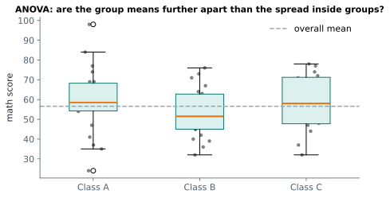

# Lesson 18: Comparing several groups with ANOVA

**You'll learn:** one-way ANOVA, between- and within-group variation, the F statistic, `f_oneway`, Tukey's HSD, Kruskal-Wallis, eta squared.

▶ **Practise this lesson in the [sandbox](https://kishoremadanagopal.github.io/learning/statistics/#anova)**: run every example and check your exercise answers.

## Key terms

- **ANOVA (analysis of variance):** a test of whether three or more group means are all equal.
- **Between-group variation:** how far the group means are from the overall mean.
- **Within-group variation:** how spread out values are inside each group.
- **F statistic:** the ratio of between-group to within-group variation.
- **Post-hoc test:** a follow-up test that finds which groups differ.
- **Tukey's HSD:** a post-hoc test comparing every pair while controlling false alarms.
- **Kruskal-Wallis test:** a rank-based alternative to one-way ANOVA.
- **Eta squared (η²):** the share of total variation explained by the groups.

With three or more groups, running a t-test for every pair inflates false alarms (the multiple-testing trap). **One-way ANOVA** (analysis of variance) tests all the groups at once:

- **H₀:** all the group means are equal.
- **H₁:** at least one group mean is different.

Despite its name, ANOVA compares **means**. It does it by comparing two kinds of variation:

- **between groups:** how far the group means are from the overall mean;
- **within groups:** how spread out the values are inside each group.

Their ratio is the **F statistic**. If the groups are further apart than the noise inside them would explain, F is large and p is small.



## One-way ANOVA with SciPy

Do the three classes differ in math?

```python
import pandas as pd
from scipy import stats

students = pd.read_csv("students.csv")
groups = [students.loc[students["class"] == c, "math"] for c in ["A", "B", "C"]]
print(students.groupby("class")["math"].agg(["mean", "std", "count"]).round(1))
res = stats.f_oneway(*groups)
print(f"F = {res.statistic:.2f}, p = {res.pvalue:.3f}")
```

`*groups` passes the list's items as separate arguments. p is well above 0.05: the differences between classes are small compared with the spread inside each class, so there's no evidence the classes differ. The picture agrees: the boxes overlap heavily.

## A case where groups do differ

House prices across the three neighbourhoods:

```python
import pandas as pd
from scipy import stats

housing = pd.read_csv("housing.csv")
print(housing.groupby("neighborhood")["price_k"].agg(["mean", "count"]).round(1))
groups = [g["price_k"] for _, g in housing.groupby("neighborhood")]
res = stats.f_oneway(*groups)
print(f"F = {res.statistic:.1f}, p = {res.pvalue:.2e}")
```

`2e-10`-style numbers are scientific notation: 2 × 10⁻¹⁰, a tiny p-value.

## Which groups differ? Tukey's test

ANOVA only says "at least one differs". **Tukey's HSD** (honestly significant difference) test then compares every pair while keeping the overall false-alarm rate at 5%:

```python
import pandas as pd
from scipy import stats

housing = pd.read_csv("housing.csv")
names = ["Central", "Hillside", "Riverside"]
groups = [housing.loc[housing["neighborhood"] == n, "price_k"] for n in names]
res = stats.tukey_hsd(*groups)
for i in range(3):
    for j in range(i + 1, 3):
        print(f"{names[i]} vs {names[j]}: difference {groups[i].mean() - groups[j].mean():6.1f}, p = {res.pvalue[i, j]:.4f}")
```

## Assumptions and the alternative

ANOVA assumes independent observations, roughly normal data within each group (or decent group sizes), and similar spreads. When the data is clearly skewed or has outliers, the **Kruskal-Wallis** test compares groups using ranks instead:

```python
import pandas as pd
from scipy import stats

sales = pd.read_csv("sales.csv")
sales["revenue"] = sales["units"] * sales["unit_price"]
groups = [g["revenue"] for _, g in sales.groupby("region")]
print("Kruskal-Wallis p:", round(stats.kruskal(*groups).pvalue, 3))
```

## Effect size: eta squared

**Eta squared** (η²) is the share of the total variation explained by the groups, from 0 to 1:

```python
import pandas as pd

housing = pd.read_csv("housing.csv")
overall = housing["price_k"].mean()
between = housing.groupby("neighborhood")["price_k"].apply(lambda g: len(g) * (g.mean() - overall) ** 2).sum()
total = ((housing["price_k"] - overall) ** 2).sum()
print("eta squared:", round(between / total, 2))
```

Neighbourhood alone explains this share of the variation in prices; the rest comes from size, age and everything else (that's what regression handles, in Part 5).

## Common mistakes

- Running every pairwise t-test instead of ANOVA plus a post-hoc test.
- Concluding all groups differ from a significant ANOVA.
- Using ANOVA on strongly skewed data with small groups. Use Kruskal-Wallis.

## Exercises

### 1. English by class

Load `students.csv` and run a one-way ANOVA on `english` scores across the three classes A, B and C. Store the F statistic in `f_stat` and the p-value in `p_eng`.

Starter code:

```python
import pandas as pd
from scipy import stats

students = pd.read_csv("students.csv")

```

### 2. Rain across cities

Load `weather.csv`. Daily rain is very skewed (most days are dry), so compare `rain_mm` across the three cities with the **Kruskal-Wallis** test. Store the p-value in `p_rain`.

Starter code:

```python
import pandas as pd
from scipy import stats

weather = pd.read_csv("weather.csv")

```

**In the sandbox:** exercises 35–36. Press **Check** to test your answer.

<details>
<summary>Hints</summary>

1. Build a list of three Series (one per class), then `stats.f_oneway(*groups)`.
2. `[g["rain_mm"] for _, g in weather.groupby("city")]` gives one Series per city.

</details>

<details>
<summary>Answers</summary>

**1. English by class**

```python
import pandas as pd
from scipy import stats

students = pd.read_csv("students.csv")
groups = [students.loc[students["class"] == c, "english"] for c in ["A", "B", "C"]]
res = stats.f_oneway(*groups)
f_stat, p_eng = res.statistic, res.pvalue
print(round(f_stat, 2), round(p_eng, 3))
```

**2. Rain across cities**

```python
import pandas as pd
from scipy import stats

weather = pd.read_csv("weather.csv")
groups = [g["rain_mm"] for _, g in weather.groupby("city")]
p_rain = stats.kruskal(*groups).pvalue
print(p_rain)
```

</details>

## Quick quiz

1. Why use ANOVA instead of three t-tests for three groups?
   - A) Several t-tests inflate the chance of a false alarm
   - B) t-tests can't compare means
   - C) ANOVA needs less data

2. ANOVA gives p = 0.001. What do you know?
   - A) All three groups differ from each other
   - B) At least one group mean differs; a follow-up test like Tukey's says which
   - C) The first group is the largest

3. When would you choose Kruskal-Wallis over ANOVA?
   - A) When there are only two groups
   - B) When the data is strongly skewed or has outliers
   - C) When the groups have equal means

<details>
<summary>Quiz answers</summary>

1. **A) Several t-tests inflate the chance of a false alarm**: One test at α = 0.05 keeps the overall false-alarm rate at 5%.
2. **B) At least one group mean differs; a follow-up test like Tukey's says which**: ANOVA is an overall test; post-hoc tests identify the pairs.
3. **B) When the data is strongly skewed or has outliers**: Kruskal-Wallis uses ranks, so it doesn't assume normal data.

</details>

---
Previous: [Lesson 17](17-chi-square.md) · Next: [Lesson 19: Correlation](19-correlation.md)
