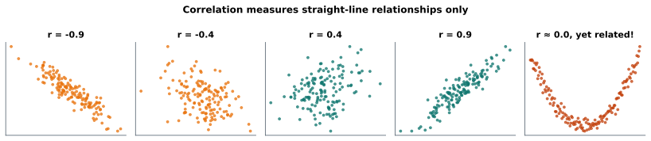

# Lesson 19: Correlation

**You'll learn:** scatter plots, Pearson's r, testing a correlation with `pearsonr`, Spearman's rank correlation, correlation matrices and heatmaps, confounders, correlation vs causation.

▶ **Practise this lesson in the [sandbox](https://kishoremadanagopal.github.io/learning/statistics/#correlation)**: run every example and check your exercise answers.

## Key terms

- **Scatter plot:** a chart with one dot per row, placed by two numerical variables.
- **Correlation:** a measure of how two variables move together.
- **Pearson's r:** the strength and direction of a straight-line relationship, from −1 to +1.
- **Spearman's ρ (rho):** a correlation computed on ranks, measuring any steadily rising or falling relationship.
- **Correlation matrix:** a table of the correlations between every pair of variables.
- **Heatmap:** a grid of coloured cells, often used to show a correlation matrix.
- **Confounder:** a third variable that influences both variables in a relationship.
- **Causation:** one variable directly changing another.

"Do students who study more score higher?" is a question about two numerical variables moving together. Start with a picture: the **scatter plot**.

```python
import pandas as pd
import matplotlib.pyplot as plt

students = pd.read_csv("students.csv")
fig, ax = plt.subplots(figsize=(6, 3.8))
ax.scatter(students["hours_studied"], students["math"], color="teal")
ax.set_xlabel("hours studied per week")
ax.set_ylabel("math score")
ax.set_title("Study time and math scores")
plt.show()
```

The points drift upwards: more hours tend to go with higher scores. A **correlation coefficient** puts a number on that.

## Pearson's r

**Pearson's correlation r** measures how closely points follow a **straight line**:

| r | Meaning |
|---|---|
| +1 | a perfect upward line |
| about +0.7 | a strong upward trend |
| about +0.3 | a weak upward trend |
| 0 | no straight-line relationship |
| negative | a downward trend (as one rises, the other falls) |



The last panel is the classic warning: x and y are perfectly related by a curve, but r is about 0, because r only measures **straight-line** relationships. Always look at the scatter plot.

```python
import pandas as pd

students = pd.read_csv("students.csv")
print("hours vs math:     ", round(students["hours_studied"].corr(students["math"]), 2))
print("attendance vs math:", round(students["attendance_pct"].corr(students["math"]), 2))
print("attendance vs english:", round(students["attendance_pct"].corr(students["english"]), 2))
```

## Is the correlation real? Testing r

A correlation from a small sample could be luck. `stats.pearsonr` gives r with a p-value (H₀: the true correlation is 0) and a confidence interval:

```python
import pandas as pd
from scipy import stats

students = pd.read_csv("students.csv")
res = stats.pearsonr(students["hours_studied"], students["math"])
ci = res.confidence_interval(0.95)
print(f"r = {res.statistic:.2f}, p = {res.pvalue:.1e}, 95% CI {ci.low:.2f} to {ci.high:.2f}")
```

## Spearman's rank correlation

**Spearman's ρ** (rho) correlates the **ranks** instead of the values. It measures any steadily increasing or decreasing relationship (not just straight lines), and outliers can't dominate it:

```python
import numpy as np
from scipy import stats

x = np.arange(1, 11)
y = x ** 3                    # always rising, but curved
y_outlier = x.astype(float)
y_outlier[-1] = 100           # a straight line plus one wild value

print("curve:   Pearson", round(stats.pearsonr(x, y).statistic, 3), " Spearman", round(stats.spearmanr(x, y).statistic, 3))
print("outlier: Pearson", round(stats.pearsonr(x, y_outlier).statistic, 3), " Spearman", round(stats.spearmanr(x, y_outlier).statistic, 3))
```

Use Spearman for ranks, ordinal data (ratings 1–5), skewed data or data with outliers.

## Correlation matrices and heatmaps

`df.corr()` correlates every pair of columns at once. A **heatmap** makes the pattern easy to scan:

```python
import pandas as pd
import matplotlib.pyplot as plt

students = pd.read_csv("students.csv")
cols = ["hours_studied", "attendance_pct", "math", "science", "english"]
corr = students[cols].corr()
print(corr.round(2))

fig, ax = plt.subplots(figsize=(5.5, 4.5))
im = ax.imshow(corr, cmap="RdBu", vmin=-1, vmax=1)
ax.set_xticks(range(len(cols)), cols, rotation=45, ha="right")
ax.set_yticks(range(len(cols)), cols)
for i in range(len(cols)):
    for j in range(len(cols)):
        ax.text(j, i, f"{corr.iloc[i, j]:.2f}", ha="center", va="center", fontsize=9)
fig.colorbar(im)
ax.set_title("Correlation matrix")
plt.show()
```

## Correlation is not causation

Ice-cream sales and drownings are correlated, because both rise in hot weather. A correlation can come from:

- **causation:** studying causes higher scores (probably partly true here);
- **reverse causation:** the arrow points the other way (students who are already good may enjoy studying more);
- a **confounder:** a third variable driving both (hot weather; or a student's motivation, which drives both hours and scores);
- **coincidence:** with enough variables, some correlate by chance.

To claim causation you need an **experiment** (randomly assign who gets the treatment, as in an A/B test) or careful methods that control for confounders. Regression, next, is the first step.

## Common mistakes

- Computing r without looking at the scatter plot. Curves and outliers fool it.
- Saying a correlation proves cause and effect.
- Reading r = 0.3 as "30% related". Square it for the share of variation explained (here 9%).

## Exercises

### 1. Strongest link

Load `students.csv`. Among `hours_studied`, `attendance_pct`, `science` and `english`, find the variable with the **strongest** correlation with `math` (largest Pearson r). Store its name in `strongest` and its r in `r_value`.

Starter code:

```python
import pandas as pd

students = pd.read_csv("students.csv")

```

### 2. Pearson vs Spearman on houses

Load `housing.csv`. Store Pearson's r between `distance_km` and `price_k` in `pearson_r`, its p-value in `pearson_p`, and Spearman's ρ between the same columns in `spearman_rho`.

Starter code:

```python
import pandas as pd
from scipy import stats

housing = pd.read_csv("housing.csv")

```

**In the sandbox:** exercises 37–38. Press **Check** to test your answer.

<details>
<summary>Hints</summary>

1. `students[cols].corrwith(students["math"])` gives one r per column; `idxmax()` finds the biggest.
2. `stats.pearsonr(x, y)` returns `.statistic` and `.pvalue`; `stats.spearmanr(x, y).statistic` gives ρ.

</details>

<details>
<summary>Answers</summary>

**1. Strongest link**

```python
import pandas as pd

students = pd.read_csv("students.csv")
cols = ["hours_studied", "attendance_pct", "science", "english"]
r = students[cols].corrwith(students["math"])
strongest = r.abs().idxmax()
r_value = r[strongest]
print(r.round(2))
print(strongest, round(r_value, 2))
```

**2. Pearson vs Spearman on houses**

```python
import pandas as pd
from scipy import stats

housing = pd.read_csv("housing.csv")
res = stats.pearsonr(housing["distance_km"], housing["price_k"])
pearson_r, pearson_p = res.statistic, res.pvalue
spearman_rho = stats.spearmanr(housing["distance_km"], housing["price_k"]).statistic
print(round(pearson_r, 3), pearson_p, round(spearman_rho, 3))
```

</details>

## Quick quiz

1. r = -0.8 between price and sales means:
   - A) A strong tendency for sales to fall as price rises
   - B) Price has no effect on sales
   - C) 80% of sales are caused by price

2. Two variables have r ≈ 0. Can they still be strongly related?
   - A) Yes, by a curve, which r doesn't measure
   - B) No, r ≈ 0 means unrelated
   - C) Only if the sample is small

3. Towns with more firefighters have more fire damage. The best explanation is:
   - A) Firefighters cause damage
   - B) A confounder: bigger fires bring both more firefighters and more damage
   - C) Coincidence

<details>
<summary>Quiz answers</summary>

1. **A) A strong tendency for sales to fall as price rises**: The sign gives the direction and the size gives the strength of the straight-line relationship.
2. **A) Yes, by a curve, which r doesn't measure**: r only measures straight-line relationships. Look at the scatter plot.
3. **B) A confounder: bigger fires bring both more firefighters and more damage**: A third variable (fire size) drives both. Correlation alone can't show cause.

</details>

---
Previous: [Lesson 18](18-anova.md) · Next: [Lesson 20: Simple linear regression](20-linear-regression.md)
