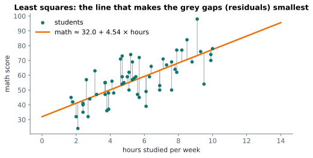

# Lesson 20: Simple linear regression

**You'll learn:** the regression line, least squares, slope and intercept, `stats.linregress`, prediction and extrapolation, R², residuals and residual plots, testing the slope, regression to the mean.

▶ **Practise this lesson in the [sandbox](https://kishoremadanagopal.github.io/learning/statistics/#linear-regression)**: run every example and check your exercise answers.

## Key terms

- **Linear regression:** fitting a straight line to predict an outcome from a predictor.
- **Outcome (dependent variable):** the variable being predicted, y.
- **Predictor (independent variable):** the variable used to predict, x.
- **Slope:** the average change in y for a one-unit increase in x.
- **Intercept:** the predicted y when x is 0.
- **Residual:** actual y minus predicted y.
- **Least squares:** choosing the line that minimises the sum of squared residuals.
- **R² (coefficient of determination):** the share of the variation in y explained by the model.
- **Extrapolation:** predicting outside the range of the data.
- **Regression to the mean:** extreme results tend to be followed by less extreme ones.

Correlation says "these move together". **Regression** goes further: it finds the line that best **predicts** one variable (the **outcome**, y) from another (the **predictor**, x):

y ≈ intercept + slope × x

- The **slope** is how much y changes, on average, when x goes up by 1.
- The **intercept** is the predicted y when x is 0.

## Least squares

Which line is "best"? For each point, the vertical gap between the actual y and the line's prediction is the **residual**. **Least squares** picks the line that makes the **sum of squared residuals** as small as possible.



`stats.linregress` fits it:

```python
import pandas as pd
from scipy import stats

students = pd.read_csv("students.csv")
fit = stats.linregress(students["hours_studied"], students["math"])
print(f"math ≈ {fit.intercept:.1f} + {fit.slope:.2f} × hours")
print(f"r = {fit.rvalue:.2f}, R² = {fit.rvalue ** 2:.2f}, p-value for the slope = {fit.pvalue:.1e}")
```

**Read it in words:** each extra hour of study per week goes with about 4.5 more points in math, on average. A student who studies 0 hours is predicted to score about 32 (but no student studied 0 hours, so don't lean on that number).

## Predicting

Plug a new x into the equation:

```python
import pandas as pd
from scipy import stats

students = pd.read_csv("students.csv")
fit = stats.linregress(students["hours_studied"], students["math"])
for hours in (3, 6, 9):
    print(f"{hours} hours → predicted math {fit.intercept + fit.slope * hours:.1f}")
```

Only predict **within the range of the data** (here, about 1 to 10 hours). Predicting for 30 hours a week is **extrapolation**: the line might give a score over 100, which is impossible. Straight lines don't go on forever in real life.

## R²: how much does the line explain?

**R²** (the coefficient of determination) is the share of the variation in y that the line explains, from 0 to 1. With one predictor, it's simply r². An R² of 0.5 means study hours explain about half of the differences in math scores; the other half comes from everything else (talent, sleep, luck…).

```python
import numpy as np
import pandas as pd
from scipy import stats

students = pd.read_csv("students.csv")
x, y = students["hours_studied"], students["math"]
fit = stats.linregress(x, y)
predicted = fit.intercept + fit.slope * x
residuals = y - predicted

ss_total = ((y - y.mean()) ** 2).sum()      # total variation around the mean
ss_resid = (residuals ** 2).sum()            # variation the line doesn't explain
print("R² by hand:", round(1 - ss_resid / ss_total, 3), " r²:", round(fit.rvalue ** 2, 3))
print("typical prediction error (residual std):", round(np.std(residuals, ddof=2), 1), "points")
```

## Checking the residuals

A line is only a good summary if the residuals look like **random noise**: no pattern, roughly the same spread everywhere. A **residual plot** (residuals against predictions) shows problems that R² hides:

```python
import pandas as pd
import matplotlib.pyplot as plt
from scipy import stats

students = pd.read_csv("students.csv")
x, y = students["hours_studied"], students["math"]
fit = stats.linregress(x, y)
predicted = fit.intercept + fit.slope * x

fig, ax = plt.subplots(figsize=(6, 3))
ax.scatter(predicted, y - predicted, color="teal")
ax.axhline(0, color="darkorange")
ax.set_xlabel("predicted math")
ax.set_ylabel("residual")
ax.set_title("Residuals: no pattern is good news")
plt.show()
```

| Residual plot shows | Problem | Try |
|---|---|---|
| a curve | the relationship isn't a straight line | add x², or transform x or y |
| a funnel (spread grows) | the error isn't constant | log-transform y |
| a few far-off points | outliers with big influence | investigate them |

## Is the slope real?

`linregress` also tests H₀: slope = 0 (no relationship). `fit.pvalue` is that test's p-value and `fit.stderr` the slope's standard error, so a 95% confidence interval for the slope is:

```python
import pandas as pd
from scipy import stats

students = pd.read_csv("students.csv")
fit = stats.linregress(students["hours_studied"], students["math"])
t = stats.t.ppf(0.975, len(students) - 2)
print(f"slope {fit.slope:.2f}, 95% CI {fit.slope - t * fit.stderr:.2f} to {fit.slope + t * fit.stderr:.2f}")
```

The whole interval is well above 0, so the relationship is very unlikely to be luck. The degrees of freedom are n − 2, because the line used up two numbers (slope and intercept).

## Regression to the mean

A side effect of imperfect correlation: extreme values tend to be followed by less extreme ones. Students with the very best scores on one test usually score a bit lower on the next, not because they got worse, but because some of their first score was luck. Keep this in mind before crediting a "fix" applied only to the worst performers.

## Common mistakes

- Interpreting the intercept when x = 0 is impossible or far from the data.
- Extrapolating far beyond the data.
- Trusting R² without looking at the residual plot.

## Exercises

### 1. Size and price

Load `housing.csv` and fit `price_k` against `area_sqm` with `stats.linregress`. Store the slope in `slope`, R² in `r_squared`, and the predicted price of a **100 m²** home in `pred_100`.

Starter code:

```python
import pandas as pd
from scipy import stats

housing = pd.read_csv("housing.csv")

```

### 2. Residuals by hand

Using the same fit (`price_k` on `area_sqm`), add a column `residual` to `housing` (actual price minus predicted price). Store the `home_id` of the home the line **underestimates** the most (the largest positive residual) in `underpriced_id`.

Starter code:

```python
import pandas as pd
from scipy import stats

housing = pd.read_csv("housing.csv")

```

**In the sandbox:** exercises 39–40. Press **Check** to test your answer.

<details>
<summary>Hints</summary>

1. x is `area_sqm`, y is `price_k`. R² is `fit.rvalue ** 2`.
2. Residual = actual − (intercept + slope × area). The biggest positive residual is the home that costs much more than its size predicts.

</details>

<details>
<summary>Answers</summary>

**1. Size and price**

```python
import pandas as pd
from scipy import stats

housing = pd.read_csv("housing.csv")
fit = stats.linregress(housing["area_sqm"], housing["price_k"])
slope = fit.slope
r_squared = fit.rvalue ** 2
pred_100 = fit.intercept + fit.slope * 100
print(round(slope, 2), round(r_squared, 3), round(pred_100, 1))
```

**2. Residuals by hand**

```python
import pandas as pd
from scipy import stats

housing = pd.read_csv("housing.csv")
fit = stats.linregress(housing["area_sqm"], housing["price_k"])
housing["residual"] = housing["price_k"] - (fit.intercept + fit.slope * housing["area_sqm"])
underpriced_id = housing.loc[housing["residual"].idxmax(), "home_id"]
print(underpriced_id)
```

</details>

## Quick quiz

1. A regression gives sales ≈ 200 + 15 × ads. What does 15 mean?
   - A) Each extra ad goes with about 15 more sales, on average
   - B) 15% of sales come from ads
   - C) Sales are 15 when there are no ads

2. R² = 0.36 means:
   - A) The correlation is 0.36
   - B) The line explains about 36% of the variation in y
   - C) 36% of predictions are correct

3. Why is predicting far outside the data's range risky?
   - A) The formula stops working
   - B) The straight-line pattern may not continue there (extrapolation)
   - C) R² becomes negative

<details>
<summary>Quiz answers</summary>

1. **A) Each extra ad goes with about 15 more sales, on average**: The slope is the average change in y per one-unit increase in x.
2. **B) The line explains about 36% of the variation in y**: R² is the share of variation explained; here r would be ±0.6.
3. **B) The straight-line pattern may not continue there (extrapolation)**: You have no evidence about how the relationship behaves beyond the data.

</details>

---
Previous: [Lesson 19](19-correlation.md) · Next: [Lesson 21: Multiple regression](21-multiple-regression.md)
