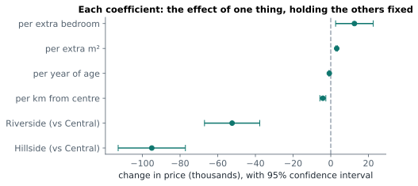
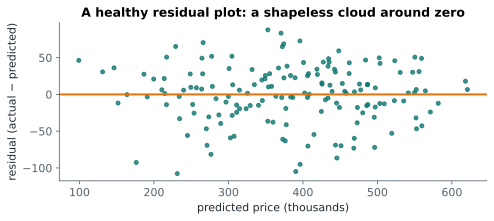

# Lesson 21: Multiple regression

**You'll learn:** multiple regression, statsmodels formulas, coefficients "holding others fixed", p-values and intervals for coefficients, dummy variables with `C()`, adjusted R², prediction, residual checks, multicollinearity and VIF.

▶ **Practise this lesson in the [sandbox](https://kishoremadanagopal.github.io/learning/statistics/#multiple-regression)**: run every example and check your exercise answers.

## Key terms

- **Multiple regression:** regression with several predictors.
- **Coefficient:** the estimated effect of one predictor, holding the others fixed.
- **OLS (ordinary least squares):** the standard way of fitting a linear regression.
- **statsmodels:** a Python library for statistical models and tests.
- **Formula:** text like `"price ~ area + C(neighborhood)"` describing a model.
- **Dummy variable:** a 0/1 column representing one category.
- **Reference category:** the category the dummy variables are compared with.
- **Adjusted R²:** R² penalised for the number of predictors.
- **Multicollinearity:** strong correlation between predictors.
- **VIF (variance inflation factor):** a measure of how much multicollinearity inflates a coefficient's uncertainty.

House prices depend on size, but also on age, location and the number of bedrooms. **Multiple regression** fits all of them at once:

price ≈ b₀ + b₁ × area + b₂ × bedrooms + b₃ × age + …

Each **coefficient** (b₁, b₂…) is the effect of one variable **holding the others fixed**. That's the big advantage over looking at one variable at a time: it separates effects that come tangled together.

## Fitting with statsmodels

**statsmodels** is Python's main library for statistical models. Its formula interface reads like the equation: `"outcome ~ predictor1 + predictor2"`:

```python
import pandas as pd
import statsmodels.formula.api as smf

housing = pd.read_csv("housing.csv")
model = smf.ols("price_k ~ area_sqm + bedrooms + age_years + distance_km", data=housing).fit()
print(model.params.round(2))
print("R²:", round(model.rsquared, 3))
```

OLS stands for **ordinary least squares**, the same "smallest squared residuals" idea as before.

**Reading the coefficients:**

- `area_sqm` ≈ 3: each extra square metre adds about 3 (thousand) to the price, for homes with the same bedrooms, age and distance;
- `age_years` is negative: older homes are cheaper, other things equal;
- `distance_km` is negative: each km from the centre lowers the price.

## The summary table

`model.summary()` prints everything: coefficients, their standard errors, p-values and confidence intervals. The middle table is the important part:

```python
import pandas as pd
import statsmodels.formula.api as smf

housing = pd.read_csv("housing.csv")
model = smf.ols("price_k ~ area_sqm + bedrooms + age_years + distance_km", data=housing).fit()
table = pd.DataFrame({"coef": model.params, "p-value": model.pvalues}).join(model.conf_int().rename(columns={0: "CI low", 1: "CI high"}))
print(table.round(3))
```

Each p-value tests H₀: "this coefficient is 0, once the others are included". A predictor can look important on its own but become non-significant in a multiple regression, because another variable was already carrying its information.

## Categories as predictors: dummy variables

Neighbourhood is a category. Wrap it in `C(...)` and statsmodels creates **dummy variables** (0/1 columns), one per category except a **reference** category that the others are compared with:

```python
import pandas as pd
import statsmodels.formula.api as smf

housing = pd.read_csv("housing.csv")
model = smf.ols("price_k ~ area_sqm + bedrooms + age_years + distance_km + C(neighborhood)", data=housing).fit()
print(model.params.round(1))
print("R²:", round(model.rsquared, 3), " adjusted R²:", round(model.rsquared_adj, 3))
```

Central is the reference (it's first alphabetically). `C(neighborhood)[T.Hillside]` ≈ −95 means: a Hillside home costs about 95 thousand **less than a Central home of the same size, age, bedrooms and distance**.



A coefficient plot like this shows every effect with its uncertainty: intervals that cross the dashed zero line are effects you can't be sure of.

## Comparing models: adjusted R²

Adding any variable, even pure noise, never lowers R². **Adjusted R²** penalises extra variables, so it only rises when a variable genuinely helps:

```python
import numpy as np
import pandas as pd
import statsmodels.formula.api as smf

housing = pd.read_csv("housing.csv")
housing["noise"] = np.random.default_rng(0).normal(size=len(housing))
for formula in ["price_k ~ area_sqm",
                "price_k ~ area_sqm + C(neighborhood)",
                "price_k ~ area_sqm + C(neighborhood) + noise"]:
    m = smf.ols(formula, data=housing).fit()
    print(f"{formula:45} R² {m.rsquared:.3f}  adjusted {m.rsquared_adj:.3f}")
```

## Predicting

```python
import pandas as pd
import statsmodels.formula.api as smf

housing = pd.read_csv("housing.csv")
model = smf.ols("price_k ~ area_sqm + bedrooms + age_years + distance_km + C(neighborhood)", data=housing).fit()
new_homes = pd.DataFrame({
    "area_sqm": [80, 120], "bedrooms": [2, 4], "age_years": [10, 40],
    "distance_km": [2.0, 8.0], "neighborhood": ["Central", "Hillside"],
})
print(model.predict(new_homes).round(1))
```

## Checking the model

The same checks as simple regression apply: a residual plot should look like a shapeless cloud.



## Multicollinearity

When predictors are strongly correlated with each other (area and bedrooms here: bigger homes have more bedrooms), the model struggles to separate their effects: coefficients get wide confidence intervals and can even flip sign. Check the correlation between predictors, or the **variance inflation factor** (VIF; above about 5 to 10 is a warning):

```python
import pandas as pd
from statsmodels.stats.outliers_influence import variance_inflation_factor
import statsmodels.api as sm

housing = pd.read_csv("housing.csv")
X = sm.add_constant(housing[["area_sqm", "bedrooms", "age_years", "distance_km"]])
print("area vs bedrooms r:", round(housing["area_sqm"].corr(housing["bedrooms"]), 2))
for i, col in enumerate(X.columns[1:], start=1):
    print(f"VIF {col}: {variance_inflation_factor(X.values, i):.1f}")
```

## Regression and machine learning

This is the same linear regression that machine learning libraries like scikit-learn fit. Statistics focuses on **understanding** the coefficients (effects, intervals, p-values); machine learning focuses on **predicting** new cases well and checks that on held-out data. The next course in the core path, machine learning, starts from here.

## Common mistakes

- Reading a coefficient as the effect "on its own" rather than "holding the others fixed".
- Forgetting `C()` around a numeric code that's really a category (like a store number).
- Keeping two near-duplicate predictors and trusting their individual coefficients.

## Exercises

### 1. Model the price

Load `housing.csv` and fit `price_k ~ area_sqm + age_years + distance_km + C(neighborhood)` with `smf.ols`. Store the fitted model in `model`, its adjusted R² in `adj_r2`, and the coefficient for `age_years` in `age_coef`.

Starter code:

```python
import pandas as pd
import statsmodels.formula.api as smf

housing = pd.read_csv("housing.csv")

```

### 2. Predict a home

Using the model `price_k ~ area_sqm + bedrooms + age_years + distance_km + C(neighborhood)`, store the predicted price of a **95 m², 3-bedroom, 20-year-old Riverside home 5 km from the centre** in `predicted` (a single number).

Starter code:

```python
import pandas as pd
import statsmodels.formula.api as smf

housing = pd.read_csv("housing.csv")

```

**In the sandbox:** exercises 41–42. Press **Check** to test your answer.

<details>
<summary>Hints</summary>

1. `smf.ols("price_k ~ ...", data=housing).fit()`, then `.rsquared_adj` and `.params["age_years"]`.
2. Build a one-row DataFrame with every predictor column, then `model.predict(df).iloc[0]`.

</details>

<details>
<summary>Answers</summary>

**1. Model the price**

```python
import pandas as pd
import statsmodels.formula.api as smf

housing = pd.read_csv("housing.csv")
model = smf.ols("price_k ~ area_sqm + age_years + distance_km + C(neighborhood)", data=housing).fit()
adj_r2 = model.rsquared_adj
age_coef = model.params["age_years"]
print(round(adj_r2, 3), round(age_coef, 2))
```

**2. Predict a home**

```python
import pandas as pd
import statsmodels.formula.api as smf

housing = pd.read_csv("housing.csv")
model = smf.ols("price_k ~ area_sqm + bedrooms + age_years + distance_km + C(neighborhood)", data=housing).fit()
home = pd.DataFrame({"area_sqm": [95], "bedrooms": [3], "age_years": [20],
                     "distance_km": [5.0], "neighborhood": ["Riverside"]})
predicted = model.predict(home).iloc[0]
print(round(predicted, 1))
```

</details>

## Quick quiz

1. In a multiple regression, the coefficient for age is -0.9. What does it mean?
   - A) Each extra year of age lowers the predicted price by about 0.9, holding the other variables fixed
   - B) Age explains 90% of the price
   - C) Older homes are always cheaper

2. Why prefer adjusted R² when comparing models with different numbers of predictors?
   - A) It's always higher
   - B) Plain R² rises with any added variable, even noise; adjusted R² penalises extras
   - C) It's easier to calculate

3. What's multicollinearity?
   - A) Too many rows
   - B) Predictors that are strongly correlated with each other, making their separate effects hard to estimate
   - C) Residuals that form a curve

<details>
<summary>Quiz answers</summary>

1. **A) Each extra year of age lowers the predicted price by about 0.9, holding the other variables fixed**: Coefficients are effects with the other predictors held constant.
2. **B) Plain R² rises with any added variable, even noise; adjusted R² penalises extras**: Adjusted R² only increases when a variable improves the model more than chance would.
3. **B) Predictors that are strongly correlated with each other, making their separate effects hard to estimate**: Correlated predictors give unstable coefficients with wide intervals.

</details>

---
Previous: [Lesson 20](20-linear-regression.md) · Next: [Lesson 22: A/B testing](22-ab-testing.md)
