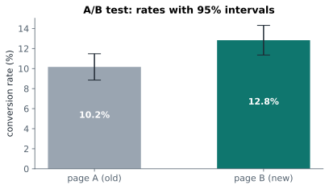

# Lesson 22: A/B testing

**You'll learn:** randomised experiments, pre-registration, sample size for proportions, sample ratio mismatch, the two-proportion z-test, absolute vs relative lift, guardrail metrics, segments, peeking.

▶ **Practise this lesson in the [sandbox](https://kishoremadanagopal.github.io/learning/statistics/#ab-testing)**: run every example and check your exercise answers.

## Key terms

- **A/B test:** a randomised experiment comparing a control (A) with a new version (B).
- **Control / treatment:** the current version, and the version being tested.
- **Randomisation:** assigning users to groups by chance, so the groups differ only in the change.
- **Primary metric:** the one measure the test is designed to judge.
- **Guardrail metric:** a measure that mustn't get worse, like revenue or page speed.
- **Minimum detectable effect (MDE):** the smallest lift the test is sized to detect.
- **Sample ratio mismatch (SRM):** groups that differ in size more than chance allows, usually a sign of a bug.
- **Two-proportion z-test:** a test comparing two rates, like conversion rates.
- **Absolute lift:** the difference between rates, in percentage points.
- **Relative lift:** the difference divided by the control rate, as a percentage.
- **Peeking:** checking results repeatedly and stopping when they look significant.

An **A/B test** (a randomised controlled experiment) is how companies decide whether a change works: show the current version (**A**, the control) to some users and the new version (**B**, the treatment) to others, **at random**, then compare. Randomisation is what makes it powerful: because chance alone decides who sees B, any difference beyond chance is **caused** by the change.

`ab_test.csv` is a finished experiment: 4,000 visitors, each randomly shown page A or page B.

## 1. Design before you start

Decide these **before** collecting data, and write them down:

| Decision | Our test |
|---|---|
| **Primary metric** | conversion rate (did the visitor buy?) |
| **Hypotheses** | H₀: same conversion rate; H₁: rates differ (two-sided) |
| **α and power** | 0.05 and 80% |
| **Minimum detectable effect** | +3 percentage points (from about 10% to 13%) |
| **Sample size** | worked out below |
| **Guardrail metrics** | revenue per visitor shouldn't drop |

statsmodels works out the sample size for two proportions:

```python
from statsmodels.stats.power import NormalIndPower
from statsmodels.stats.proportion import proportion_effectsize

effect = proportion_effectsize(0.13, 0.10)        # 10% → 13%
n = NormalIndPower().solve_power(effect_size=effect, alpha=0.05, power=0.8)
print(f"about {n:.0f} visitors per group")
```

We have about 2,000 per group, a little more than needed. (Detecting a smaller lift, say +2 points, would need about 3,800 per group: small effects are expensive.)

## 2. Check the experiment ran fairly

Before looking at results, check that randomisation worked: the groups should be similar in size and in their mix of visitors. A **sample ratio mismatch** (say 60/40 instead of 50/50) usually means a bug, and invalidates the test.

```python
import pandas as pd
from scipy import stats

ab = pd.read_csv("ab_test.csv")
counts = ab["group"].value_counts()
print(counts)
print("split test p =", round(stats.chisquare(counts).pvalue, 3))
print(pd.crosstab(ab["group"], ab["device"], normalize="index").round(3))
```

The split is close to 50/50 (p well above 0.05) and both groups have the same device mix. Good.

## 3. Test the primary metric

Conversion is yes/no, so compare two **proportions** with a **z-test** (for large samples it gives the same answer as the chi-square test from Part 4):

```python
import pandas as pd
from statsmodels.stats.proportion import proportions_ztest

ab = pd.read_csv("ab_test.csv")
summary = ab.groupby("group")["converted"].agg(["sum", "count", "mean"])
print(summary)
z, p = proportions_ztest(summary["sum"], summary["count"])
print(f"z = {z:.2f}, p = {p:.4f}")
```

## 4. Estimate the lift with a confidence interval

The p-value says B's advantage is unlikely to be luck. The business needs to know **how big** it is:

```python
import numpy as np
import pandas as pd

ab = pd.read_csv("ab_test.csv")
g = ab.groupby("group")["converted"].agg(["mean", "count"])
pa, na = g.loc["A", "mean"], g.loc["A", "count"]
pb, nb = g.loc["B", "mean"], g.loc["B", "count"]

diff = pb - pa
se = np.sqrt(pa * (1 - pa) / na + pb * (1 - pb) / nb)
print(f"A {pa:.2%}  B {pb:.2%}")
print(f"absolute lift: {diff:+.2%} (95% CI {diff - 1.96 * se:+.2%} to {diff + 1.96 * se:+.2%})")
print(f"relative lift: {diff / pa:+.0%}")
```



**Absolute** lift is in percentage points (10.2% → 12.8% is +2.7 points); **relative** lift is the percentage change (+26%). Say which one you mean; mixing them up is a classic reporting error.

## 5. Check the guardrail: revenue per visitor

More buyers is good, but not if each buyer spends less. Revenue per visitor (including the zeros for non-buyers) is very skewed, so use Welch's t-test (fine with 2,000 per group thanks to the CLT) and a bootstrap interval as a cross-check:

```python
import numpy as np
import pandas as pd
from scipy import stats

ab = pd.read_csv("ab_test.csv")
ra = ab.loc[ab["group"] == "A", "revenue"].to_numpy()
rb = ab.loc[ab["group"] == "B", "revenue"].to_numpy()
print(f"revenue per visitor: A {ra.mean():.2f}, B {rb.mean():.2f}")
print("Welch p =", round(stats.ttest_ind(rb, ra, equal_var=False).pvalue, 4))

rng = np.random.default_rng(0)
diffs = [rng.choice(rb, len(rb)).mean() - rng.choice(ra, len(ra)).mean() for _ in range(3000)]
print("bootstrap 95% CI for B - A:", np.percentile(diffs, [2.5, 97.5]).round(2))
```

## 6. Segments: interesting, but careful

It's tempting to slice the results (mobile vs desktop, new vs returning…). Slices have smaller samples and multiply the number of tests, so treat them as **ideas to test next**, not conclusions, unless they were planned in advance:

```python
import pandas as pd
from statsmodels.stats.proportion import proportions_ztest

ab = pd.read_csv("ab_test.csv")
for device, d in ab.groupby("device"):
    s = d.groupby("group")["converted"].agg(["sum", "count", "mean"])
    _, p = proportions_ztest(s["sum"], s["count"])
    print(f"{device:8} A {s.loc['A', 'mean']:.1%}  B {s.loc['B', 'mean']:.1%}  p = {p:.3f}")
```

## Classic A/B testing mistakes

| Mistake | Why it's a problem | Do instead |
|---|---|---|
| **Peeking**: stopping as soon as p < 0.05 | checking repeatedly inflates false alarms far above 5% | fix the sample size in advance (or use sequential methods built for peeking) |
| testing many metrics and reporting the winner | multiple testing | one primary metric, decided in advance |
| too short a test | misses weekly cycles and the novelty effect | run whole weeks |
| ignoring practical significance | a "significant" +0.1% may not pay for the change | compare the lift's interval with what matters to the business |
| believing p = 0.06 means "no effect" | it means not enough evidence | report the interval; consider more data |

## Writing the result

> **Launch page B.** In a 4,000-visitor randomised test, B converted 12.8% of visitors against 10.2% for A: an absolute lift of 2.7 percentage points (95% CI 0.7 to 4.6; p = 0.008). Revenue per visitor also rose. The split and device mix were balanced. Segment results (mobile vs desktop) are suggestive only and weren't pre-planned.

## Common mistakes

- Peeking and stopping early.
- Mixing up percentage points and percent.
- Treating unplanned segment results as conclusions.

## Exercises

### 1. Is the split fair?

Load `ab_test.csv`. Test whether the A/B split is consistent with 50/50 using `stats.chisquare` on the group counts, and store the p-value in `p_split`. Set `srm` (sample ratio mismatch) to `True` if p < 0.01, otherwise `False`.

Starter code:

```python
import pandas as pd
from scipy import stats

ab = pd.read_csv("ab_test.csv")

```

### 2. Desktop test

Load `ab_test.csv` and keep **desktop** visitors. Run `proportions_ztest` comparing conversions in A and B, and store the p-value in `p_desktop`. Store B's conversion rate minus A's in `lift_desktop`.

Starter code:

```python
import pandas as pd
from statsmodels.stats.proportion import proportions_ztest

ab = pd.read_csv("ab_test.csv")

```

**In the sandbox:** exercises 43–44. Press **Check** to test your answer.

<details>
<summary>Hints</summary>

1. `stats.chisquare(counts)` with no expected counts assumes equal shares.
2. Filter to desktop, group by `group` and aggregate `sum` and `count` of `converted`, then pass those two columns to `proportions_ztest`.

</details>

<details>
<summary>Answers</summary>

**1. Is the split fair?**

```python
import pandas as pd
from scipy import stats

ab = pd.read_csv("ab_test.csv")
counts = ab["group"].value_counts()
p_split = stats.chisquare(counts).pvalue
srm = bool(p_split < 0.01)
print(counts.to_dict(), round(p_split, 3), srm)
```

**2. Desktop test**

```python
import pandas as pd
from statsmodels.stats.proportion import proportions_ztest

ab = pd.read_csv("ab_test.csv")
desktop = ab[ab["device"] == "desktop"]
s = desktop.groupby("group")["converted"].agg(["sum", "count", "mean"])
_, p_desktop = proportions_ztest(s["sum"], s["count"])
lift_desktop = s.loc["B", "mean"] - s.loc["A", "mean"]
print(round(lift_desktop, 4), round(p_desktop, 4))
```

</details>

## Quick quiz

1. Why does randomly assigning visitors to A or B let you conclude B caused the difference?
   - A) Randomisation balances everything else between the groups, so only the page differs systematically
   - B) Random numbers are always accurate
   - C) It makes the sample bigger

2. A test is checked every morning and stopped the first day p < 0.05. What's wrong?
   - A) Nothing
   - B) Peeking inflates the false-alarm rate well above 5%
   - C) The p-value becomes too large

3. Conversion goes from 10% to 12%. What are the absolute and relative lifts?
   - A) +2 percentage points absolute, +20% relative
   - B) +20 percentage points absolute, +2% relative
   - C) +2% both ways

<details>
<summary>Quiz answers</summary>

1. **A) Randomisation balances everything else between the groups, so only the page differs systematically**: With random assignment, confounders are spread evenly, so a difference beyond chance is due to the change.
2. **B) Peeking inflates the false-alarm rate well above 5%**: Repeated looks give chance many opportunities to cross 0.05. Fix the sample size or use a sequential method.
3. **A) +2 percentage points absolute, +20% relative**: Absolute is the difference in rates; relative divides it by the starting rate.

</details>

---
Previous: [Lesson 21](21-multiple-regression.md) · Next: [Lesson 23: Final project: what drives house prices?](23-final-project.md)
